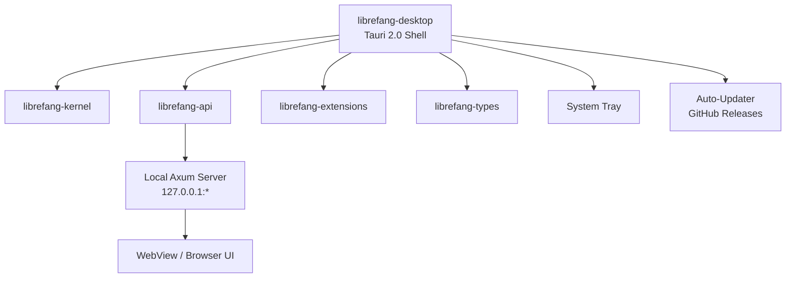

# Other — librefang-desktop

# librefang-desktop

Native desktop application for LibreFang, built on Tauri 2.0. Wraps the agent OS core into a platform-native experience with system tray integration, auto-updates, and single-instance enforcement.

## Architecture

The desktop app is a thin shell around the workspace's core libraries. It does not implement agent logic directly — instead it wires together the kernel, API server, extensions, and shared types into a deployable desktop package.



The Tauri runtime hosts a local Axum HTTP/WebSocket server (`librefang-api`) and serves the agent UI through either an embedded WebView or the system browser (via the `open` crate). The kernel manages agent lifecycle, while extensions provide pluggable capabilities.

## Key Responsibilities

| Concern | Implementation |
|---|---|
| **Native packaging** | Tauri bundles for `.deb`, `.AppImage`, `.dmg`, and Windows installer |
| **System tray** | `tray-icon` feature — runs in background, no mandatory window |
| **Single instance** | `tauri-plugin-single-instance` prevents duplicate processes |
| **Auto-start** | `tauri-plugin-autostart` optionally launches on login |
| **Auto-update** | `tauri-plugin-updater` checks GitHub Releases using Ed25519-signed manifests |
| **Shell integration** | `tauri-plugin-shell` for spawning system processes |
| **Notifications** | `tauri-plugin-notification` for native OS notifications |
| **Dialogs** | `tauri-plugin-dialog` for native file pickers and message boxes |
| **Global shortcuts** | `tauri-plugin-global-shortcut` for hotkey bindings |

## Configuration

### Tauri Config (`tauri.conf.json`)

| Field | Value |
|---|---|
| Product name | `LibreFang` |
| Identifier | `ai.librefang.desktop` |
| macOS minimum | 12.0 |
| Windows digest | SHA-256 |
| Update pubkey | Ed25519 (minisign format) |
| Update endpoint | `https://github.com/librefang/librefang/releases/latest/download/latest.json` |

#### Content Security Policy

The CSP is intentionally permissive toward `127.0.0.1:*` (HTTP and WebSocket) because the app communicates with its embedded local API server. External origins are restricted to Google Fonts. Key directives:

- `connect-src` — allows WebSocket upgrades to the local server
- `media-src` — allows audio/video blob URLs for voice/video channels
- `frame-src` — supports embedded content via blob URLs
- `object-src 'none'` — blocks plugin content
- `script-src` — requires `'unsafe-inline'` and `'unsafe-eval'` for the WebView frontend

> **Note:** If the frontend migrates to a strict CSP build tool, the `unsafe-*` directives should be removed and replaced with nonces or hashes.

### Feature Flags

Features are forwarded to `librefang-api` to control which communication channels are compiled in:

| Flag | Effect |
|---|---|
| `default` | Standard channel set (via `librefang-api/default`) |
| `all-channels` | Enables every available channel backend |
| `mini` | Minimal build with reduced channel support |
| `custom-protocol` | Production-only; switches Tauri from dev server to `tauri://` protocol |

Set features in the workspace `Cargo.toml` or per-invocation:

```bash
cargo build --package librefang-desktop --features all-channels
```

## Dependencies on Workspace Crates

- **`librefang-kernel`** — Core agent orchestration and lifecycle management.
- **`librefang-api`** — Axum-based HTTP/WS API server. Built with `default-features = false` to allow feature control at the desktop level.
- **`librefang-types`** — Shared data structures and serialization types.
- **`librefang-extensions`** — Extension loading and management.

Additional runtime dependencies:

- `clap` — CLI argument parsing (configuration overrides, debug flags).
- `dirs` — Resolves platform-specific config/cache directories.
- `axum` / `tokio` — Powers the embedded API server.
- `toml` / `serde_json` — Configuration file parsing.
- `tracing` / `tracing-subscriber` — Structured logging.

## Build

The build script (`build.rs`) delegates entirely to `tauri_build::build()`, which:

1. Compiles and bundles frontend assets.
2. Generates Tauri capability files from plugin configuration.
3. Produces platform-specific bundle artifacts in `target/release/bundle/`.

```bash
# Development (uses Tauri dev server, hot reload)
cargo tauri dev

# Production build (uses custom-protocol feature automatically)
cargo tauri build
```

## Packaging

Tauri's bundle configuration produces installers for all targets:

| Platform | Formats |
|---|---|
| Linux | `.deb`, `.AppImage` |
| macOS | `.dmg` (min macOS 12.0) |
| Windows | NSIS installer (WebView2 bootstrapper included) |

Icons are expected at `icons/` in the project root with the standard Tauri naming convention (`icon.ico`, `icon.png`, `32x32.png`, `128x128.png`, `128x128@2x.png`).

## Auto-Update Flow

1. `tauri-plugin-updater` polls the GitHub Releases endpoint on startup or schedule.
2. The endpoint returns a JSON manifest signed with the Ed25519 key embedded in `tauri.conf.json`.
3. The signature is verified against the bundled public key before any download.
4. On Windows, updates install in `passive` mode (user sees a progress bar, no manual steps).
5. On Linux/macOS, the updated bundle replaces the current installation per Tauri's platform behavior.

To rotate the signing key, update the `pubkey` field and re-sign all release assets with the new minisign key.

## Security Considerations

- The CSP allows `'unsafe-inline'` and `'unsafe-eval'` in script sources. This is typical for development convenience but should be locked down for production if the threat model requires it.
- No Windows code-signing certificate is configured (`certificateThumbprint: null`). Production Windows builds should set this to avoid SmartScreen warnings.
- macOS entitlements and exception domains are unconfigured. If the app needs network or hardware access on macOS, entitlements must be added and codesigned with an Apple Developer certificate.
- The embedded update public key is compile-time static. Compromise of the corresponding secret key allows distributing malicious updates.