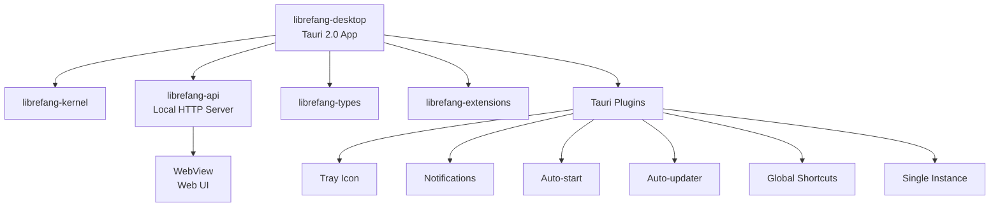

# Other — librefang-desktop

# librefang-desktop

Native desktop application for LibreFang, built on Tauri 2.0. This crate wraps the LibreFang agent runtime into a platform-native desktop experience with system tray integration, auto-updates, global shortcuts, and notification support.

## Architecture

The desktop app acts as a thin native shell around LibreFang's core crates. It does not implement agent logic itself — instead it bootstraps the kernel, serves the web UI via a local HTTP server, and provides desktop integration through Tauri plugins.



At runtime, the app:

1. Starts the `librefang-kernel` agent runtime
2. Launches an `axum`-based HTTP/WebSocket server through `librefang-api`
3. Opens a Tauri `WebView` window pointed at `http://127.0.0.1:<port>`
4. Registers system tray icons, global shortcuts, and platform integrations

## Key Dependencies

### Internal crates

| Crate | Purpose |
|---|---|
| `librefang-kernel` | Core agent execution runtime |
| `librefang-api` | HTTP/WebSocket API server (runs locally) |
| `librefang-types` | Shared type definitions |
| `librefang-extensions` | Agent extension system |

### Tauri plugins

| Plugin | Purpose |
|---|---|
| `tauri-plugin-single-instance` | Prevents multiple app instances from running simultaneously |
| `tauri-plugin-autostart` | Registers the app to launch on system startup |
| `tauri-plugin-updater` | Checks for and applies updates from GitHub Releases |
| `tauri-plugin-notification` | Native OS notifications |
| `tauri-plugin-shell` | Shell command execution from the frontend |
| `tauri-plugin-dialog` | Native file/message dialogs |
| `tauri-plugin-global-shortcut` | System-wide keyboard shortcuts |

### Notable external crates

- **`axum`** — Serves the local HTTP/WebSocket API that the WebView connects to
- **`open`** — Opens URLs in the system's default browser
- **`dirs`** — Resolves platform-specific directories for config/data storage
- **`toml`** — Parses configuration files

## Configuration

### tauri.conf.json

The Tauri configuration defines the app identity and behavior:

- **Product name:** `LibreFang`
- **Identifier:** `ai.librefang.desktop`
- **Windows:** Empty array in config — created programmatically at runtime to target the local API server

#### Content Security Policy

The CSP is permissive toward localhost connections, allowing the WebView to communicate with the local `librefang-api` server over HTTP and WebSocket (`http://127.0.0.1:*`, `ws://127.0.0.1:*`). External resources are limited to Google Fonts. Key directives:

- `connect-src` — Allows XHR/fetch to the local API and WebSocket connections
- `media-src` — Permits blob URLs for media streaming
- `script-src` — Allows `unsafe-inline` and `unsafe-eval` for frontend framework compatibility
- `object-src 'none'` — Blocks plugin content

#### Auto-updater

Updates are distributed via GitHub Releases. The updater is configured with:

- **Endpoint:** `https://github.com/librefang/librefang/releases/latest/download/latest.json`
- **Public key:** Embedded in the config for signature verification
- **Windows install mode:** `passive` — shows a progress UI but requires no user interaction

## Feature Flags

Feature flags control which communication channels the API server enables, passing through directly to `librefang-api`:

| Flag | Effect |
|---|---|
| `default` | Standard channel set |
| `all-channels` | Enables every available channel |
| `mini` | Minimal channel subset |
| `custom-protocol` | Required for production Tauri builds — switches from `dev-server` to `tauri://` protocol |

## Building

The `build.rs` delegates entirely to `tauri_build::build()`, which generates the Rust bindings from `tauri.conf.json` and prepares platform-specific assets.

### Development

```bash
cargo tauri dev
```

This compiles the Rust backend and launches the Tauri dev server with hot-reload for the frontend.

### Production

```bash
cargo tauri build
```

Produces platform-native installers:

- **Linux:** `.deb` and `.AppImage`
- **macOS:** `.dmg` / `.app` (minimum macOS 12.0)
- **Windows:** `.msi` / `.exe` (SHA-256 digest, WebView2 bootstrapped if missing)

## Entry Point

The binary is registered as:

```toml
[[bin]]
name = "librefang-desktop"
path = "src/main.rs"
```

The `main.rs` is responsible for:

1. Parsing CLI arguments via `clap`
2. Initializing the `tracing` subscriber for structured logging
3. Starting the `librefang-kernel` runtime
4. Launching the `librefang-api` HTTP server on a localhost port
5. Building and running the Tauri app with all plugins registered
6. Creating the main window pointed at the local server