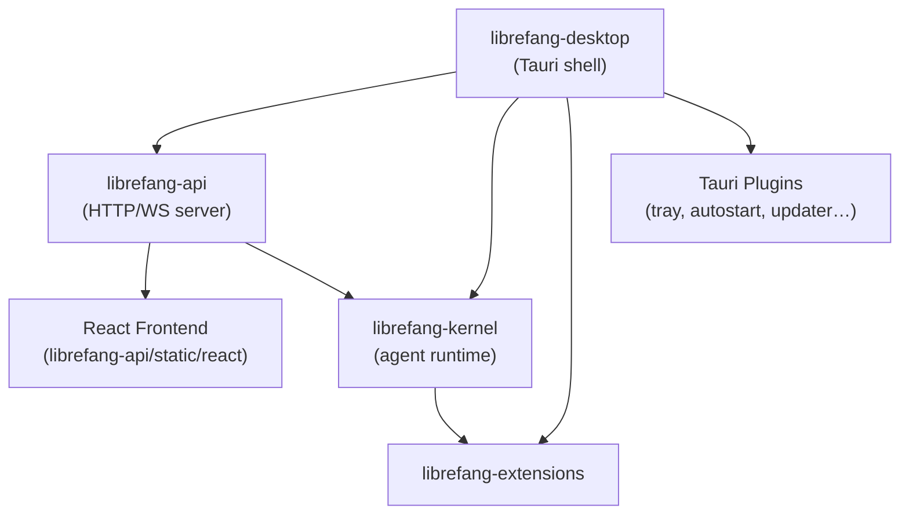

# Other — librefang-desktop

# librefang-desktop

Native application shell for LibreFang, built on Tauri 2.0. Compiles to a desktop binary (macOS, Windows, Linux) and mobile apps (iOS, Android) from a single crate.

## Purpose

This crate is the **packaging and native integration layer**. It does not contain business logic — instead it wires together the core crates and exposes them through a native OS window with platform-specific capabilities like system trays, autostart, auto-update, and push notifications.

The underlying `librefang-api` crate serves the React frontend (from `librefang-api/static/react`) inside the Tauri webview, while `librefang-kernel` provides the agent runtime.

## Architecture



On **desktop**, everything runs locally: the Tauri webview loads the frontend from the embedded API server.

On **mobile**, the app is a **thin client**. The webview opens a `lfconnect://localhost/` URL that connects to a remote LibreFang daemon on your home server, VPS, or NAS. This is by design — LibreFang needs 24/7 uptime for cron jobs, channel adapters, and triggers, which iOS and Android cannot guarantee in the background. See [`MOBILE.md`](./MOBILE.md) for the full mobile architecture.

## Build Entry Points

| File | Role |
|---|---|
| `build.rs` | Calls `tauri_build::build()` — standard Tauri build script that compiles the frontend assets and generates bindings. |
| `src/main.rs` | Desktop binary entry point. Initializes the Tauri app with all registered plugins and launches the kernel. |

The `[lib]` section declares three crate types: `"staticlib"`, `"cdylib"`, and `"lib"`. The staticlib and cdylib outputs are required by `cargo tauri ios build` and `cargo tauri android build` so the native shell (Xcode/Gradle) can link the Rust code. A side effect is that desktop builds also produce these artifacts, adding roughly 10–20% to clean build times. Cargo cannot condition gate crate types, so this cost is accepted.

## Tauri Configuration Files

Tauri 2.0 uses layered configuration. The base `tauri.conf.json` is merged with a platform-specific overlay:

| File | Scope |
|---|---|
| `tauri.conf.json` | Base config: product name, identifier, CSP, bundle settings, icon paths |
| `tauri.desktop.conf.json` | Desktop overlay: auto-updater public key, endpoint URLs, Windows install mode |
| `tauri.android.conf.json` | Android overlay: `lfconnect://` scheme, minSdkVersion 26, bundled frontend |
| `tauri.ios.conf.json` | iOS overlay: `lfconnect://` scheme, minimum iOS 16.0, bundled frontend |

Key details from the base config:

- **CSP** allows connections to `http://127.0.0.1:*` and `ws://127.0.0.1:*` (local API server), plus Google Fonts. `object-src` is set to `'none'`.
- **Bundle targets** are set to `"all"` — Tauri produces .dmg/.app (macOS), .msi/.exe (Windows), .deb/.AppImage (Linux).
- **withGlobalTauri** is `true`, exposing the Tauri API globally in the webview for the React frontend to call.

## Platform-Specific Dependencies

Cargo features and `cfg` predicates gate native capabilities by platform.

### macOS and Windows

Always includes:

- `tauri/tray-icon` — native system tray (NSStatusItem / Shell_NotifyIconW)
- `tauri-plugin-single-instance` — prevents multiple app instances
- `tauri-plugin-autostart` — launch at login
- `tauri-plugin-global-shortcut` — global hotkeys
- `tauri-plugin-updater` — in-app updates from GitHub Releases
- `tauri-plugin-shell` — CLI process spawning

### Linux

Same plugin set as macOS/Windows, but **`tray-icon` is opt-in** via the `linux-tray` feature. The reason: Tauri 2.10's `tray-icon` on Linux pulls `libappindicator-rs 0.9`, which transitively depends on 8 unmaintained GTK3 crates (RUSTSEC-2024-0411 through 0420) plus a glib unsoundness (RUSTSEC-2024-0429). Headless server and CI builds don't need a tray, so it's off by default. See issue #3667.

### Mobile (iOS / Android)

- `tauri-plugin-barcode-scanner` — QR code scanning for connection setup
- `keyring` — secure credential storage

Desktop-only plugins (single-instance, autostart, global shortcuts, updater, shell) are compiled out via `cfg(not(any(target_os = "ios", target_os = "android")))`.

## Cargo Features

| Feature | Default | Purpose |
|---|---|---|
| `default` | ✅ | Inherits `librefang-api/default` — full feature set |
| `all-channels` | ❌ | Inherits `librefang-api/all-channels` — enables all channel adapters |
| `mini` | ❌ | Inherits `librefang-api/mini` — minimal build for constrained environments |
| `custom-protocol` | ❌ | Enables `tauri/custom-protocol` for production builds (uses `tauri://` instead of dev server) |
| `mobile` | ❌ | No-op flag documenting the mobile build path; mobile targets are cfg-gated |
| `linux-tray` | ❌ | Re-enables `tauri/tray-icon` on Linux; no-op on macOS/Windows. Accepts the GTK3 advisory cost. |
| `mobile-no-email` | ❌ | Excludes the email channel adapter on mobile because `rustls-platform-verifier 0.7.0`'s `Verifier::new_with_extra_roots` is not implemented for Android. Uses `librefang-api/all-channels-no-email`. |

### Example build commands

```bash
# Standard desktop development
cargo build -p librefang-desktop

# Desktop with Linux tray enabled
cargo build -p librefang-desktop --features linux-tray

# Production desktop (uses custom protocol, no dev server)
cargo build -p librefang-desktop --features custom-protocol --release

# Mobile (Android) without email channel
cargo build -p librefang-desktop --target aarch64-linux-android \
  --no-default-features --features mobile-no-email

# Mobile (iOS)
cargo build -p librefang-desktop --target aarch64-apple-ios \
  --no-default-features --features mobile
```

## Dependency Graph

```
librefang-desktop
├── librefang-kernel       # Agent runtime (tasks, cron, triggers)
├── librefang-api          # HTTP/WebSocket server + React frontend
├── librefang-types        # Shared type definitions
├── librefang-extensions   # Extension loading and management
├── tauri 2                # Native shell framework
├── clap                   # CLI argument parsing
├── tokio                  # Async runtime
├── axum                   # HTTP framework (used by api internally)
├── reqwest                # HTTP client
├── tracing                # Structured logging
├── serde / serde_json     # Serialization
├── toml                   # Config file parsing
└── open                   # Open URLs in default browser
```

## Mobile Development

The full mobile guide is in [`MOBILE.md`](./MOBILE.md). Summary:

1. Run `cargo tauri android init` and/or `cargo tauri ios init` from `crates/librefang-desktop/` to generate the native scaffolds (`gen/android/`, `gen/apple/`).
2. Use `cargo tauri android dev` or `cargo tauri ios dev` for local development with hot reload.
3. CI builds signed `.aab`, `.apk`, and `.ipa` artifacts via `.github/workflows/release.yml`.

Minimum OS versions: iOS 16.0, Android API 26 (Android 8.0).

## Distribution

- **Desktop**: Auto-updater checks `https://github.com/librefang/librefang/releases/latest/download/latest.json` using the embedded public key (dW50cnVzdGVk...). Windows uses passive install mode.
- **Mobile**: Uploaded to TestFlight (iOS) and Play Internal Testing (Android) by CI. See `docs/src/app/operations/mobile-release/page.mdx` for the full release runbook and `.github/SECRETS.md` for required secrets.