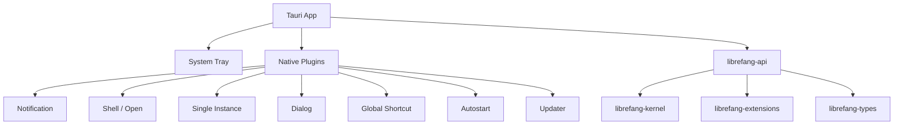

# Other — librefang-desktop

# librefang-desktop

Native desktop application for LibreFang, built on **Tauri 2.0**. This crate packages the LibreFang agent runtime into a platform-native desktop shell with system tray integration, auto-update support, and native OS dialogs.

## Purpose

LibreFang's core services (kernel, API server, extensions) are headless by design. `librefang-desktop` wraps those services in a native window with:

- A system tray icon for background operation
- Native OS notifications and dialogs
- Single-instance enforcement (only one copy runs at a time)
- Global keyboard shortcuts
- Auto-launch on login
- Automatic updates from GitHub Releases

The web UI is served by the embedded `librefang-api` HTTP server, and Tauri's webview renders it in a native window.

## Architecture



The binary is a standard Tauri application. At startup it initializes the agent stack through the dependent crates and opens a webview pointed at the local API server.

## Dependencies on Other Crates

| Crate | Role |
|---|---|
| `librefang-kernel` | Core agent runtime — manages agent lifecycle and orchestration |
| `librefang-api` | HTTP/WebSocket server that serves the web UI — runs on `127.0.0.1` inside the app |
| `librefang-types` | Shared type definitions |
| `librefang-extensions` | Extension system for agent capabilities |

`librefang-api` is included **without default features** by default, which means the API server starts in its minimal embedded configuration suitable for in-process use alongside the Tauri runtime.

## Feature Flags

Features are forwarded to `librefang-api` to control which transport channels are compiled in:

| Feature | Effect |
|---|---|
| `default` | Standard feature set (forwards to `librefang-api/default`) |
| `all-channels` | Enables all communication channels (forwards to `librefang-api/all-channels`) |
| `mini` | Minimal build with fewer channels (forwards to `librefang-api/mini`) |
| `custom-protocol` | Tauri production feature — uses `tauri://` protocol instead of `localhost` for serving assets. **Required for release builds.** |

## Tauri Configuration

Defined in `tauri.conf.json`.

### App Identity

- **Product name:** `LibreFang`
- **Identifier:** `ai.librefang.desktop`
- **Version:** synced via workspace (`26.4.32245`)

### Windows

The `windows` array is **empty** in the config. Windows are created programmatically at runtime — typically a single main window pointing at the local API server.

### Content Security Policy

The CSP allows:

- Connections to `http://127.0.0.1:*` and `ws://127.0.0.1:*` (the embedded API)
- Google Fonts loading (`https://fonts.googleapis.com`, `https://fonts.gstatic.com`)
- Inline styles and scripts (required for the SPA framework)
- Media and frame sources from `blob:` and local origins
- `object-src 'none'` and `base-uri 'self'` for hardening

### Auto-Updater

Configured to check GitHub Releases for updates:

```json
"endpoints": ["https://github.com/librefang/librefang/releases/latest/download/latest.json"]
```

- Uses a public key for signature verification (embedded in config)
- On Windows, uses **passive** install mode (prompts user, installs in background)
- Signing is handled via Tauri's built-in updater signing with Ed25519

### Bundle Settings

Targets all platforms:

| Platform | Format | Notes |
|---|---|---|
| **Linux** | `.deb`, `.AppImage` | No media framework bundling; no extra deb dependencies |
| **macOS** | `.dmg`, `.app` | Minimum macOS 12.0; no custom entitlements |
| **Windows** | `.msi`, `.exe` | SHA-256 digest; WebView2 downloaded via bootstrapper if missing |

## Tauri Plugins Used

| Plugin | Purpose |
|---|---|
| `tauri-plugin-notification` | Native OS notifications for agent events |
| `tauri-plugin-shell` | Opening external URLs/files via the OS |
| `tauri-plugin-single-instance` | Ensures only one app instance runs; forwards args to existing instance |
| `tauri-plugin-dialog` | Native file open/save dialogs, message boxes |
| `tauri-plugin-global-shortcut` | System-wide hotkeys (e.g., show/hide window) |
| `tauri-plugin-autostart` | Register/unregister login item (LaunchAgent, registry key, etc.) |
| `tauri-plugin-updater` | Check and apply updates from GitHub Releases |

## Build

The build script (`build.rs`) delegates entirely to `tauri_build::build()`, which:

1. Compiles and bundles frontend assets
2. Generates the Tauri runtime metadata
3. Produces platform-specific installers based on `bundle.targets`

```bash
# Development build
cargo build -p librefang-desktop

# Production build (uses custom-protocol for asset serving)
cargo build -p librefang-desktop --features custom-protocol --release
```

## Connection to the Rest of the Codebase

`librefang-desktop` is the top-level user-facing entry point. It does not export any libraries — it is a pure binary crate.

**Inbound:** Nothing depends on this crate.

**Outbound:** It consumes the entire LibreFang stack at runtime by pulling in `librefang-kernel` (agent execution), `librefang-api` (HTTP/WS server for the UI), `librefang-extensions` (plugin system), and `librefang-types` (shared data structures).

The desktop app starts the API server in-process, then opens a Tauri webview window pointing at it. The frontend communicates with the backend over HTTP/WebSocket on `127.0.0.1`, using the same API that would be available if running `librefang-api` as a standalone server.