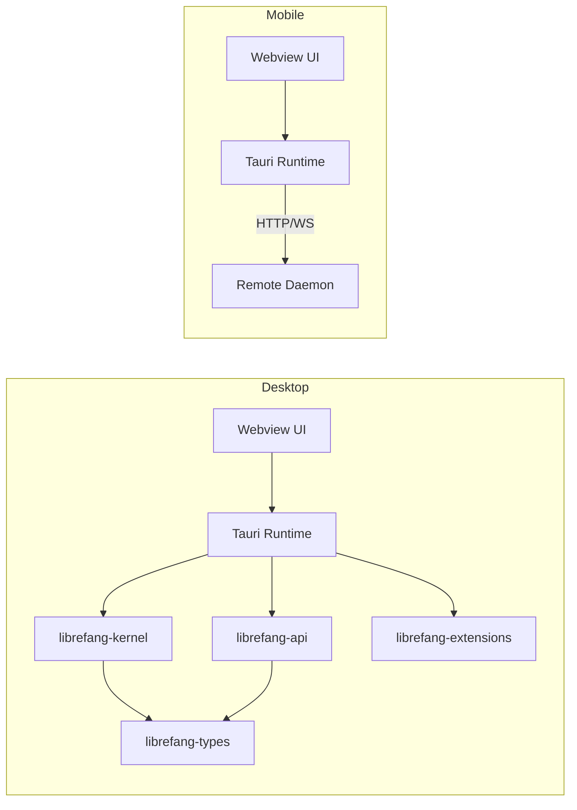

# Other — librefang-desktop

# librefang-desktop

Native desktop and mobile application for the LibreFang Agent OS, built on Tauri 2.0. The desktop build runs a full local daemon with a webview UI; the mobile build acts as a thin client connecting to a remote daemon.

## Architecture



On **desktop**, the Tauri runtime hosts the LibreFang kernel and API in-process. On **mobile**, the app is a dashboard that connects over HTTP/WebSocket to a daemon running elsewhere (home server, VPS, NAS, or another desktop). This split is intentional — LibreFang needs 24×7 uptime for cron, autodream, channel adapters, and triggers, which iOS and Android cannot guarantee due to background execution limits.

## Platform Targets

| Platform | Identifier | Config | Min Version |
|----------|-----------|--------|-------------|
| Windows / macOS / Linux | `ai.librefang.desktop` | `tauri.desktop.conf.json` | macOS 12.0 |
| Android | `ai.librefang.app` | `tauri.android.conf.json` | API 26 (Android 8.0) |
| iOS | `ai.librefang.app` | `tauri.ios.conf.json` | iOS 14.0 |

The base `tauri.conf.json` defines shared settings: product name, CSP policy, bundle metadata, and icon set. Platform-specific files (`tauri.desktop.conf.json`, `tauri.android.conf.json`, `tauri.ios.conf.json`) override or extend these per target.

## Cargo Features

| Feature | Effect |
|---------|--------|
| `default` | Enables `librefang-api/default` |
| `all-channels` | Enables `librefang-api/all-channels` — all channel adapters |
| `mini` | Enables `librefang-api/mini` — minimal channel set |
| `custom-protocol` | Enables `tauri/custom-protocol` — required for production builds |
| `mobile` | No-op flag; documents the mobile build path (mobile targets are cfg-gated) |

## Desktop-Only Features

The following are compiled out on iOS/Android via `cfg(not(any(target_os = "ios", target_os = "android")))`:

| Plugin / Feature | Purpose |
|-----------------|---------|
| `tauri` features `tray-icon`, `image-png` | System tray icon with PNG support |
| `tauri-plugin-single-instance` | Prevents multiple app instances |
| `tauri-plugin-autostart` | Launch at login |
| `tauri-plugin-global-shortcut` | Global keyboard shortcuts |
| `tauri-plugin-updater` | Auto-update from GitHub releases |
| `tauri-plugin-shell` | CLI process spawning |

The updater is configured in `tauri.desktop.conf.json` with a public key for signature verification and pulls from `https://github.com/librefang/librefang/releases/latest/download/latest.json`. On Windows, the install mode is `passive`.

## Mobile-Only Features

Mobile targets (`cfg(any(target_os = "ios", target_os = "android"))`) include:

| Plugin | Purpose |
|--------|---------|
| `tauri-plugin-barcode-scanner` | QR code scanning for connection wizard |

The barcode scanner is used for the connection wizard (issue #3344) — scan a QR code from the desktop app to configure the remote daemon URL.

## Shared Plugins (All Platforms)

| Plugin | Purpose |
|--------|---------|
| `tauri-plugin-notification` | OS-level push notifications |
| `tauri-plugin-dialog` | Native file/message dialogs |

## Dependencies on Internal Crates

| Crate | Relationship |
|-------|-------------|
| `librefang-kernel` | Core agent runtime — loaded in-process on desktop |
| `librefang-api` | HTTP/WS API server — `default-features = false` at the base level; features are forwarded from this crate's feature flags |
| `librefang-types` | Shared data types |
| `librefang-extensions` | Extension system |

## Content Security Policy

The CSP in `tauri.conf.json` is permissive for local development, allowing:

- `http://127.0.0.1:*` and `ws://127.0.0.1:*` — communication with the local API server
- Google Fonts for styling
- `unsafe-inline` and `unsafe-eval` in script/style sources (required by some frontend frameworks)
- `blob:` and `data:` URIs for media
- `object-src 'none'` — blocks Flash/plugins

The Android config overrides this to `null` (unrestricted), which is typical for mobile thin-client builds connecting to remote endpoints.

## Build

`build.rs` delegates to `tauri_build::build()` which generates the Tauri runtime bindings from the configuration files.

### Desktop Build

```bash
# Development
cargo run -p librefang-desktop

# Production (requires custom-protocol)
cargo build -p librefang-desktop --features custom-protocol --release
```

### Mobile Build

Mobile requires one-time scaffold generation:

```bash
cd crates/librefang-desktop

# Android (requires Android NDK 26+, SDK API 26+, Java 17)
cargo tauri android init
cargo tauri android dev

# iOS (macOS only, requires Xcode 15+)
cargo tauri ios init
cargo tauri ios dev
```

The generated `gen/android/` and `gen/apple/` directories must be committed after initialization.

## Bundle Configuration

- **Bundle targets**: `all` — produces platform-native installers (`.msi`/`.exe` on Windows, `.dmg`/`.app` on macOS, `.deb`/`.AppImage` on Linux)
- **Category**: `Productivity`
- **Windows webview**: Download bootstrapper mode — downloads WebView2 if not installed
- **Windows signing**: SHA-256 digest, certificate configured at release time
- **Linux AppImage**: `bundleMediaFramework` disabled