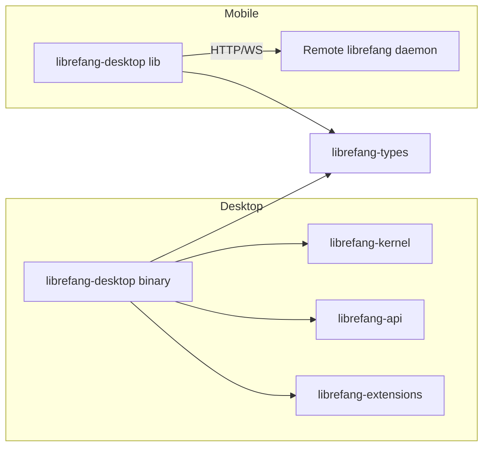
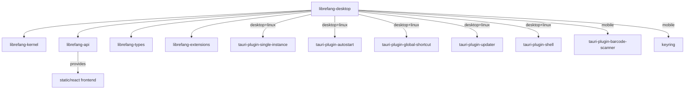

# Other — librefang-desktop

# librefang-desktop

Native desktop and mobile application for the LibreFang Agent OS, built on **Tauri 2.0**. The crate produces a single codebase that compiles into three distinct deployment targets: a full-featured desktop binary (macOS, Windows, Linux), an iOS app, and an Android app.

## Architecture Overview



The desktop binary runs the full LibreFang stack locally — kernel, API server, extensions, and all channel adapters. The mobile apps are **thin clients**: they host a webview dashboard that connects to a remote `librefang` daemon over HTTP/WebSocket. This split is intentional because iOS and Android impose strict background execution limits that would prevent the 24×7 operation required by cron jobs, autodream, channel adapters, and triggers.

## Platform Matrix

| Capability | macOS / Windows | Linux | iOS / Android |
|---|---|---|---|
| System tray icon | Always on | Opt-in (`linux-tray` feature) | Not available |
| Single-instance enforcement | ✅ | ✅ | Not available |
| Autostart on login | ✅ | ✅ | Not available |
| Global keyboard shortcuts | ✅ | ✅ | Not available |
| Auto-updater | ✅ | ✅ | Not available |
| CLI process spawning (shell plugin) | ✅ | ✅ | Not available |
| Barcode scanner | ❌ | ❌ | ✅ |
| Keychain integration | ❌ | ❌ | ✅ |
| Runs full daemon locally | ✅ | ✅ | ❌ (remote only) |

## Build Configuration

### Crate Types

The `[lib]` section declares three crate types:

```toml
[lib]
crate-type = ["staticlib", "cdylib", "lib"]
```

- **`staticlib`** — Required by Xcode to link into the iOS native shell.
- **`cdylib`** — Loaded by the Tauri mobile runtime on Android.
- **`lib` (rlib)** — Used by the desktop binary in `src/main.rs`.

Cargo does not support conditionalizing crate-type on `cfg(mobile)`, so desktop builds also produce the `staticlib` and `cdylib` outputs. This adds ~10–20% to clean build times. If desktop build performance becomes a concern, this is the first place to investigate.

### Linux Tray and GTK3 Advisory

On macOS and Windows, the system tray uses native APIs (`NSStatusItem` / `Shell_NotifyIconW`). On Linux, Tauri 2.10's `tray-icon` feature pulls in `libappindicator-rs 0.9`, which transitively depends on 8 unmaintained GTK3 crates (RUSTSEC-2024-0411 through RUSTSEC-2024-0420) plus a `glib` unsoundness issue (RUSTSEC-2024-0429).

For this reason, the Linux tray is **disabled by default**. To enable it:

```bash
cargo build --features linux-tray
```

This accepts the audit advisories pending Tauri's migration to `tray-icon 0.22+`/ksni. See issue #3667.

### Cargo Features

| Feature | Purpose |
|---|---|
| `default` | Inherits `librefang-api/default` |
| `all-channels` | Inherits `librefang-api/all-channels` |
| `mini` | Inherits `librefang-api/mini` |
| `custom-protocol` | Production Tauri builds (`tauri/custom-protocol`) |
| `mobile` | No-op flag documenting the mobile build path |
| `linux-tray` | Opt-in system tray on Linux desktop |
| `mobile-no-email` | Excludes `channel-email` for mobile targets (see below) |

#### Mobile Email Exclusion

The `mobile-no-email` feature exists because `rustls-connector 0.23.0` pulls `rustls-platform-verifier 0.7.0`, whose `Verifier::new_with_extra_roots` is not implemented for the Android target. Mobile CI builds use:

```bash
cargo build --no-default-features --features mobile-no-email
```

## Tauri Configuration Files

Tauri 2 uses a layered configuration system. The base config is `tauri.conf.json`, with platform-specific overlays:

| File | Scope |
|---|---|
| `tauri.conf.json` | Base configuration for all platforms |
| `tauri.desktop.conf.json` | Desktop-specific overlay (updater, signing key) |
| `tauri.android.conf.json` | Android overlay (app identifier, frontend dist, min SDK 26) |
| `tauri.ios.conf.json` | iOS overlay (app identifier, frontend dist, min iOS 16.0) |

### Key Base Configuration (`tauri.conf.json`)

- **Product name**: `LibreFang`
- **Identifier**: `ai.librefang.desktop`
- **withGlobalTauri**: `true` — exposes Tauri APIs on `window.__TAURI__` in the frontend
- **CSP policy**: Restricts all resource loading to `'self'`, `tauri:`, `ipc:`, and `127.0.0.1:*` endpoints. Allows Google Fonts and inline styles. Blocks `object-src` and restricts `frame-src` to same-origin and blob URIs.
- **Windows**: The `windows` array is empty in the base config — desktop windows are created programmatically at runtime rather than declared statically.
- **Bundle targets**: `"all"` — produces platform-native installers (dmg, msi, deb, appimage, aab, apk, ipa).
- **Minimum macOS**: 12.0
- **Windows signing**: SHA-256 digest algorithm, WebView2 bootstrapper download mode.

### Desktop Updater (`tauri.desktop.conf.json`)

The auto-updater uses a public key for update signature verification and checks GitHub Releases for the latest `latest.json` manifest. On Windows, the install mode is set to `passive` (shows a progress bar but requires no user interaction).

### Mobile Frontend

Both `tauri.android.conf.json` and `tauri.ios.conf.json` point `frontendDist` to `../librefang-api/static/react` and open a single main window at `lfconnect://localhost/`. The `lfconnect://` custom protocol scheme is the mobile connection wizard's entry point for pairing with a remote daemon.

## Dependencies and Workspace Integration



The crate depends on four internal workspace crates:

- **`librefang-kernel`** — Core agent runtime, loaded directly in the desktop process.
- **`librefang-api`** — HTTP/WebSocket API server; also provides the React frontend static assets served to mobile webviews.
- **`librefang-types`** — Shared type definitions.
- **`librefang-extensions`** — Extension loading and management.

The `librefang-api` dependency uses `default-features = false` in the base `[dependencies]` block, with feature propagation controlled by the desktop crate's own features (`default`, `all-channels`, `mini`, `mobile-no-email`).

## Build Entry Points

- **`build.rs`** — Delegates to `tauri_build::build()`. This generates the Tauri runtime bindings from the configuration files.
- **`src/main.rs`** — Desktop binary entry point (`[[bin]] name = "librefang-desktop"`).
- **`src/lib.rs`** (implied by `[lib]`) — Library crate that Tauri's mobile runtime links into.

## Mobile Development

For full mobile setup and workflow documentation, see [`MOBILE.md`](./MOBILE.md). Key commands:

```bash
# From crates/librefang-desktop/

# Android emulator (requires prior `cargo tauri android init`)
cargo tauri android dev

# iOS Simulator, macOS only (requires prior `cargo tauri ios init`)
cargo tauri ios dev
```

The generated `gen/android/` (Gradle) and `gen/apple/` (Xcode) scaffolds are committed to the repository after running the init commands.

Minimum OS versions:

| Platform | Minimum |
|---|---|
| iOS | 16.0 |
| Android | API 26 (Android 8.0) |

## Release and Distribution

- CI builds signed `.aab`, `.apk`, and `.ipa` artifacts via `.github/workflows/release.yml` in jobs `mobile_android` and `mobile_ios`.
- Desktop installers (dmg, msi, deb, appimage) are produced by the same workflow.
- Auto-update manifests are published to GitHub Releases as `latest.json`, signed with the public key embedded in `tauri.desktop.conf.json`.
- Mobile store uploads (TestFlight, Play Internal Testing) and their prerequisites are documented in `docs/src/app/operations/mobile-release/page.mdx`.
- Upload secrets are tracked in `.github/SECRETS.md`.