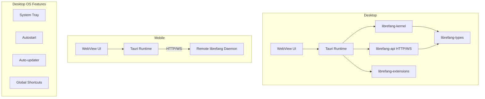

# Other — librefang-desktop

# librefang-desktop

Native desktop and mobile application for LibreFang Agent OS, built on Tauri 2.0. Packages the full LibreFang runtime (kernel, API server, extensions) into a native OS shell on desktop, and acts as a thin remote client on iOS/Android.

## Architecture


```mermaid
graph TB
    subgraph Desktop
        UI[WebView UI] --> TAURI[Tauri Runtime]
        TAURI --> KERNEL[librefang-kernel]
        TAURI --> API[librefang-api HTTP/WS]
        TAURI --> EXT[librefang-extensions]
        KERNEL --> TYPES[librefang-types]
        API --> TYPES
    end
    subgraph Mobile
        MUI[WebView UI] --> MTAURI[Tauri Runtime]
        MTAURI --> |HTTP/WS| DAEMON[Remote librefang Daemon]
    end
    subgraph Desktop OS Features
        TRAY[System Tray]
        AUTO[Autostart]
        UPDATER[Auto-updater]
        SHORTCUT[Global Shortcuts]
    end
```

On desktop (macOS, Windows, Linux), the application embeds the entire LibreFang stack — kernel, API server, and extension system — inside the Tauri process. The WebView frontend communicates with the backend through Tauri's IPC and the local `librefang-api` HTTP/WebSocket server.

On mobile (iOS, Android), the app is a **thin client** with no embedded daemon. It connects to a remote LibreFang instance over HTTP/WebSocket. This is intentional: LibreFang requires 24/7 uptime for cron jobs, autodream, channel adapters, and triggers, which iOS and Android cannot guarantee due to OS background execution limits.

## Platform Support

| Platform | Tray | Autostart | Single Instance | Global Shortcuts | Auto-updater | Shell Plugin |
|----------|------|-----------|-----------------|------------------|--------------|--------------|
| macOS    | ✅   | ✅        | ✅              | ✅               | ✅           | ✅           |
| Windows  | ✅   | ✅        | ✅              | ✅               | ✅           | ✅           |
| Linux    | ⚠️   | ✅        | ✅              | ✅               | ✅           | ✅           |
| iOS      | ❌   | ❌        | ❌              | ❌               | ❌           | ❌           |
| Android  | ❌   | ❌        | ❌              | ❌               | ❌           | ❌           |

Mobile-exclusive plugins: `tauri-plugin-barcode-scanner` and `keyring`.

### Linux System Tray

The system tray on Linux requires GTK3 via `libappindicator`, which carries multiple RUSTSEC advisories (2024-0411 through 2024-0420, plus glib unsoundness 2024-0429). The tray is therefore **disabled by default** on Linux.

To enable it, build with:

```bash
cargo build --features linux-tray
```

This opts into the deprecated GTK3 dependency chain. Headless servers and CI environments do not need this feature. See issue #3667 for the tracking and migration plan to `tray-icon 0.22+`/ksni.

## Crate Types

The `[lib]` section declares three crate types:

```toml
[lib]
crate-type = ["staticlib", "cdylib", "lib"]
```

- **`lib` (rlib)**: Used by the desktop binary in `src/main.rs`.
- **`staticlib` / `cdylib`**: Required by Tauri's mobile runtime — Xcode links the `.a` and Gradle loads the `.so`/`.dylib`.

Cargo cannot conditionalize crate-type on the target platform at the manifest level, so desktop builds also produce the extra artifacts. This adds roughly 10–20% to clean build times. If desktop build performance becomes a concern, this is the first place to investigate.

## Cargo Features

| Feature | Effect |
|---------|--------|
| `default` | Inherits from `librefang-api/default` |
| `custom-protocol` | Enables `tauri/custom-protocol` for production builds |
| `mobile` | No-op flag documenting the mobile build path; mobile targets are `cfg`-gated |
| `linux-tray` | Re-enables system tray on Linux (`tauri/tray-icon`). No-op on macOS/Windows where tray is always active |

Removed features (`all-channels`, `mini`, `mobile-no-email`) were deleted when channel adapters became sidecars. Any CI or packaging configuration referencing them should drop the `-f` flag.

## Tauri Configuration

Configuration is split across layered JSON files that Tauri merges at build time:

- **`tauri.conf.json`** — Base config. Product name (`LibreFang`), version, identifier (`ai.librefang.desktop`), CSP policy, bundle settings, icon paths. No windows are declared here; they are created programmatically.
- **`tauri.desktop.conf.json`** — Desktop overrides. Configures the auto-updater with a public key and GitHub releases endpoint. Windows install mode is `passive`.
- **`tauri.android.conf.json`** — Android overrides. Identifier becomes `ai.librefang.app`, frontend dist points to `../librefang-api/static/react`, window URL uses the `lfconnect://` scheme, minimum SDK is API 26.
- **`tauri.ios.conf.json`** — iOS overrides. Same identifier and window setup as Android, minimum system version is iOS 16.0.

### Content Security Policy

The desktop CSP (`tauri.conf.json`) allows:

- `default-src`: self, tauri, ipc, localhost HTTP/WS, Google Fonts
- `img-src`: self, tauri, data, blob, localhost
- `script-src`: self, tauri, ipc, unsafe-inline
- `connect-src`: self, tauri, ipc, localhost HTTP/WS
- `media-src` / `frame-src`: self, blob, localhost
- `object-src`: none
- Mobile configs set `csp: null` (disabled)

## Key Dependencies

### Internal Crates

- **`librefang-kernel`** — Core agent runtime (cron, triggers, channel orchestration)
- **`librefang-api`** — Axum-based HTTP/WS API server serving the React frontend
- **`librefang-types`** — Shared type definitions
- **`librefang-extensions`** — Extension/sidecar system

### Tauri Plugins

Desktop platforms include: `single-instance`, `autostart`, `global-shortcut`, `updater`, `shell`, `notification`, `dialog`.

Mobile platforms include: `barcode-scanner`, plus `keyring` for credential storage.

## Build

```toml
# build.rs
fn main() {
    tauri_build::build()
}
```

Standard Tauri build script. No custom logic.

### Build Commands

```bash
# Desktop (development)
cargo tauri dev

# Desktop (production bundle)
cargo tauri build

# Android emulator
cargo tauri android dev

# iOS simulator (macOS only)
cargo tauri ios dev
```

### Mobile Scaffold Generation

Run once after cloning or when regenerating native shells:

```bash
cd crates/librefang-desktop
cargo tauri android init
cargo tauri ios init   # macOS only
```

Commit the resulting `gen/android/` and `gen/apple/` directories to version control.

## Mobile Release

CI builds signed `.aab`, `.apk`, and `.ipa` artifacts in `.github/workflows/release.yml` (jobs `mobile_android` and `mobile_ios`). TestFlight and Play Internal Testing uploads are unattended. For upload secrets, required accounts, version-mapping rules, and failure recovery, see:

- `docs/src/app/operations/mobile-release/page.mdx`
- `.github/SECRETS.md`
- `.github/templates/PRIVACY_MOBILE_TEMPLATE.md` (pending legal review)

## Related Issues

- Epic: #3351
- Scaffold: #3342
- Mobile UX: #3343
- Connection wizard + QR: #3344
- CI build jobs: #3345
- Distribution: #3348
- Linux tray GTK3 migration: #3667