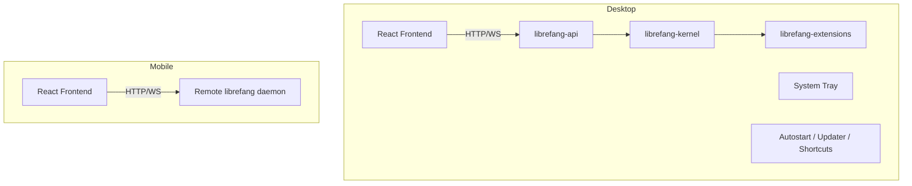

# Other — librefang-desktop

# librefang-desktop

Native application shell for the LibreFang Agent OS, built on Tauri 2.0. Runs as a desktop app on macOS, Windows, and Linux, and as a thin mobile client on iOS and Android.

## Overview

This crate provides the native wrapper around the LibreFang web UI (`librefang-api/static/react`). On desktop, it hosts the kernel, API server, and system integration (tray icon, autostart, global shortcuts, auto-updates). On mobile, it acts as a dashboard window that connects to a remote `librefang` daemon — the daemon is never embedded in the mobile binary.

## Architecture


```mermaid
graph TD
    subgraph Desktop
        UI[React Frontend] -->|HTTP/WS| API[librefang-api]
        API --> KERNEL[librefang-kernel]
        KERNEL --> EXT[librefang-extensions]
        TRAY[System Tray]
        AUTO[Autostart / Updater / Shortcuts]
    end
    subgraph Mobile
        MUI[React Frontend] -->|HTTP/WS| REMOTE[Remote librefang daemon]
    end
```

Desktop runs the full stack locally. Mobile is a connection window to a daemon running elsewhere (home server, VPS, NAS). This split is intentional — cron jobs, autodream, channel adapters, and triggers require 24×7 uptime that iOS/Android cannot guarantee due to OS background limits.

## Platform Support

| Platform | Minimum Version | Tray Icon | Autostart | Updater | Shell Plugin |
|----------|----------------|-----------|-----------|---------|-------------|
| macOS | 12.0 | ✅ always | ✅ | ✅ | ✅ |
| Windows | WebView2 bootstrapper | ✅ always | ✅ | ✅ | ✅ |
| Linux | — | ⚠️ opt-in (`linux-tray`) | ✅ | ✅ | ✅ |
| iOS | 16.0 | — | — | — | — |
| Android | API 26 (8.0) | — | — | — | — |

### Mobile-only features

- Barcode scanner plugin (`tauri-plugin-barcode-scanner`)
- Keychain integration (`keyring`) for credential storage

## Configuration Files

Tauri 2 uses layered platform-specific configuration files that merge with the base:

| File | Purpose |
|------|---------|
| `tauri.conf.json` | Base config — product name, identifier, CSP policy, bundle settings, icon paths |
| `tauri.desktop.conf.json` | Desktop overlay — auto-updater pubkey, endpoint, install mode |
| `tauri.android.conf.json` | Android overlay — app identifier (`ai.librefang.app`), min SDK, frontend dist path |
| `tauri.ios.conf.json` | iOS overlay — app identifier, minimum system version, frontend dist path |

Key details in the base config:

- **CSP policy**: Restricts all resource loading to `self`, `tauri:`, `ipc:`, and `127.0.0.1` origins. Allows Google Fonts and blob/data URIs for media. `object-src` is `none`.
- **Bundle identifier**: `ai.librefang.desktop` for desktop, `ai.librefang.app` for mobile.
- **Frontend**: Desktop serves windows dynamically; mobile pre-bundles from `../librefang-api/static/react` using the `lfconnect://localhost/` protocol.

## Build

`build.rs` delegates entirely to `tauri_build::build()`, which generates the Tauri context and embeds the frontend assets.

### Crate types

The `[lib]` section produces three outputs:

```toml
crate-type = ["staticlib", "cdylib", "lib"]
```

- `staticlib` / `cdylib` — required by `cargo tauri ios build` and `cargo tauri android build` so the native shell can link the Rust code.
- `lib` (rlib) — used by the desktop binary in `src/main.rs`.

Cargo cannot conditionalize `crate-type` on target, so desktop builds also produce the static/dynamic libraries. This adds ~10–20% to clean build times. If desktop build performance becomes a concern, this is the first place to investigate.

## Feature Flags

| Feature | Default | Effect |
|---------|---------|--------|
| `default` | ✅ | Inherits `librefang-api/default` |
| `custom-protocol` | — | Enables `tauri/custom-protocol` for production builds (uses `tauri://` instead of dev server) |
| `mobile` | — | No-op documentation flag; mobile targets are cfg-gated at the dependency level |
| `linux-tray` | — | Enables `tauri/tray-icon` on Linux (see [Linux Tray](#linux-tray-gtk3-advisory) below). No-op on macOS/Windows. |

Removed features: `all-channels`, `mini`, `mobile-no-email` — all channel adapters are now sidecars with no Rust feature gates.

## Linux Tray & GTK3 Advisory

On macOS and Windows, the system tray uses native APIs (`NSStatusItem` / `Shell_NotifyIconW`). On Linux, Tauri's `tray-icon` feature pulls in `libappindicator-rs 0.9`, which transitively depends on 8 unmaintained GTK3 crates (RUSTSEC-2024-0411 through 0420) plus a `glib` unsoundness issue (RUSTSEC-2024-0429).

By default, Linux builds do **not** include `tray-icon`. Headless server and CI builds don't need a tray. For desktop Linux distributions where a tray is desired, opt in:

```bash
cargo build --features linux-tray
```

This accepts the audit advisories. The situation is tracked in #3667 and will resolve when Tauri migrates to `tray-icon 0.22+` or the `ksni` crate.

## Dependencies on Workspace Crates

| Crate | Usage |
|-------|-------|
| `librefang-kernel` | Core agent runtime — scheduling, execution, state management |
| `librefang-api` | HTTP/WebSocket server serving the React frontend and API endpoints |
| `librefang-types` | Shared type definitions |
| `librefang-extensions` | Extension system for channel adapters and integrations |

## Development

### Desktop

```bash
# From the workspace root or crates/librefang-desktop/
cargo tauri dev
```

### Mobile

Prerequisites are documented in [`MOBILE.md`](./MOBILE.md). Summary:

```bash
# One-time scaffold (commit the generated directories)
cargo tauri android init
cargo tauri ios init    # macOS only

# Development
cargo tauri android dev
cargo tauri ios dev     # macOS only
```

### Production build

```bash
cargo tauri build --features custom-protocol
```

For Linux with tray support:

```bash
cargo tauri build --features custom-protocol,linux-tray
```