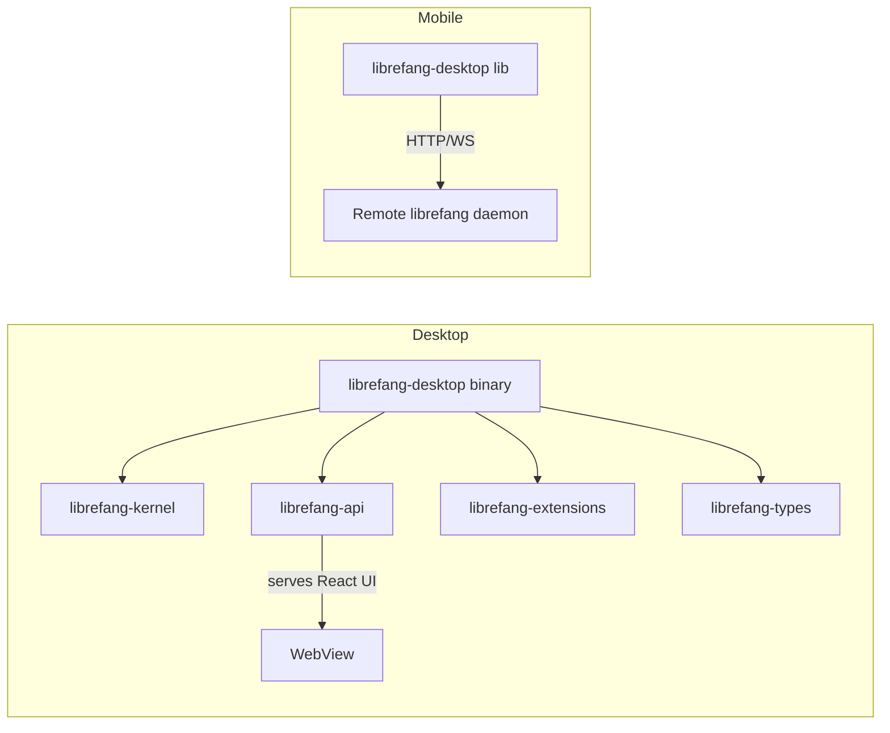

# Other — librefang-desktop

# librefang-desktop

Native desktop and mobile application for the LibreFang Agent OS, built on Tauri 2.0. This crate produces the installable GUI that users interact with on macOS, Windows, Linux, iOS, and Android.

## Purpose

LibreFang runs persistent background work — cron jobs, autodream, channel adapters, triggers — that requires 24×7 uptime. The desktop app embeds the full daemon and presents it through a system tray + webview interface. The mobile apps, by contrast, are **thin clients** that connect to a remote daemon over HTTP/WebSocket; they cannot host the daemon due to OS background execution limits.

## Architecture


```mermaid
graph LR
    subgraph Desktop
        DT[librefang-desktop binary] --> DK[librefang-kernel]
        DT --> DA[librefang-api]
        DT --> DX[librefang-extensions]
        DT --> DY[librefang-types]
        DA --> |"serves React UI"| WV[WebView]
    end
    subgraph Mobile
        MT[librefang-desktop lib] --> |"HTTP/WS"| RD[Remote librefang daemon]
    end
```

The desktop binary pulls in `librefang-kernel`, `librefang-api`, `librefang-extensions`, and `librefang-types` as direct dependencies. The Tauri runtime hosts the React frontend (served by `librefang-api/static/react`) inside a native webview window.

## Crate Layout

The manifest defines both a `[[bin]]` and a `[lib]`:

| Target | Path | Purpose |
|--------|------|---------|
| `bin` (`librefang-desktop`) | `src/main.rs` | Desktop entry point |
| `lib` (`staticlib`, `cdylib`, `lib`) | `src/lib.rs` | Shared library for mobile shells and desktop binary |

All three crate types (`staticlib`, `cdylib`, `lib`) are always produced. Cargo cannot conditionalize crate-type on `cfg(mobile)`, so desktop builds also emit `liblibrefang_desktop.a` and `liblibrefang_desktop.so`/`.dylib`. This adds ~10–20% to clean build time and is the known trade-off for a unified workspace.

## Platform-Specific Dependency Blocks

Dependencies are split across four `cfg` blocks in `Cargo.toml`:

### macOS + Windows (`not(ios, android, linux)`)

Always includes `tray-icon` and `image-png` features for Tauri. Native system tray uses `NSStatusItem` (macOS) and `Shell_NotifyIconW` (Windows) — no GTK dependency.

Plugins: `single-instance`, `autostart`, `global-shortcut`, `updater`, `shell`.

### Linux (`target_os = "linux"`)

Identical plugin set to macOS/Windows, but **`tray-icon` is excluded by default**. Tauri 2.10's `tray-icon` on Linux pulls `libappindicator-rs 0.9`, which transitively depends on 8 unmaintained GTK3 crates (RUSTSEC-2024-0411 through 0420) and a `glib` unsoundness (RUSTSEC-2024-0429). Headless server and CI builds don't need a tray. To opt in:

```bash
cargo build --features linux-tray
```

This is a conscious security trade-off tracked in issue #3667. The situation will resolve once Tauri migrates to `tray-icon 0.22+` or the `ksni` crate.

### iOS + Android (`any(ios, android)`)

Includes `tauri-plugin-barcode-scanner` (for the connection wizard QR flow) and `keyring` for credential storage. All desktop-only plugins are omitted.

## Cargo Features

| Feature | Default | Description |
|---------|---------|-------------|
| `default` | ✅ | Inherits `librefang-api/default` |
| `custom-protocol` | ❌ | Enables `tauri/custom-protocol` for production builds (uses `tauri://` instead of dev server) |
| `mobile` | ❌ | No-op flag documenting the mobile build path; actual gating uses `cfg(target_os)` |
| `linux-tray` | ❌ | Linux-only: re-enables system tray, accepting GTK3 dependency chain |

Removed features (`all-channels`, `mini`, `mobile-no-email`) — channel adapters are now sidecars, not Rust feature gates. CI workflows referencing these flags should drop the `-f` argument.

## Tauri Configuration

Tauri merges configuration from multiple JSON files at build time:

### `tauri.conf.json` (base)

- **Product name**: `LibreFang`
- **Identifier**: `ai.librefang.desktop`
- **`withGlobalTauri`**: `true` — exposes `__TAURI__` on `window` for frontend IPC
- **Windows**: empty array (windows are created programmatically at runtime)
- **CSP**: strict policy allowing `self`, `tauri:`, `ipc:`, and `127.0.0.1:*` for HTTP/WebSocket. External origins limited to Google Fonts. `object-src` is `none`. See the full policy in the manifest for specific directive values.

### `tauri.desktop.conf.json`

Configures the auto-updater plugin with a public key and endpoint pointing to GitHub Releases (`latest.json`). Windows install mode is `passive` (shows progress but requires no user interaction).

### `tauri.android.conf.json` / `tauri.ios.conf.json`

Override the identifier to `ai.librefang.app` and set the main window URL to `lfconnect://localhost/` (the mobile connection wizard). Frontend is served from `librefang-api/static/react`. Android `minSdkVersion` is 26; iOS `minimumSystemVersion` is 16.0.

## Desktop-Only Features

The following are compiled out on mobile via `cfg(not(any(target_os = "ios", target_os = "android")))`:

- **System tray icon** — with menu for quick actions
- **Single-instance enforcement** — prevents duplicate processes via `tauri-plugin-single-instance`
- **Autostart on login** — `tauri-plugin-autostart`
- **Global keyboard shortcuts** — `tauri-plugin-global-shortcut`
- **Auto-updater** — checks GitHub Releases, verifies signature with embedded public key
- **Shell/CLI process spawning** — `tauri-plugin-shell`

## Mobile Architecture

See `MOBILE.md` for the full guide. Key points:

- The mobile app is a dashboard that connects to a remote `librefang` daemon.
- No daemon is embedded in the mobile binary.
- Connection wizard uses a QR code scanner (`tauri-plugin-barcode-scanner`) to pair with the remote server.
- Credentials are stored in the OS keychain via the `keyring` crate.

**Minimum OS versions:**

| Platform | Minimum |
|----------|---------|
| iOS | 16.0 |
| Android | API 26 (Android 8.0) |

### Mobile dev commands

```bash
cd crates/librefang-desktop

# Android emulator (requires prior `cargo tauri android init`)
cargo tauri android dev

# iOS Simulator, macOS only (requires prior `cargo tauri ios init`)
cargo tauri ios dev
```

The generated `gen/android/` and `gen/apple/` directories must be committed after initialization.

## Building

```bash
# Desktop (debug)
cargo build -p librefang-desktop

# Desktop (release with custom protocol)
cargo build -p librefang-desktop --features custom-protocol --release

# Linux with system tray (accept GTK3 advisories)
cargo build -p librefang-desktop --features linux-tray

# Production Tauri bundle (dmgs, msis, appimages, debs)
cargo tauri build
```

The `build.rs` is minimal — it calls `tauri_build::build()` which generates the Tauri embed assets from the configuration files.

## Bundle Configuration

The Tauri bundler is configured to produce all target formats:

- **Linux**: `.deb` (no extra depends) and `.AppImage` (no media framework bundling)
- **macOS**: minimum system version 12.0 (Monterey)
- **Windows**: SHA-256 digest, WebView2 installed via download bootstrapper

## Relationship to Other Crates

| Crate | Relationship |
|-------|-------------|
| `librefang-kernel` | Core agent runtime, embedded in desktop binary |
| `librefang-api` | HTTP/WebSocket server serving the React UI and API endpoints |
| `librefang-types` | Shared type definitions |
| `librefang-extensions` | Sidecar channel adapters and plugin system |

The desktop app is the integration point — it wires the kernel and API together behind a native shell. Mobile only consumes `librefang-api` types for its remote connection.

## Security Notes

1. **Linux tray trade-off** (#3667): The `linux-tray` feature pulls deprecated GTK3 crates with known RUSTSEC advisories. Do not enable it in CI or headless server builds. Desktop users on distributions where a tray is expected should evaluate the risk.
2. **CSP policy**: The desktop CSP allows `http://127.0.0.1:*` and `ws://127.0.0.1:*` for local API communication. No external JavaScript or style sources are permitted beyond Google Fonts.
3. **Updater signing**: Release artifacts are verified against the embedded Ed25519 public key in `tauri.desktop.conf.json`.