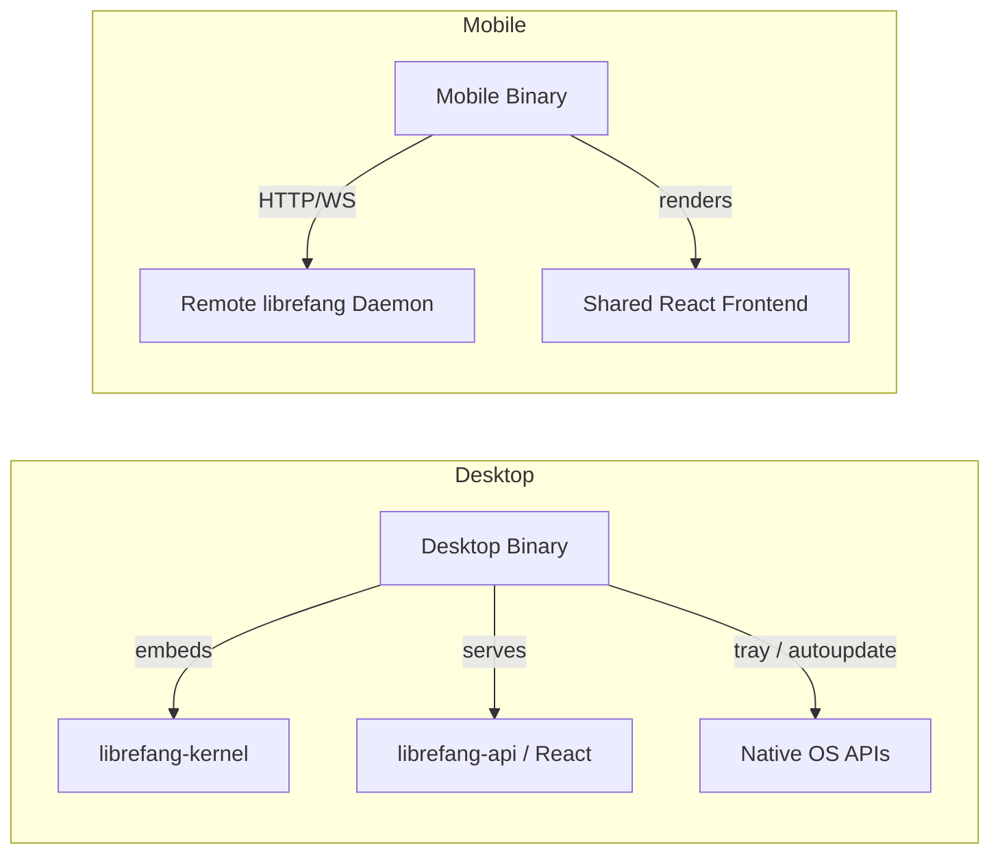

# Other — librefang-desktop

# librefang-desktop

Native desktop and mobile application for LibreFang, built on **Tauri 2.0**. This single crate produces binaries for four platforms (macOS, Windows, Linux, iOS, Android) with platform-specific feature sets gated by `cfg` attributes and Cargo features.

## Purpose

LibreFang is an Agent Operating System — it runs, orchestrates, and extends AI agents across channels 24×7. The desktop crate provides the native shell: a system tray, auto-update, autostart, and a windowed UI rendered from the shared React frontend bundled in `librefang-api`.

On mobile, the same crate compiles as a **thin client** that connects to a remote librefang daemon over HTTP/WebSocket. The daemon is never embedded in the mobile binary — iOS and Android cannot guarantee the uptime that cron, autodream, and channel adapters require.

## Architecture


```mermaid
graph LR
    subgraph Desktop
        DT[Desktop Binary] -->|embeds| Kernel[librefang-kernel]
        DT -->|serves| API[librefang-api / React]
        DT -->|tray / autoupdate| OS[Native OS APIs]
    end

    subgraph Mobile
        MT[Mobile Binary] -->|HTTP/WS| Daemon[Remote librefang Daemon]
        MT -->|renders| React[Shared React Frontend]
    end
```

### Dependency graph

The desktop crate sits at the top of the workspace dependency tree:

| Crate | Role |
|---|---|
| `librefang-kernel` | Core agent runtime — embedded in desktop builds |
| `librefang-api` | HTTP/WebSocket API server + static React frontend |
| `librefang-types` | Shared type definitions |
| `librefang-extensions` | Extension/plugin system |

## Platform targets

### macOS and Windows

Full feature set with no opt-in required:

- **System tray icon** — native `NSStatusItem` / `Shell_NotifyIconW`, no GTK dependency.
- **Single-instance enforcement** — `tauri-plugin-single-instance`.
- **Autostart on login** — `tauri-plugin-autostart`.
- **Global keyboard shortcuts** — `tauri-plugin-global-shortcut`.
- **Auto-updater** — `tauri-plugin-updater` with passive install mode on Windows. Public key and GitHub release endpoint configured in `tauri.desktop.conf.json`.
- **Shell plugin** — `tauri-plugin-shell` for CLI process spawning.

### Linux

Identical plugin set to macOS/Windows, except the **system tray is opt-in** (see [Linux tray and GTK3](#linux-tray-and-gtk3) below).

### iOS and Android

Compiled-out features: system tray, single-instance, autostart, global shortcuts, auto-updater, and shell plugin. Additional mobile-only dependencies are pulled in:

- `tauri-plugin-barcode-scanner` — QR-based connection wizard.
- `keyring` — native credential storage.

Mobile-specific Tauri configs (`tauri.android.conf.json`, `tauri.ios.conf.json`) set the window URL to `lfconnect://localhost/` and point `frontendDist` at the shared React build in `librefang-api/static/react`.

Minimum OS versions:

| Platform | Minimum |
|----------|---------|
| iOS | 16.0 |
| Android | API 26 (Android 8.0) |
| macOS | 12.0 |

## Cargo features

| Feature | Default | Description |
|---------|---------|-------------|
| `default` | ✅ | Inherits `librefang-api/default` |
| `custom-protocol` | ❌ | Production Tauri builds — activates `tauri/custom-protocol` |
| `mobile` | ❌ | Documentation-only flag; mobile targets are cfg-gated, not feature-gated |
| `linux-tray` | ❌ | Opts into `tauri/tray-icon` on Linux (see below) |

Removed features: `all-channels`, `mini`, `mobile-no-email` — channel adapters are now sidecars with no Rust feature gate. CI configs referencing these flags should drop the `-f` argument.

## Tauri configuration files

The crate uses Tauri 2.0's layered configuration system:

```
tauri.conf.json              — base: product name, identifier, CSP, bundle settings
tauri.desktop.conf.json      — desktop overlay: auto-updater pubkey + endpoints
tauri.android.conf.json      — Android overlay: bundle ID, min SDK, mobile window
tauri.ios.conf.json          — iOS overlay: bundle ID, minimum system version
```

### Content Security Policy

The desktop CSP (`tauri.conf.json`) allows:
- `self`, `tauri:`, `ipc:` for scripts and connections
- `http://127.0.0.1:*` and `ws://127.0.0.1:*` for local API communication
- Google Fonts for `style-src` / `font-src`
- `blob:` and `data:` for images and media
- `object-src 'none'` and `base-uri 'self'` as hardening

## Crate types

```toml
[lib]
crate-type = ["staticlib", "cdylib", "lib"]
```

iOS requires `staticlib` (linked by Xcode) and Android requires `cdylib` (loaded by the Tauri mobile runtime). `lib` (rlib) is kept so the desktop binary in `src/main.rs` can depend on the library normally.

**Trade-off**: Cargo cannot conditionalize `crate-type` on `cfg(mobile)`, so desktop builds also produce `staticlib` and `cdylib` outputs. This adds a link step costing ~10–20% extra build time on clean builds. If desktop build times become a bottleneck, this is the first place to investigate.

## Linux tray and GTK3

Tauri 2.10's `tray-icon` feature on Linux depends on `libappindicator-rs 0.9`, which transitively pulls in eight unmaintained GTK3 crates (RUSTSEC-2024-0411 through RUSTSEC-2024-0420) plus a `glib` unsoundness issue (RUSTSEC-2024-0429).

To avoid these advisories on headless Linux servers and CI:

- **Default**: `tray-icon` is **not** enabled on Linux. The app runs without a system tray.
- **Opt-in**: Pass `--features linux-tray` to enable the tray at the cost of the GTK3 dependency chain.
- **Future**: This will be resolved when Tauri migrates to `tray-icon 0.22+` / `ksni`, eliminating the GTK dependency. Tracked in issue #3667.

## Building and running

### Desktop (development)

```bash
# From the workspace root
cargo run -p librefang-desktop

# From crates/librefang-desktop/
cargo tauri dev
```

### Desktop (production bundle)

```bash
cargo tauri build
# Produces platform-specific bundles (dmg, msi, AppImage, deb)
```

### Android

```bash
cd crates/librefang-desktop
cargo tauri android init   # first time only
cargo tauri android dev    # emulator
```

### iOS (macOS only)

```bash
cd crates/librefang-desktop
cargo tauri ios init       # first time only
cargo tauri ios dev        # simulator
```

### Linux with system tray

```bash
cargo run -p librefang-desktop --features linux-tray
```

## Mobile release and distribution

- CI builds produce signed `.aab`, `.apk`, and `.ipa` artifacts in `.github/workflows/release.yml` (jobs `mobile_android` and `mobile_ios`).
- TestFlight and Play Internal Testing uploads are unattended in CI.
- Upload secrets are tracked in `.github/SECRETS.md`.
- The mobile privacy policy template is at `.github/templates/PRIVACY_MOBILE_TEMPLATE.md` — publish under `docs/src/app/privacy-mobile/` after legal review.
- Full release procedures, version-mapping rules, and the recovery runbook for failed uploads are in `docs/src/app/operations/mobile-release/page.mdx`.

## Related issues

| Issue | Topic |
|-------|-------|
| #3351 | Mobile epic |
| #3342 | Initial scaffold (this crate) |
| #3343 | Mobile UX |
| #3344 | Connection wizard + QR |
| #3345 | CI build jobs |
| #3348 | Distribution |
| #3667 | Linux tray / GTK3 migration |