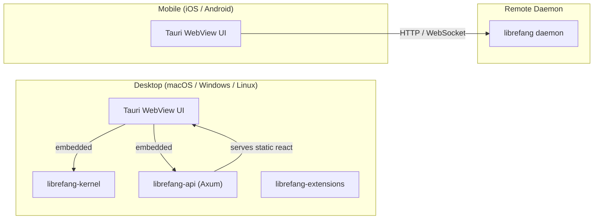

# Other — librefang-desktop

# librefang-desktop

Native client application for the LibreFang Agent OS, built on Tauri 2.0. Ships as a desktop app (macOS, Windows, Linux) and as a thin mobile client (iOS, Android) that connects to a remote LibreFang daemon.

## Architecture Overview


```mermaid
graph LR
    subgraph Desktop["Desktop (macOS / Windows / Linux)"]
        UI["Tauri WebView UI"]
        TK["librefang-kernel"]
        TA["librefang-api (Axum)"]
        EXT["librefang-extensions"]
    end

    subgraph Mobile["Mobile (iOS / Android)"]
        MUI["Tauri WebView UI"]
    end

    subgraph Remote["Remote Daemon"]
        DAEMON["librefang daemon"]
    end

    UI -- embedded --> TK
    UI -- embedded --> TA
    MUI -- HTTP / WebSocket --> DAEMON
    TA -- serves static react --> UI
```

On **desktop**, the kernel, API server, and extension runtime run in-process. On **mobile**, the app is a dashboard that connects to a separately-hosted daemon — iOS and Android cannot guarantee the background uptime required for cron jobs, autodream, channel adapters, and triggers.

## Directory Layout

```
librefang-desktop/
├── Cargo.toml                  # Workspace member manifest
├── build.rs                    # Tauri build script
├── MOBILE.md                   # Mobile build & distribution guide
├── tauri.conf.json             # Base Tauri 2 config (desktop)
├── tauri.desktop.conf.json     # Desktop-specific plugin config (updater)
├── tauri.android.conf.json     # Android overlay config
├── tauri.ios.conf.json         # iOS overlay config
├── src/
│   ├── main.rs                 # Desktop binary entry point
│   └── lib.rs                  # Shared library (desktop + mobile)
└── icons/                      # Bundle icons
```

## Key Dependencies

| Crate | Role |
|---|---|
| `librefang-kernel` | Core agent runtime (cron, triggers, channel adapters) |
| `librefang-api` | Axum HTTP/WS API server; also serves the React frontend |
| `librefang-types` | Shared data structures |
| `librefang-extensions` | Extension loading and sidecar management |
| `tauri` | Native shell + WebView (v2) |
| `tauri-plugin-*` | Autostart, single-instance, updater, shell, global shortcut, dialog, notification |

## Platform-Conditional Dependencies

Cargo target-specific dependency blocks control which plugins are available:

### macOS and Windows (`cfg(not(ios, android, linux))`)

All desktop plugins are always enabled — system tray uses native APIs (`NSStatusItem` on macOS, `Shell_NotifyIconW` on Windows) with no GTK dependency:

- `tauri` with features `tray-icon`, `image-png`
- `tauri-plugin-single-instance`
- `tauri-plugin-autostart`
- `tauri-plugin-global-shortcut`
- `tauri-plugin-updater`
- `tauri-plugin-shell`

### Linux (`cfg(target_os = "linux")`)

Identical plugin set except `tray-icon` is **opt-in** via the `linux-tray` Cargo feature. Tauri 2.10's `tray-icon` on Linux pulls `libappindicator-rs 0.9`, which transitively depends on 8 unmaintained GTK3 crates (RUSTSEC-2024-0411..0420) plus a `glib` unsoundness (RUSTSEC-2024-0429). Headless server and CI builds should not need a system tray.

See issue #3667 for context and the pending migration to `tray-icon 0.22+`/ksni.

### iOS and Android (`cfg(ios, android)`)

Desktop-only plugins are compiled out. Mobile gets:

- `tauri-plugin-barcode-scanner` — QR-based connection wizard
- `keyring` — secure credential storage

Features not available on mobile: system tray, single-instance, autostart, global shortcuts, auto-updater, CLI process spawning.

## Cargo Features

| Feature | Effect |
|---|---|
| `default` | Inherits `librefang-api/default` |
| `custom-protocol` | Enables `tauri/custom-protocol` for production builds (uses `tauri://` protocol instead of dev server) |
| `mobile` | No-op documentation flag; mobile targets are cfg-gated |
| `linux-tray` | Re-enables system tray on Linux (`tauri/tray-icon`). No-op on macOS/Windows where tray is always on |

## Crate Types

```toml
[lib]
crate-type = ["staticlib", "cdylib", "lib"]
```

- `staticlib` / `cdylib` — Required for iOS (Xcode links the static lib) and Android (Gradle loads the cdylib). Without these, `cargo tauri ios build` fails with "Library not found".
- `lib` (rlib) — Used by the desktop binary in `src/main.rs`.

Cargo cannot conditionalize crate-type on `cfg(mobile)`, so desktop builds also produce the `staticlib` and `cdylib` artifacts. This adds ~10–20% to clean build times.

## Tauri Configuration

Tauri 2 uses layered configuration. The base file is `tauri.conf.json`, with platform overlays merging on top.

### Base Config (`tauri.conf.json`)

- **Identifier**: `ai.librefang.desktop`
- **withGlobalTauri**: `true` — exposes Tauri APIs on `window.__TAURI__` for the React frontend
- **windows**: Empty array — windows are created programmatically at runtime
- **CSP**: Restrictive policy allowing `self`, `tauri:`, `ipc:`, and `127.0.0.1:*` for the embedded API server. Google Fonts are whitelisted. `object-src` is `none`.
- **Bundle targets**: `all` (platform-appropriate: dmg/app on macOS, msi/nsis on Windows, deb/appimage on Linux)
- **Minimum system versions**: macOS 12.0, Windows WebView2 via download bootstrapper

### Desktop Overlay (`tauri.desktop.conf.json`)

Configures the auto-updater:

- **Public key**: Ed25519 minisign key for update signature verification
- **Endpoint**: `https://github.com/librefang/librefang/releases/latest/download/latest.json`
- **Windows install mode**: `passive` (shows progress, no interaction required)

### Mobile Overlays

Both `tauri.android.conf.json` and `tauri.ios.conf.json` override:

- **Identifier**: `ai.librefang.app` (separate from desktop for store listings)
- **frontendDist**: `../librefang-api/static/react` — pre-built React bundle
- **Main window URL**: `lfconnect://localhost/` — custom protocol scheme for the mobile connection wizard
- **Minimum OS**: Android API 26 (8.0), iOS 16.0

## Building

### Desktop

```bash
# Development (from workspace root)
cargo run -p librefang-desktop

# Production bundle
cargo tauri build
```

### Linux with System Tray

```bash
cargo run -p librefang-desktop --features linux-tray
```

### Mobile

See `MOBILE.md` for full prerequisites (Android NDK 26+, Xcode 15+, etc.).

```bash
cd crates/librefang-desktop

# Android emulator
cargo tauri android dev

# iOS Simulator (macOS only)
cargo tauri ios dev
```

The `gen/android/` and `gen/apple/` directories are generated by `cargo tauri {android,ios} init` and must be committed after generation.

## Relationship to Other Crates

```
librefang-desktop
├── librefang-kernel      # Agent runtime (embedded on desktop)
├── librefang-api         # HTTP/WS server + React static files
│   └── librefang-types
└── librefang-extensions  # Sidecar channel adapters
```

The desktop binary is the primary integration point — it wires together the kernel, API server, extension system, and native shell. The mobile build links the same `lib.rs` but most desktop functionality is compiled out via `cfg` gates.

## Removed Features

The following Cargo features were removed and should not be referenced in CI or packaging:

- `all-channels` — channel adapters are now sidecars, not feature-gated
- `mini` — removed
- `mobile-no-email` — removed

CI workflows that previously used `-f mobile-no-email` or similar flags need to drop those flags.