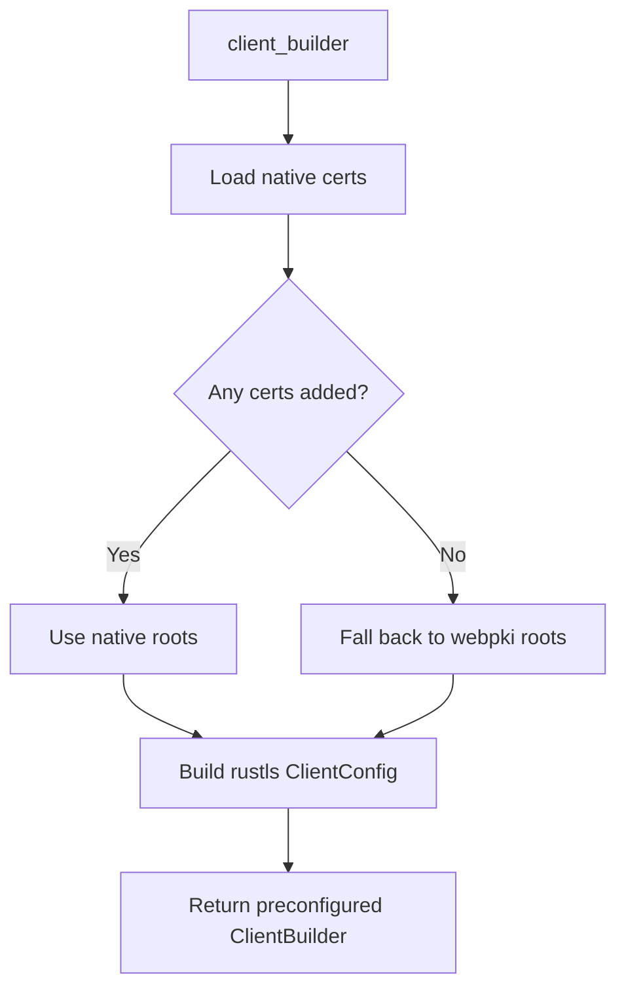

# Other — librefang-extensions-src

# librefang-extensions — HTTP Client

## Purpose

This module provides a shared `reqwest` HTTP client with robust TLS root certificate resolution. It ensures that HTTPS requests work reliably across different platforms by falling back from system-native certificates to bundled Mozilla roots when necessary.

## Architecture

Certificate trust is resolved at client construction time through a two-stage strategy:



## Public API

### `client_builder() -> ClientBuilder`

Returns a `reqwest::ClientBuilder` preconfigured with a `rustls` TLS config. The root certificate store is populated as follows:

1. Attempts to load certificates from the system's native certificate store via `rustls_native_certs::load_native_certs()`.
2. If zero native certificates were successfully parsed and added, falls back to Mozilla's bundled roots from `webpki_roots::TLS_SERVER_ROOTS`.

**TLS configuration details:**
- Crypto provider: `aws_lc_rs::default_provider()`
- Protocol versions: safe defaults (currently TLS 1.2+)
- Client authentication: none

Callers can chain additional configuration (timeouts, proxies, headers, etc.) before calling `.build()`.

### `new_client() -> reqwest::Client`

Convenience function that calls `client_builder()` and immediately builds the client. Panics if the build fails, which should never happen given the static TLS configuration.

Use this when you don't need to customize the builder. Use `client_builder()` when you need to set additional options.

## Usage Examples

```rust
// Simple case — just get a working client
let client = new_client();
let resp = client.get("https://example.com").send().await?;

// Customized — adjust timeouts, user agent, etc.
let client = client_builder()
    .timeout(Duration::from_secs(30))
    .user_agent("librefang/1.0")
    .build()?;
```

## Why Both Native and Bundled Roots

System certificate stores vary widely across platforms and container environments. Alpine-based Docker images, for instance, may lack the expected CA bundle paths. By falling back to `webpki_roots`, the client remains functional even when the host's certificate infrastructure is missing or misconfigured. When native roots *are* available, they take precedence so that privately-trusted CAs (e.g., corporate proxies) continue to work.