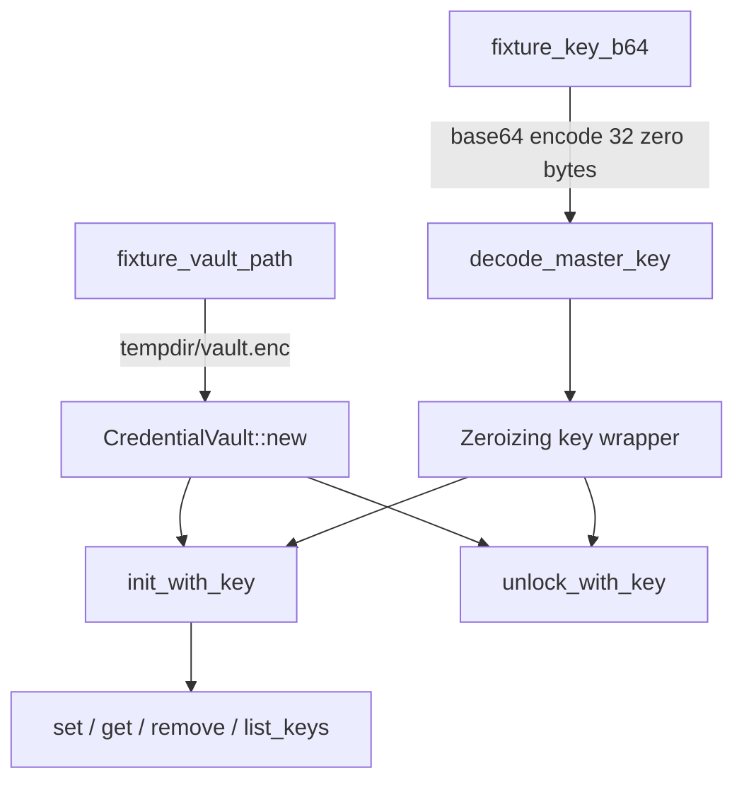

# Other — librefang-extensions-tests

# librefang-extensions/tests/vault_roundtrip.rs

Integration tests for the `CredentialVault` implementation, validating the encrypt → persist → reload → decrypt lifecycle and several security invariants the daemon depends on.

## Purpose

These tests exist because the vault is on the critical path for credential management (issues #3651, #3696). A silent corruption or authentication bypass would compromise the entire system. The suite is deliberately self-contained—no OS keyring, no environment variables—so it runs reliably in CI without host-specific setup.

## Tested Invariants

### 1. Key length enforcement (`decode_master_key_rejects_wrong_byte_length`)

`decode_master_key` accepts only a base64 string that decodes to exactly 32 bytes. This pins a common footgun: 32 ASCII characters encode to 24 bytes after base64 decode, not 32. The test asserts both the rejection path (24-byte key) and the happy path (32-byte key).

### 2. Round-trip consistency (`vault_roundtrip_encrypt_then_decrypt_with_same_key`)

The core lifecycle:

```
init_with_key → set (×N) → drop → new → unlock_with_key → get
```

After vault initialization, entries are written, the vault is dropped (simulating process restart with only the encrypted file surviving), then reopened and unlocked with the same key. All stored values must be recoverable byte-for-byte.

This test also verifies that `list_keys` returns user-facing keys but **excludes** the `SENTINEL_KEY` internal sentinel (see invariant 4).

### 3. Wrong-key rejection (`vault_unlock_with_wrong_key_fails`)

A vault initialized under key A must fail to unlock under key B. AES-GCM authenticated encryption guarantees this—the decryption fails loudly rather than yielding corrupt plaintext. The test accepts either `ExtensionError::Vault` or `ExtensionError::VaultKeyMismatch` since the exact variant depends on the vault format version. After failure, `is_unlocked()` must return `false`.

### 4. Sentinel key protection (`vault_rejects_writes_to_reserved_sentinel_key`)

The `SENTINEL_KEY` constant (the #3651 sentinel) is owned by the vault implementation. External callers must not overwrite or remove it via the public `set` / `remove` APIs. Both operations must surface `ExtensionError::Vault`.

## Test Architecture



### Helper Functions

| Function | Purpose |
|---|---|
| `fixture_key_b64()` | Returns a deterministic base64-encoded 32-byte key (all zeros). Not cryptographically strong—only for reproducibility. |
| `fixture_vault_path(tmp)` | Returns `tmp.path().join("vault.enc")`, isolating each test's file on disk. |

### Production APIs Under Test

| API | Tested by |
|---|---|
| `decode_master_key` | `decode_master_key_rejects_wrong_byte_length`, plus every test that calls `fixture_key_b64` |
| `CredentialVault::new` | All vault tests |
| `init_with_key` | All vault tests (creates a fresh vault on disk) |
| `unlock_with_key` | `vault_roundtrip_encrypt_then_decrypt_with_same_key`, `vault_unlock_with_wrong_key_fails` |
| `set` | Round-trip test, sentinel test, wrong-key test |
| `get` | Round-trip test |
| `remove` | Sentinel test |
| `list_keys` | Round-trip test |
| `is_unlocked` | Round-trip test, wrong-key test |

## Design Decisions

**No OS keyring dependency.** All tests use explicit master keys via `init_with_key` / `unlock_with_key`. This avoids `KeyringError` or missing keychain entries in headless CI.

**Zeroizing everywhere.** Keys and values are wrapped in `Zeroizing` to match production usage patterns and ensure the test code doesn't accidentally depend on non-zeroing behavior.

**tempfile for isolation.** Each test creates its own `TempDir`, so tests can run in parallel without file contention. The encrypted file is the only artifact; everything else lives in memory and is zeroed on drop.

**Relaxed error variant matching.** The wrong-key test accepts both `ExtensionError::Vault(_)` and `ExtensionError::VaultKeyMismatch { .. }` because the underlying AES-GCM failure routing has changed between format versions. The contract being tested is "non-Ok result," not a specific enum variant.