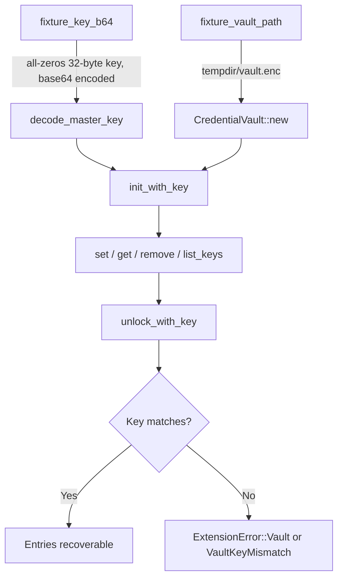

# Other — librefang-extensions-tests

# librefang-extensions-tests: Credential Vault Integration Tests

Integration test suite for the `CredentialVault` subsystem. Exercises the full encrypt → persist → reload → decrypt lifecycle against real disk I/O (via `tempfile`), validating invariants the daemon relies on at boot and at runtime.

## Scope

The tests live in `librefang-extensions/tests/vault_roundtrip.rs` and target the public API surface exposed by `librefang_extensions::vault`:

| API under test | What is verified |
|---|---|
| `decode_master_key` | Rejects keys that don't decode to exactly 32 bytes; accepts valid 32-byte keys |
| `CredentialVault::new` + `init_with_key` | Fresh vault initialisation on an empty path |
| `set` / `get` / `list_keys` / `remove` | Normal CRUD operations, plus sentinel key filtering |
| `unlock_with_key` | Re-opening an existing vault file with the correct key; rejection of a wrong key |

No OS keyring, environment variables, or network services are required. All disk state lives inside a `tempfile::TempDir` that is cleaned up on drop.

## Key Invariants Verified

### 1. Master key length enforcement (`decode_master_key_rejects_wrong_byte_length`)

`decode_master_key` requires a base64-encoded string that decodes to **exactly 32 bytes**. A common mistake is passing 32 ASCII characters (which base64-decodes to 24 bytes). The test pins this rejection so a future caller cannot accidentally boot with a truncated key.

```rust
// 24 raw bytes → base64 string → decode_master_key → Error
// 32 raw bytes → base64 string → decode_master_key → Ok
```

### 2. Full round-trip (`vault_roundtrip_encrypt_then_decrypt_with_same_key`)

Proves that data written in one `CredentialVault` lifetime survives to the next:

1. Initialise a fresh vault with key K.
2. Write two entries (`OPENAI_API_KEY`, `ANTHROPIC_API_KEY`).
3. **Drop** the vault (in-memory state is zeroed; only the encrypted file survives).
4. Reopen the same file with key K.
5. Assert both entries decrypt to their original values.
6. Assert `list_keys` returns user-facing keys but **hides** the internal `SENTINEL_KEY`.

### 3. Wrong-key rejection (`vault_unlock_with_wrong_key_fails`)

AES-GCM authenticates ciphertext, so a mismatched key must fail loudly rather than produce garbage plaintext. This is the contract the boot path depends on (issue #3651). The test accepts either `ExtensionError::Vault(_)` or `ExtensionError::VaultKeyMismatch { .. }` — the specific variant is not pinned because it has changed across format versions. The contract is simply: **non-`Ok`, and `is_unlocked()` remains `false`**.

### 4. Sentinel key write protection (`vault_rejects_writes_to_reserved_sentinel_key`)

The `SENTINEL_KEY` constant (introduced for #3651) is owned by the vault implementation. The public `set` and `remove` methods must reject any attempt to write to or delete it, preventing external callers from silently breaking the boot-path verification branch.

## Test Architecture



### Helper Functions

- **`fixture_key_b64()`** — Returns a deterministic base64-encoded 32-byte key (all zeros). Not cryptographically strong, but sufficient for round-trip validation. Mirrors the production recipe: `openssl rand -base64 32` produces 44 chars decoding to 32 bytes.
- **`fixture_vault_path(tmp)`** — Returns `tmp.path().join("vault.enc")` for a given `TempDir`.

### External Dependencies

| Crate | Role |
|---|---|
| `librefang_extensions` | Provides `CredentialVault`, `decode_master_key`, `SENTINEL_KEY`, `ExtensionError` |
| `tempfile` | Creates isolated temporary directories for each test |
| `base64` | Encodes/decodes test keys; uses the `Engine` trait |
| `zeroize` | `Zeroizing<T>` wrapper ensures sensitive key material is wiped on drop |

## Relationship to Production Code

These tests exercise the **public API only** — no direct file I/O, no knowledge of the on-disk format, no access to private vault internals. This means:

- The on-disk encryption format can evolve without rewriting tests (as long as the API contract holds).
- The sentinel key behavior is enforced at the API boundary, not via file-level checks.
- The `ExtensionError` variants tested (`Vault`, `VaultKeyMismatch`) are the same ones the daemon's boot path handles, ensuring error propagation remains consistent.

### References to related issues

| Issue | Relevance |
|---|---|
| #3696 | Original credential vault feature — this test module was introduced alongside it |
| #3651 | Sentinel key mechanism — tested here to prevent regressions in write protection and `list_keys` filtering |

## Running

```sh
# Run just the vault integration tests
cargo test -p librefang-extensions --test vault_roundtrip

# Run with output visible
cargo test -p librefang-extensions --test vault_roundtrip -- --nocapture
```

No special environment setup is required. Tests are fully self-contained and safe to run in parallel.