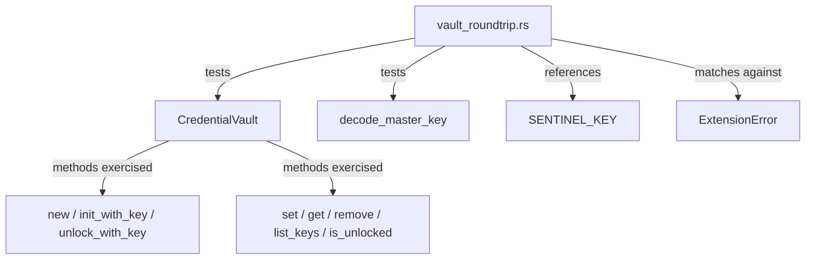

# Other — librefang-extensions-tests

# librefang-extensions-tests: Vault Round-Trip Integration Tests

## Purpose

This test module validates the `CredentialVault` implementation in `librefang-extensions/src/vault.rs`. It exercises the full encrypt → persist → reload → decrypt lifecycle using an explicit master key, with no dependency on the OS keyring or environment variables. The tests pin several invariants that the rest of the daemon relies on at boot and at runtime.

## What Is Being Tested

The module targets four behavioral contracts of the vault:

1. **Key decoding strictness** — `decode_master_key` only accepts base64 strings that decode to exactly 32 bytes.
2. **Round-trip integrity** — Data written under key *K* and recovered after a drop/reopen cycle is identical.
3. **Wrong-key rejection** — AES-GCM authentication ensures a vault created under key *A* cannot be unlocked with key *B*. The failure is explicit, not silent corruption.
4. **Sentinel key protection** — The internal `SENTINEL_KEY` (the #3651 boot-path sentinel) is invisible to `list_keys` and immutable via `set`/`remove`.

## Test Inventory

### `decode_master_key_rejects_wrong_byte_length`

Validates the 32-byte master key contract. A common mistake is passing 32 ASCII characters (which base64-decodes to only 24 bytes). This test pins that rejection so the error surfaces early rather than producing a truncated key that silently weakens encryption.

- **Rejects** a base64-encoded 24-byte key with an error containing `"Invalid key length"`.
- **Accepts** a base64-encoded 32-byte key and confirms the decoded bytes match.

### `vault_roundtrip_encrypt_then_decrypt_with_same_key`

The core lifecycle test, executed in two phases to simulate process restart:

```
Phase 1                          Phase 2
┌────────────────────┐           ┌────────────────────┐
│ CredentialVault    │  drop →   │ CredentialVault    │
│   init_with_key(K) │           │   unlock_with_key(K)│
│   set("OPENAI…")   │           │   get("OPENAI…")    │
│   set("ANTHROPIC…")│           │   get("ANTHROPIC…") │
│   (vault dropped)  │           │   list_keys()       │
└────────────────────┘           └────────────────────┘
```

- Phase 1: Creates a vault at a temp path, writes two credential entries, then drops the vault. The in-memory `Zeroizing` wrappers ensure plaintext is wiped on drop; only the encrypted file survives on disk.
- Phase 2: Reconstructs a `CredentialVault` pointing to the same file, unlocks with the same key, and asserts that `get` returns the original values.
- Also verifies that `list_keys` returns user-visible keys (`OPENAI_API_KEY`, `ANTHROPIC_API_KEY`) but **excludes** `SENTINEL_KEY`.

### `vault_unlock_with_wrong_key_fails`

Initialises a vault under key *A*, writes a credential, then attempts to unlock the same file under key *B*. Asserts:

- The unlock call returns an error matching either `ExtensionError::Vault(_)` or `ExtensionError::VaultKeyMismatch { .. }`. The test does not pin a specific variant because the AES-GCM failure path has been routed through both depending on vault format version.
- `is_unlocked()` remains `false` after the failed attempt — the vault must not enter an inconsistent unlocked state.

This contract is critical for the boot path (#3651): a wrong-key failure must be detectable so the daemon can prompt for re-authentication rather than proceed with garbage.

### `vault_rejects_writes_to_reserved_sentinel_key`

Attempts both `set` and `remove` on `SENTINEL_KEY`. Both must return `ExtensionError::Vault(_)`. If external code could overwrite or delete the sentinel, the boot-path verify branch would silently break.

## Test Helpers

| Function | Purpose |
|---|---|
| `fixture_key_b64()` | Returns a deterministic base64-encoded 32-byte key (all zeros). Not cryptographically strong — only used for reproducibility. |
| `fixture_vault_path(tmp)` | Returns `tmp.path().join("vault.enc")` — a consistent file name inside the provided `TempDir`. |

All tests use `tempfile::TempDir` to ensure vault files are cleaned up after each test run, with no cross-test state leakage.

## Dependencies on Production Code



### Imports

- `librefang_extensions::vault` — `decode_master_key`, `CredentialVault`, `SENTINEL_KEY`
- `librefang_extensions::ExtensionError` — error variants `Vault(_)` and `VaultKeyMismatch { .. }`
- `tempfile::TempDir` — isolated filesystem per test
- `zeroize::Zeroizing` — ensures test key material and credential values follow the same zero-on-drop discipline as production code
- `base64::Engine` — encodes/decodes test fixture keys

## Running These Tests

These are standard `#[test]` functions. Because they rely only on filesystem temp directories and explicit keys (no OS keyring, no network), they run fully offline and are safe for CI:

```sh
cargo test -p librefang-extensions --test vault_roundtrip
```

## Design Notes for Contributors

- **Do not relax the 32-byte requirement** in `decode_master_key_rejects_wrong_byte_length` without also updating the production `decode_master_key` function and CLAUDE.md. The 32-byte length is a security property (AES-256).
- **Do not pin a specific `ExtensionError` variant** for the wrong-key test. The error routing depends on vault format internals that may change across versions; the contract is "non-Ok," not a specific discriminant.
- **The sentinel key tests exist because** the sentinel is part of the boot-path verification flow (#3651). If the vault implementation changes how internal keys are stored, these tests ensure the public API still prevents external mutation.
- **`Zeroizing` wrappers in tests mirror production usage.** Tests should always wrap key material and credential values in `Zeroizing::new(...)` to validate that the API compiles and behaves correctly with that wrapper.