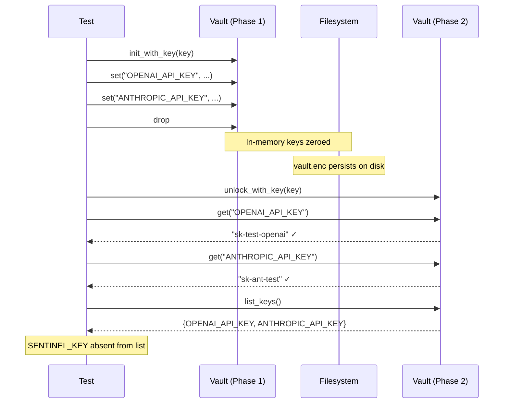

# Other — librefang-extensions-tests

# librefang-extensions: Vault Round-Trip Integration Tests

## Overview

`vault_roundtrip.rs` is an integration test suite that validates the **encrypt → persist → reload → decrypt** lifecycle of `CredentialVault`. It operates entirely through the public API, using an explicit master key to avoid dependencies on the OS keyring or environment variables. This makes the suite deterministic and safe to run in any CI environment.

The tests pin several invariants that the rest of the daemon depends on at boot time, particularly around the #3651 sentinel key and the #3696 vault feature.

## Test Architecture

```
┌─────────────────────────────────┐
│       vault_roundtrip.rs        │
│  (integration test binary)      │
├─────────────────────────────────┤
│  Helpers:                       │
│  • fixture_key_b64()            │──── base64::encode
│  • fixture_vault_path()         │──── tempfile::TempDir
├─────────────────────────────────┤
│  Tests call into:               │
│  • CredentialVault::new         │
│  • init_with_key / unlock_with  │
│  • set / get / remove           │
│  • list_keys / is_unlocked      │
│  • decode_master_key            │
│  • SENTINEL_KEY (constant)      │
└─────────────────────────────────┘
          │
          ▼
┌─────────────────────────────────┐
│  librefang_extensions::vault    │
│  (production module under test) │
└─────────────────────────────────┘
```

## Test Fixtures

### `fixture_key_b64() → String`

Returns a deterministic base64-encoded 32-byte key (all zeros). The key has no cryptographic strength; it exists solely to verify that the same key value reproduces the same vault contents on reopen. This mirrors the production recipe of `openssl rand -base64 32` (44 base64 characters decoding to exactly 32 bytes).

### `fixture_vault_path(tmp: &TempDir) → PathBuf`

Resolves to `tmp.path().join("vault.enc")`. Each test creates its own `TempDir`, ensuring complete isolation between vault instances.

## Test Cases

### `decode_master_key_rejects_wrong_byte_length`

**What it verifies:** `decode_master_key` enforces a strict 32-byte requirement after base64 decoding.

**Why it matters:** A common mistake is passing 32 ASCII characters directly (which base64-decodes to only 24 bytes). This test pins the "gotcha" documented in CLAUDE.md so a future caller cannot accidentally boot with a truncated key.

**Behaviour validated:**

| Input | Raw bytes after decode | Result |
|---|---|---|
| base64 of 24 bytes | 24 bytes | `Err` containing `"Invalid key length"` |
| base64 of 32 bytes | 32 bytes | `Ok`, key matches original bytes |

---

### `vault_roundtrip_encrypt_then_decrypt_with_same_key`

**What it verifies:** The full encrypt-persist-reload-decrypt round-trip.

**Flow:**



**Additional invariant checked:** `list_keys()` returns user-visible keys but filters out `SENTINEL_KEY` (the #3651 internal sentinel). This ensures the public API never leaks implementation details.

---

### `vault_unlock_with_wrong_key_fails`

**What it verifies:** A vault initialised under key A cannot be unlocked with a different key B.

**Why it matters:** AES-GCM provides authenticated encryption, so a wrong key produces an authentication failure rather than silently corrupting state. The daemon's boot path (#3651) depends on this contract— it must receive a definitive error, not garbled plaintext.

**Behaviour validated:**

- `unlock_with_key` returns `Err(ExtensionError::Vault(_))` or `Err(ExtensionError::VaultKeyMismatch { .. })`
- After a failed unlock, `is_unlocked()` returns `false`
- Both error variants are accepted because the underlying AES-GCM failure message has historically been routed through either variant depending on the file format version

---

### `vault_rejects_writes_to_reserved_sentinel_key`

**What it verifies:** The `SENTINEL_KEY` constant is protected from external mutation.

**Why it matters:** The sentinel is owned by the vault implementation and used internally by the boot-path verify branch (#3651). Allowing external callers to overwrite or remove it would silently break vault integrity checks.

**Behaviour validated:**

| Operation on `SENTINEL_KEY` | Result |
|---|---|
| `set(SENTINEL_KEY, ...)` | `Err(ExtensionError::Vault(_))` |
| `remove(SENTINEL_KEY)` | `Err(ExtensionError::Vault(_))` |

## API Surface Under Test

All calls exercise the public API of `librefang_extensions::vault`:

| Function / Method | Tested by |
|---|---|
| `decode_master_key(b64) → Result<Zeroizing<[u8;32]>>` | `decode_master_key_rejects_wrong_byte_length`, all others indirectly |
| `CredentialVault::new(path)` | every test |
| `init_with_key(key)` | `vault_roundtrip_...`, `vault_unlock_with_wrong_key...`, `vault_rejects_writes_...` |
| `unlock_with_key(key)` | `vault_roundtrip_...`, `vault_unlock_with_wrong_key...` |
| `set(key, value)` | `vault_roundtrip_...`, `vault_unlock_with_wrong_key...`, `vault_rejects_writes_...` |
| `get(key) → Option<Zeroizing<String>>` | `vault_roundtrip_...` |
| `remove(key)` | `vault_rejects_writes_...` |
| `list_keys() → Vec<String>` | `vault_roundtrip_...` |
| `is_unlocked() → bool` | `vault_roundtrip_...`, `vault_unlock_with_wrong_key...` |
| `SENTINEL_KEY` constant | `vault_roundtrip_...` (absence check), `vault_rejects_writes_...` |

## Design Decisions

- **No OS keyring dependency.** All tests use `init_with_key` / `unlock_with_key` with an explicit key, not the OS keyring integration. This keeps the suite portable and CI-friendly.
- **No env-var dependency.** The master key is generated in-process via `fixture_key_b64()`, not read from the environment.
- **Deterministic key.** The all-zeros key is intentionally weak but sufficient— tests verify round-trip correctness and invariant enforcement, not cryptographic strength.
- **`Zeroizing` wrappers everywhere.** Every key and credential value is wrapped in `Zeroizing` to match production usage patterns and ensure the test code doesn't accidentally diverge from the API's ownership model.

## Adding New Tests

When adding vault invariants to this file:

1. Create a fresh `tempfile::tempdir()` for isolation.
2. Use `fixture_key_b64()` and `decode_master_key` for key setup.
3. Use `fixture_vault_path(&tmp)` for the vault file path.
4. Wrap all key/credential values in `Zeroizing::new(...)`.
5. Assert against `ExtensionError::Vault(_)` or `ExtensionError::VaultKeyMismatch { .. }` for error cases— do not pin a specific error message string, as AES-GCM routing may change across format versions.