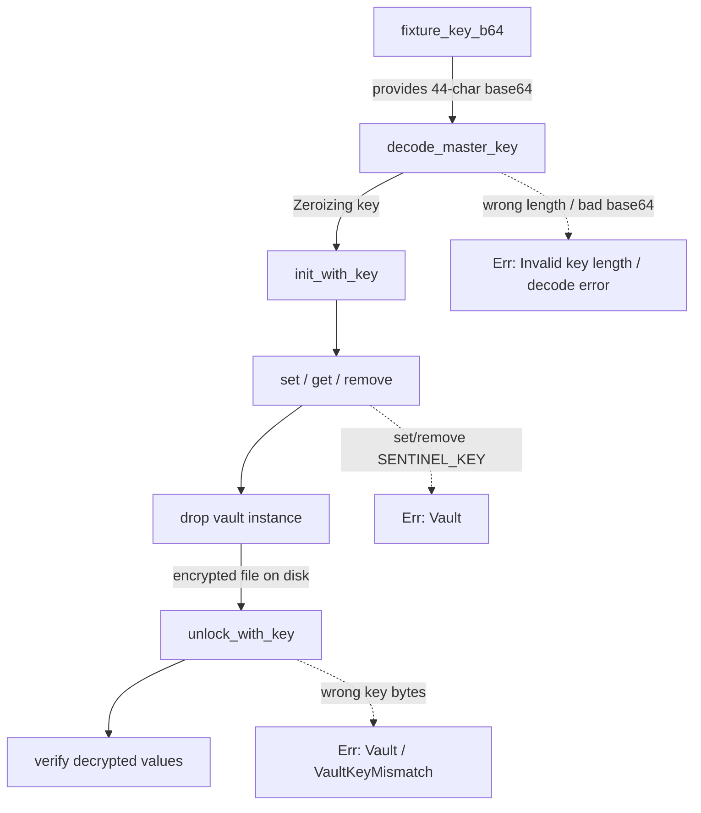

# Other — librefang-extensions-tests

# librefang-extensions/tests — Credential Vault Integration Tests

## Overview

This module contains integration tests for the `CredentialVault` type defined in `librefang_extensions::vault`. It validates the full encrypt → persist → reload → decrypt lifecycle along with several security invariants that the daemon depends on at boot time.

The tests deliberately avoid the OS keyring and environment variables. Every test constructs an explicit master key and a temporary file path, making the suite reproducible on any host without setup.

## Test Inventory

### Key Decoding

| Test | What it pins |
|---|---|
| `decode_master_key_rejects_wrong_byte_length` | A base64 string that decodes to fewer than 32 bytes is rejected with an `Invalid key length` error. |
| `decode_master_key_rejects_literal_32_ascii_chars` | Two foot-gun cases: (1) 32 characters that are valid base64 but decode to only 24 bytes, and (2) 32 characters outside the base64 alphabet. Both must surface a structured error, never a silently truncated key. Also confirms that a correct 44-character base64 string (the `openssl rand -base64 32` recipe) is accepted. |

### Vault Lifecycle

| Test | What it pins |
|---|---|
| `vault_roundtrip_encrypt_then_decrypt_with_same_key` | Initialise a vault, write entries, drop the instance, reopen from the encrypted file with the same key, and verify every value round-trips intact. Also checks that `list_keys` returns user keys but excludes the internal `SENTINEL_KEY`. |
| `vault_unlock_with_wrong_key_fails` | A vault initialised under key A must refuse to unlock under key B. The error must be `ExtensionError::Vault(_)` or `ExtensionError::VaultKeyMismatch`, and `is_unlocked()` must remain `false`. This relies on AES-GCM authentication—wrong keys produce a decryption failure, not garbage plaintext. |
| `vault_rejects_writes_to_reserved_sentinel_key` | The `SENTINEL_KEY` constant (the #3651 sentinel) cannot be overwritten via `set` or deleted via `remove`. Both operations must return `ExtensionError::Vault(_)`. |

## Key Concepts

### The 32-byte / 44-character Key Contract

`decode_master_key` expects a **base64-encoded** string that decodes to exactly 32 raw bytes. The documented production recipe is `openssl rand -base64 32`, which produces a 44-character string. A common mistake is pasting 32 raw ASCII characters and assuming that counts as 32 bytes—it does not. Base64 decoding 32 characters yields only 24 bytes. The tests in this file pin that rejection behaviour.

```
# Correct:  44 base64 chars → 32 raw bytes
openssl rand -base64 32   →  "AAAAAAAAAAAAAAAAAAAAAAAAAAAAAAAAAAAAAAAAAAA=" (44 chars)

# Wrong:    32 ASCII chars → 24 raw bytes (rejected)
"xxxxxxxxxxxxxxxxxxxxxxxxxxxxxxxx"  (32 chars, all valid base64 → 24 bytes)
```

### Sentinel Key (#3651)

`SENTINEL_KEY` is a reserved internal key used by the vault implementation to verify integrity at boot. It must never appear in `list_keys` output, and external callers must not be able to `set` or `remove` it. Violating this invariant would silently break the boot-path verification branch.

## Test Flow Diagram


```mermaid
flowchart TD
    A[fixture_key_b64] -->|provides 44-char base64| B[decode_master_key]
    B -->|Zeroizing key| C[init_with_key]
    C --> D[set / get / remove]
    D --> E[drop vault instance]
    E -->|encrypted file on disk| F[unlock_with_key]
    F --> G[verify decrypted values]
    B -.->|wrong length / bad base64| H[Err: Invalid key length / decode error]
    F -.->|wrong key bytes| I[Err: Vault / VaultKeyMismatch]
    D -.->|set/remove SENTINEL_KEY| J[Err: Vault]
```

## Helper Functions

### `fixture_key_b64() -> String`

Returns a deterministic 44-character base64 string encoding 32 zero bytes. Not cryptographically strong—its purpose is to provide a stable key that round-trips through `decode_master_key` and reproduces identical vault contents on reopen.

### `fixture_vault_path(tmp: &TempDir) -> PathBuf`

Joins `vault.enc` to the temporary directory root. Every test gets its own isolated file via `tempfile::tempdir()`, so tests can run in parallel without contention.

## Dependencies on `librefang_extensions::vault`

The tests exercise these public items from the vault module:

- `CredentialVault::new` — construct with a file path (no I/O yet)
- `CredentialVault::init_with_key` — create a new encrypted vault file
- `CredentialVault::unlock_with_key` — open an existing vault file
- `CredentialVault::is_unlocked` — check in-memory state
- `CredentialVault::set` / `get` / `remove` / `list_keys` — CRUD on entries
- `decode_master_key` — validate and decode a base64 master key string
- `SENTINEL_KEY` — the reserved internal key constant

Error variants asserted against:

- `ExtensionError::Vault(_)` — general vault operation failure
- `ExtensionError::VaultKeyMismatch { .. }` — wrong-key unlock (format-dependent)

## Running

```sh
# From the workspace root
cargo test -p librefang-extensions --test vault_roundtrip

# Single test
cargo test -p librefang-extensions --test vault_roundtrip -- decode_master_key_rejects_literal_32_ascii_chars
```

No environment variables or OS keyring setup is required. The `tempfile` crate creates and cleans up all disk artefacts automatically.