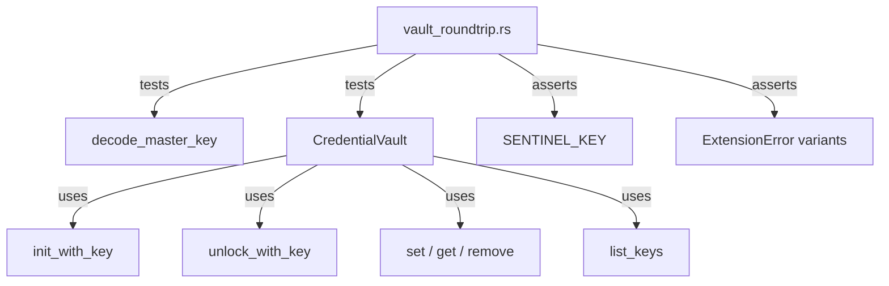

# Other — librefang-extensions-tests

# librefang-extensions-tests: Vault Round-Trip Integration Tests

## Purpose

This module (`vault_roundtrip.rs`) validates the **encrypt → persist → reload → decrypt** lifecycle of the `CredentialVault` and the `decode_master_key` utility. It operates entirely outside the OS keyring and without environment variables, using an explicit master key so tests are hermetic and repeatable on any host.

The tests protect four invariants that the daemon boot path and runtime depend on:

1. Master key decoding enforces exactly 32 bytes after base64 decode.
2. A vault initialised with key *K* can only be unlocked with the same key *K*.
3. The internal sentinel key (`SENTINEL_KEY`, issue #3651) is invisible to `list_keys` and immutable via `set`/`remove`.
4. Structured errors surface for every failure mode—no silent truncation or corruption.

## Relationship to Production Code


```mermaid
graph TD
    A[vault_roundtrip.rs] -->|tests| B[decode_master_key]
    A -->|tests| C[CredentialVault]
    C -->|uses| D[init_with_key]
    C -->|uses| E[unlock_with_key]
    C -->|uses| F["set / get / remove"]
    C -->|uses| G[list_keys]
    A -->|asserts| H[SENTINEL_KEY]
    A -->|asserts| I[ExtensionError variants]
```

The module imports from two production surfaces:

- **`librefang_extensions::vault`** — `decode_master_key`, `CredentialVault`, `SENTINEL_KEY`
- **`librefang_extensions::ExtensionError`** — `Vault(_)` and `VaultKeyMismatch { .. }` error variants

## Test Fixtures

### `fixture_key_b64() → String`

Returns a deterministic, all-zeros 32-byte key encoded as base64 (44 characters). This mirrors the production recipe (`openssl rand -base64 32` → 44 chars → 32 bytes). Cryptographic strength is irrelevant here; only key-length correctness and round-trip fidelity matter.

### `fixture_vault_path(tmp: &TempDir) → PathBuf`

Resolves `vault.enc` inside the provided temporary directory. Every test creates its own `TempDir` so vaults are fully isolated.

## Test Cases

### `decode_master_key_rejects_wrong_byte_length`

**What it covers.** The 32-byte length contract. Base64-decoding a 24-byte payload produces valid base64 but the wrong length.

**Behaviour pinned:**
- A 24-byte payload (valid base64, wrong length) → `Err` containing `"Invalid key length"`.
- A genuine 32-byte payload → `Ok`, with `key.as_ref()` matching the original bytes.

### `decode_master_key_rejects_literal_32_ascii_chars`

**What it covers.** The operator foot-gun documented in CLAUDE.md: typing 32 ASCII characters does **not** produce a 32-byte key. This test locks in two distinct failure modes plus the correct recipe.

| Input | Length | Base64-valid? | Decoded bytes | Expected result |
|---|---|---|---|---|
| `"x" × 32` | 32 chars | Yes | 24 | `Err` — `"Invalid key length"` mentioning 32 |
| `"!" × 32` | 32 chars | No | — | `Err` — contains `"decode"` |
| `base64([0xAB; 32])` | 44 chars | Yes | 32 | `Ok` — key matches `[0xAB; 32]` |

The third case is the sanity anchor confirming the documented `openssl rand -base64 32` shape (44 chars) is accepted.

### `vault_roundtrip_encrypt_then_decrypt_with_same_key`

**What it covers.** The full encrypt-persist-reload-decrypt lifecycle across vault drop and reopen.

**Flow:**

1. **Phase 1 — Write:** Create vault, `init_with_key`, `set` two entries (`OPENAI_API_KEY`, `ANTHROPIC_API_KEY`), then drop the vault. On drop, in-memory key material is zeroed; only the encrypted file survives on disk.
2. **Phase 2 — Read:** Create a *new* `CredentialVault` at the same path, `unlock_with_key` with the identical key, then `get` each entry.

**Assertions:**
- Both values survive the round-trip exactly.
- `list_keys` returns user-facing keys but **excludes** `SENTINEL_KEY`.

### `vault_unlock_with_wrong_key_fails`

**What it covers.** AES-GCM authenticated decryption guarantees: a wrong key produces a detectable error, not garbage plaintext.

**Flow:**

1. Initialise vault under key A, write entry `"K"`.
2. Drop vault.
3. Attempt `unlock_with_key` with key B (different 32 bytes).

**Assertions:**
- Result is `Err` matching either `ExtensionError::Vault(_)` or `ExtensionError::VaultKeyMismatch { .. }`. The test intentionally accepts both variants because the underlying AES-GCM failure message has been routed through either depending on format version.
- `vault.is_unlocked()` remains `false` after the failed attempt.

### `vault_rejects_writes_to_reserved_sentinel_key`

**What it covers.** The `SENTINEL_KEY` (issue #3651) is owned by the vault implementation. External callers must not overwrite or remove it, as doing so would silently break the boot-path verification branch.

**Assertions:**
- `vault.set(SENTINEL_KEY, ...)` → `Err(ExtensionError::Vault(_))`
- `vault.remove(SENTINEL_KEY)` → `Err(ExtensionError::Vault(_))`

## Running

```sh
cargo test -p librefang-extensions --test vault_roundtrip
```

All five tests are standalone—no shared state, no environment variables, no OS keyring access. They can run in any order and in parallel.