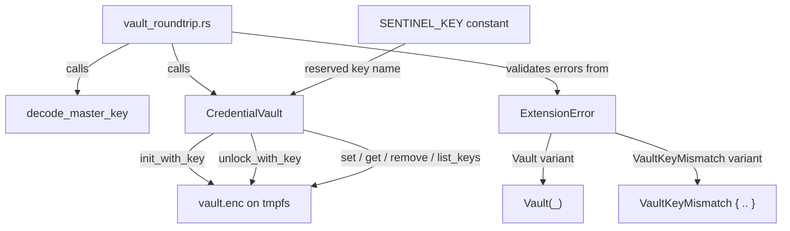

# Other — librefang-extensions-tests

# librefang-extensions-tests — Vault Round-Trip Integration Tests

## Overview

This module (`vault_roundtrip.rs`) is an integration test suite for the `CredentialVault` subsystem. It validates the cryptographic and API contracts that the rest of the daemon depends on for secure credential storage, without requiring an OS keyring or environment variables on the host machine.

All tests use an explicit master key and a temporary filesystem path, making them fully self-contained and safe for parallel execution.

## Contracts Under Test

The test suite guards five invariants:

| # | Invariant | Why it matters |
|---|-----------|----------------|
| 1 | `decode_master_key` requires exactly 32 bytes after base64 decoding | Prevents silent key truncation that would weaken AES-GCM encryption |
| 2 | `decode_master_key` rejects literal 32-character ASCII input (both valid-but-short base64 and non-base64) | Guards against the operator foot-gun of confusing "32 characters" with "32 bytes" |
| 3 | A vault encrypted under key K can only be decrypted with the same key K | AES-GCM authentication must fail loudly on key mismatch — no silent corruption |
| 4 | The `SENTINEL_KEY` reserved internal key is invisible to `list_keys` and immutable via `set`/`remove` | Protects the boot-path verification branch (#3651) from accidental or malicious overwrite |
| 5 | Full encrypt → persist → reload → decrypt round-trip preserves all stored entries | Validates end-to-end correctness of the file-backed vault |

## Architecture


```mermaid
graph TD
    A[vault_roundtrip.rs] -->|calls| B[decode_master_key]
    A -->|calls| C[CredentialVault]
    C -->|init_with_key| D[vault.enc on tmpfs]
    C -->|unlock_with_key| D
    C -->|set / get / remove / list_keys| D
    E[SENTINEL_KEY constant] -->|reserved key name| C
    A -->|validates errors from| F[ExtensionError]
    F -->|Vault variant| G["Vault(_)"]
    F -->|VaultKeyMismatch variant| H["VaultKeyMismatch { .. }"]
```

## Test Fixtures

Two helper functions provide deterministic, reproducible test inputs:

### `fixture_key_b64() -> String`

Returns a base64-encoded all-zeros 32-byte key. The encoding produces a 44-character string (the same length as `openssl rand -base64 32`), which decodes back to exactly 32 bytes. Tests don't need cryptographic strength — only consistency across the round-trip.

### `fixture_vault_path(tmp: &TempDir) -> PathBuf`

Joins `vault.enc` to the provided temporary directory, yielding a filesystem path that is automatically cleaned up when the `TempDir` drops.

## Test Cases

### `decode_master_key_rejects_wrong_byte_length`

**What it tests:** Invariant #1 — `decode_master_key` enforces a 32-byte decoded length.

**How it works:**
- Encodes 24 zero bytes as base64, producing a valid base64 string that decodes to 24 bytes.
- Asserts that `decode_master_key` returns an error containing `"Invalid key length"`.
- Confirms the happy path: 32 raw bytes round-trip cleanly through encode → decode.

**Why it exists:** A naïve implementation might accept any base64 input and silently use a truncated key, weakening AES-256-GCM to AES-192-GCM (or worse).

---

### `decode_master_key_rejects_literal_32_ascii_chars`

**What it tests:** Invariant #2 — the documented operator foot-gun is caught and surfaced as a structured error.

**How it works:** Three sub-cases in one test:

1. **32 valid base64 characters** (`"xxxx...x"` × 32). These decode successfully to 24 bytes. The length guard rejects it with an error mentioning both `"Invalid key length"` and `"32"`.

2. **32 non-base64 characters** (`"!!!!...!"` × 32). Base64 decoding itself fails. The test asserts the error contains `"decode"` (not a panic, not a silently wrong key).

3. **Correct form** — 32 raw bytes encoded as base64 produce a 44-character string. This is accepted and round-trips correctly. The test explicitly asserts the 44-character length to document the `openssl rand -base64 32` recipe.

**Why it exists:** CLAUDE.md documents this as a known gotcha: operators commonly paste a 32-character ASCII string thinking it represents 32 bytes. Both failure modes (valid-but-short and invalid-alphabet) must produce structured errors.

---

### `vault_roundtrip_encrypt_then_decrypt_with_same_key`

**What it tests:** Invariants #5 and #4 (round-trip correctness + sentinel key invisibility).

**How it works — two phases:**

**Phase 1 (write):**
1. Create a fresh `CredentialVault` pointing at a temp file.
2. Call `init_with_key` with the fixture key.
3. Store two credentials: `OPENAI_API_KEY` and `ANTHROPIC_API_KEY`.
4. Drop the vault — memory is zeroed; only the encrypted file survives.

**Phase 2 (read):**
1. Create a new `CredentialVault` at the same path.
2. Call `unlock_with_key` with the same key.
3. Assert `get` returns the original values for both keys.
4. Assert `list_keys` contains both user keys.
5. Assert `list_keys` does **not** contain `SENTINEL_KEY`.

---

### `vault_unlock_with_wrong_key_fails`

**What it tests:** Invariant #3 — wrong-key decryption fails loudly.

**How it works:**
1. Initialize and write a credential under key A (all zeros).
2. Attempt to unlock the same vault file with key B (all ones).
3. Assert the result is an error matching either `ExtensionError::Vault(_)` or `ExtensionError::VaultKeyMismatch { .. }`.
4. Assert the vault remains in a locked state (`!vault.is_unlocked()`).

**Why both error variants are accepted:** The underlying AES-GCM authentication failure has historically been routed through both `Vault` and `VaultKeyMismatch` depending on the vault format version. The contract is "non-`Ok`", not a specific variant.

---

### `vault_rejects_writes_to_reserved_sentinel_key`

**What it tests:** Invariant #4 — the sentinel key is protected from external mutation.

**How it works:**
1. Initialize a vault.
2. Attempt `set(SENTINEL_KEY, "attacker-payload")` — assert it returns `ExtensionError::Vault(_)`.
3. Attempt `remove(SENTINEL_KEY)` — assert it returns `ExtensionError::Vault(_)`.

**Why it exists:** The `SENTINEL_KEY` is an internal implementation detail of the boot-path verification (#3651). Overwriting or removing it via the public API would silently break the daemon's ability to detect vault corruption or key mismatches during startup.

## Dependencies

| Crate | Usage |
|-------|-------|
| `librefang_extensions` | Provides `CredentialVault`, `decode_master_key`, and `SENTINEL_KEY` |
| `tempfile` | Creates isolated temporary directories for each test |
| `base64` | Constructs well-formed and intentionally malformed key inputs |
| `zeroize` | Wraps keys and values in `Zeroizing<T>` to match production API signatures |

## Relationship to Production Code

These tests exercise the **public API** of the vault module (`librefang_extensions::vault`). They do not inspect internal state or depend on implementation details. The vault under test uses real AES-GCM encryption and real file I/O — only the key source and file path are substituted with test fixtures.

The error variants asserted (`ExtensionError::Vault`, `ExtensionError::VaultKeyMismatch`) live in `librefang_extensions::ExtensionError`, making this an integration-level test rather than a unit test of an isolated function.

## Running

```bash
# Run the full vault round-trip suite
cargo test -p librefang-extensions --test vault_roundtrip

# Run a single test
cargo test -p librefang-extensions --test vault_roundtrip -- decode_master_key_rejects_literal_32_ascii_chars
```