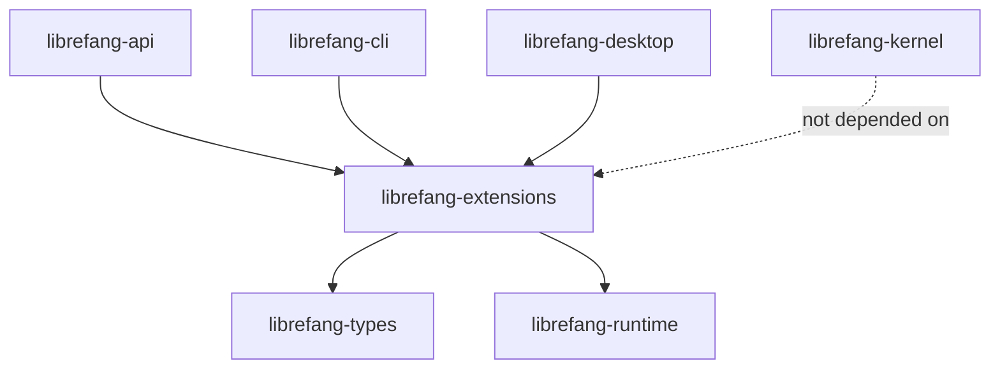

# Other — librefang-extensions

# librefang-extensions

Agent-side infrastructure that doesn't belong in `runtime` or `kernel`. MCP server catalog, credential vault, OAuth2 PKCE flows, provider health probes, plugin installer, and a shared HTTP client.

This crate sits **above** `kernel` in the dependency graph. Higher-level crates (`librefang-api`, `librefang-cli`, `librefang-desktop`) consume it, but it never imports them.

## Architecture

Extensions provides the building blocks. The API crate owns the user-facing HTTP routes and flow orchestration.

## Module Map

### `vault` — AES-256-GCM Credential Vault

Encrypted credential storage with per-agent isolation.

**Master key resolution order:**
1. `LIBREFANG_VAULT_KEY` environment variable (base64, must decode to exactly 32 bytes — `openssl rand -base64 32` produces 44 characters)
2. OS keyring (Linux `libsecret`, Windows Credential Manager)
3. File fallback

**Platform specifics:**
- **macOS** skips Keychain by default (see #2766). Enable with `[vault] use_os_keyring = true` in config. On first boot with file fallback, the vault performs one final Keychain read, mirrors the key to the file store, and never touches Keychain again.
- **File fallback path** on macOS: `~/Library/Application Support/librefang/.keyring` (mode `0600`).
- **musl-static / Android** targets do not compile the OS keyring backend. The vault transparently uses the file-based AES-256-GCM store instead.

**Internal caching:** Per-agent vault instances are cached behind a `RwLock<HashMap<AgentId, Arc<Vault>>>`. The cache invalidates on credential changes.

**Invariants:**
- Always interact with the vault through the `Vault` API. Never read the `.keyring` file directly.
- The `keyring` crate dependency is target-gated to avoid pulling `libdbus-sys` on musl and Android builds.

### `catalog` — MCP Server Catalog

Manages MCP server templates and available servers at `~/.librefang/mcp/catalog/`.

### `credentials` — Auth Source Unification

Single entry point for credential resolution. The `credentials::resolve()` function enforces a fixed precedence:

1. **Environment variables**
2. **Vault** (encrypted store)
3. **CLI login** session
4. **File**

Do not add new credential providers without accounting for this precedence chain.

### `http_client` — Shared HTTP Client

`http_client::shared_client()` returns a pre-configured `reqwest::Client`:

- `User-Agent: librefang/<version>` (matches `librefang_runtime::USER_AGENT`)
- Connection pooling
- Sensible timeout, redirect, and TLS defaults (backed by `rustls` with `webpki-roots` and `rustls-native-certs`)

**Do not create bespoke `reqwest::Client` instances.** Always use `shared_client()`. This will be flagged in review.

### `oauth` — OAuth2 PKCE Client

Implements OAuth2 with PKCE and Dynamic Client Registration (RFC 7591) for MCP servers.

The daemon detects a `401` response and sets `NeedsAuth` state on the connection. The API layer (`routes/mcp_auth.rs` in `librefang-api`) then drives the full flow: PKCE generation, callback handling, token exchange, and refresh.

When an MCP server exposes a `registration_endpoint` but no `client_id`, this module handles Dynamic Client Registration automatically.

This crate exposes the building blocks. The API crate owns the user-facing flow.

### `installer` — MCP Server Lifecycle

Install, update, and uninstall flows for MCP server plugins.

**Do not use raw `tokio::process` for plugin installs.** Always route through the `installer` module.

### `health` — Provider Liveness Probes

Provider health checking. Backed by `provider_health` in `librefang-runtime`.

### `dotenv` — Environment Parsing

`.env` file parsing for agent workspaces.

## Dependency Boundaries

### What this crate owns
- Vault and encryption
- MCP catalog
- OAuth client primitives
- Shared HTTP client
- Dotenv parsing
- Plugin installer

### What this crate does NOT own
- Kernel callback wiring — `McpOAuthProvider` trait lives in `runtime`; the implementation lives in `api`
- HTTP routing
- Channel adapters

### Allowed imports
- `librefang-types`
- `librefang-runtime`
- Standard library and third-party crates

### Forbidden imports
- `librefang-api`
- `librefang-cli`
- `librefang-desktop`

Extensions sits below all of those layers. Importing them creates circular dependencies.

## Docker Considerations

Do not bind ephemeral localhost ports for OAuth callbacks in daemon code. The port is unreachable from outside a Docker container. Route all OAuth callbacks through the API server's existing port — the `api` crate handles this.

## Key Dependencies

| Crate | Purpose |
|-------|---------|
| `aes-gcm` | AES-256-GCM encryption for the vault |
| `argon2` | Key derivation |
| `keyring` | OS keyring access (target-gated) |
| `reqwest` / `rustls` | HTTP client with Rust TLS |
| `dashmap` | Concurrent maps for caching |
| `zeroize` | Secure memory clearing for key material |
| `sha2` / `hmac` / `subtle` | Cryptographic primitives for OAuth PKCE |