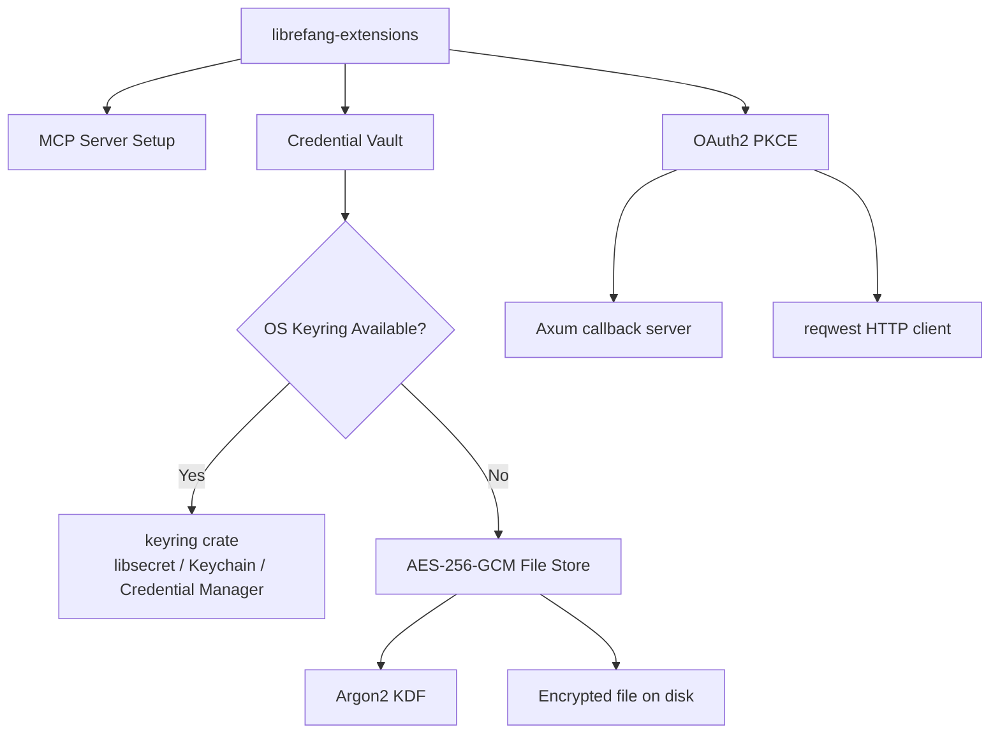

# Other — librefang-extensions

# librefang-extensions

Extension and integration system for LibreFang. Provides three major capabilities:

- **One-click MCP server setup** — automated configuration and lifecycle management for MCP (Model Context Protocol) servers
- **Credential vault** — encrypted storage with OS keyring integration and a portable AES-256-GCM file-based fallback
- **OAuth2 PKCE** — Authorization Code Flow with PKCE for secure third-party authentication

## Architecture



## Key Components

### Credential Vault

Secure storage for sensitive credentials (API keys, tokens, certificates).

**Backend selection is automatic and transparent:**

| Platform | Primary Backend | Fallback |
|----------|----------------|----------|
| Linux (glibc) | OS keyring via `libsecret` | AES-256-GCM file |
| macOS | macOS Keychain | AES-256-GCM file |
| Windows | Windows Credential Manager | AES-256-GCM file |
| Linux (musl) | *not available* | AES-256-GCM file |
| Android | *not available* | AES-256-GCM file |

The vault implementation lives in `vault.rs`. The `os_keyring` helper attempts to create a `keyring::Entry` at compile time based on target configuration. When the `keyring` crate is not compiled in (musl-static or Android cross builds), the vault seamlessly falls back to the file-based store — no code changes required.

**Encryption details for the file-based store:**

- **KDF:** Argon2 for deriving encryption keys from master passwords
- **Encryption:** AES-256-GCM with random nonces per operation
- **Memory safety:** `zeroize` is used to clear sensitive key material from memory after use

### OAuth2 PKCE

Implements the Authorization Code Flow with Proof Key for Code Exchange (PKCE), suitable for public clients that cannot securely store a client secret.

Key implementation details drawn from dependencies:

- **`axum`** — spawns a temporary local HTTP server to receive the OAuth2 callback with the authorization code
- **`reqwest`** — makes the token exchange request to the provider's token endpoint
- **`sha2` + `base64`** — generates the `code_verifier` (cryptographic random) and `code_challenge` (SHA-256 hash, base64url-encoded) per RFC 7636
- **`rand`** — cryptographically secure random generation for `code_verifier` and state parameters

### MCP Server Setup

One-click setup for MCP server instances. Uses `toml` for reading/writing server configuration files and `dashmap` for thread-safe concurrent access to server state during setup and teardown.

## Dependencies

### Core

| Crate | Purpose |
|-------|---------|
| `librefang-types` | Shared type definitions across LibreFang crates |
| `serde` / `serde_json` / `toml` | Serialization of configurations, credentials, and server state |
| `thiserror` | Ergonomic error types |
| `tracing` | Structured logging |
| `chrono` | Timestamp handling for tokens and credentials |
| `dashmap` | Lock-free concurrent map for runtime server state |
| `tokio` | Async runtime primitives |
| `dirs` | Platform-specific config/data directory resolution |

### Networking & TLS

| Crate | Purpose |
|-------|---------|
| `reqwest` | HTTP client for OAuth2 token exchange and MCP communication |
| `rustls` | TLS implementation (no OpenSSL dependency) |
| `webpki-roots` / `rustls-native-certs` | CA certificate bundles for TLS verification |
| `axum` | Lightweight HTTP server for OAuth2 redirect callback |

### Cryptography & Security

| Crate | Purpose |
|-------|---------|
| `aes-gcm` | AES-256-GCM authenticated encryption for the file-based vault |
| `argon2` | Key derivation from master passwords |
| `sha2` | SHA-256 hashing (PKCE code challenge, integrity checks) |
| `rand` | CSPRNG for nonces, verifiers, and salts |
| `zeroize` | Secure memory clearing for keys and credentials |
| `base64` | Base64url encoding for PKCE and storage formats |

### Platform Keyring (target-gated)

```toml
# Only compiled on: Linux (glibc), macOS, Windows
# Excluded on: musl targets, Android
keyring = { workspace = true }
```

This target gating prevents build failures on platforms where `libsecret`'s C FFI (`libdbus-sys`) is unavailable. The vault code handles the absence at runtime without any feature flags or configuration from the consumer.

## Integration with LibreFang

`librefang-extensions` sits alongside the core LibreFang crates:

- Depends on **`librefang-types`** for shared data structures and error types
- Provides extension/integration capabilities consumed by the application layer
- In tests, depends on **`librefang-runtime`** (`dev-dependencies`) for integration test scenarios

## Testing

The crate uses:

- **`tempfile`** — isolated temporary directories for vault file storage tests, ensuring no side effects on the developer's system
- **`serial_test`** — serializes tests that may conflict with shared resources (OS keyring, temporary files, callback server ports)
- **`librefang-runtime`** (dev-only) — provides runtime infrastructure for integration tests

Run the test suite:

```bash
cargo test -p librefang-extensions
```

## Cross-Compilation Notes

When cross-compiling for musl-static targets or Android, the `keyring` dependency is automatically excluded. The vault will always use the file-based AES-256-GCM backend on these targets. No feature flags or environment variables need to be set — this is handled entirely by Cargo's target-specific dependency resolution via `cfg(...)` predicates in `Cargo.toml`.