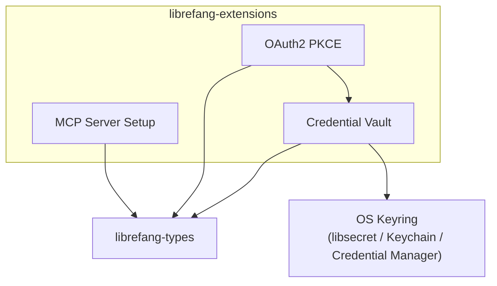

# Other — librefang-extensions

# librefang-extensions

Extension and integration system for LibreFang. Provides three major capabilities:

- **One-click MCP (Model Context Protocol) server setup** — streamline provisioning and connection of MCP-compatible servers.
- **Credential vault** — encrypted at-rest storage backed by the OS keyring for secrets, API keys, and tokens.
- **OAuth2 PKCE flow** — browser-based authorization with Proof Key for Code Exchange, for services that require user consent.

## Architecture

## Key Subsystems

### MCP Server Setup

Provisions and configures MCP-compatible servers with minimal manual steps. Reads server definitions from TOML configuration (via the `toml` crate) and manages their lifecycle.

Relevant dependencies: `reqwest`, `rustls`, `webpki-roots`, `rustls-native-certs`, `tokio`.

### Credential Vault

Stores secrets (API keys, tokens, passwords) in an encrypted on-disk format using **AES-256-GCM** for encryption and **Argon2** for key derivation. The encryption key material is held in the operating-system native keyring via the `keyring` crate, meaning the vault file itself is safe to store on disk without exposing plaintext secrets even if the file is read directly.

Key security properties:

| Property | Mechanism |
|---|---|
| Encryption at rest | AES-256-GCM (`aes-gcm`) |
| Key derivation | Argon2 (`argon2`) |
| Key storage | OS keyring — libsecret (Linux), Keychain (macOS), Credential Manager (Windows) |
| Memory hygiene | `zeroize` for secure clearing of sensitive buffers |
| Platform directories | `dirs` crate for resolving config/data paths |

### OAuth2 PKCE

Implements the Authorization Code flow with PKCE (Proof Key for Code Exchange) for public clients. This is the recommended flow for native/desktop applications that need to obtain OAuth2 tokens from providers like Google, GitHub, etc.

The flow involves:

1. Generating a cryptographically random code verifier (`rand`, `sha2`).
2. Computing the SHA-256 code challenge.
3. Spinning up a temporary local HTTP server (`axum`) to receive the redirect callback.
4. Exchanging the authorization code for tokens via `reqwest`.
5. Storing the resulting tokens in the credential vault.

Relevant dependencies: `axum`, `reqwest`, `rand`, `sha2`, `base64`, `chrono`.

## Integration Points

### librefang-types

The module depends on `librefang-types` for shared data structures — credential definitions, server configuration shapes, error types, and other cross-crate contracts. Any new extension or integration should define its public types there.

### Concurrency

The `dashmap` dependency provides a lock-free concurrent hashmap, used for in-process caching of decrypted credentials and active OAuth2 states. This allows multiple async tasks (`tokio`) to access vault contents safely without a global mutex.

## Configuration

The module uses TOML for its configuration files. Configuration is resolved from platform-standard directories via the `dirs` crate. A typical configuration file defines:

- MCP server endpoints and connection parameters
- Vault storage location and encryption settings
- OAuth2 provider client IDs and redirect parameters

## Error Handling

Errors are surfaced through `thiserror`-derived error enums covering:

- Encryption/decryption failures (AES-GCM, Argon2)
- Keyring access errors (OS keyring unavailable or locked)
- Network errors (OAuth2 token exchange, MCP server communication)
- Configuration parsing errors (TOML/JSON deserialization)
- TLS certificate errors (rustls)

All errors are instrumented through `tracing` for observability.

## Testing

Dev dependencies include `tempfile` for isolated filesystem-based tests and `serial_test` to serialize tests that interact with the OS keyring (since keyring backends are typically process-wide singletons). `librefang-runtime` is also included as a dev dependency to provide the async runtime harness needed for integration tests.