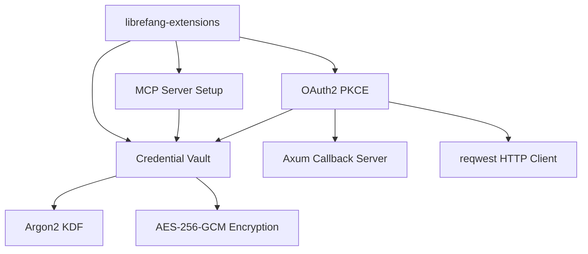

# Other — librefang-extensions

# librefang-extensions

Extension and integration layer for LibreFang. Provides three tightly-coupled subsystems that allow LibreFang to talk to external services securely:

- **MCP server provisioning** — one-click setup for Model Context Protocol servers
- **Credential vault** — encrypted-at-rest storage for API keys, tokens, and secrets
- **OAuth2 PKCE flow** — browser-based authorization with automatic token refresh

## Architecture



MCP server setup and OAuth2 PKCE both depend on the credential vault to persist the secrets they obtain. The vault encrypts all values with AES-256-GCM using a key derived through Argon2, and clears intermediate buffers with `zeroize`.

## Key Dependencies and Why They Exist

| Dependency | Purpose |
|---|---|
| `aes-gcm` | Authenticated encryption for the credential vault |
| `argon2` | Key derivation from a master password or system key |
| `zeroize` | Securely overwrite secret material in memory after use |
| `axum` | Lightweight HTTP server to receive OAuth2 redirect callbacks |
| `reqwest` + `rustls` | TLS-capable HTTP client for token exchange; uses `rustls` with both `webpki-roots` and `rustls-native-certs` for maximum certificate compatibility |
| `dashmap` | Lock-free concurrent map for in-memory credential and extension state |
| `sha2` + `rand` | PKCE code verifier/challenge generation and general cryptographic randomness |
| `base64` | Encoding PKCE challenges and vault payloads |
| `toml` | Persisting extension configuration to disk |

## Credential Vault

The vault is the security foundation. Every secret that flows through this module — MCP server tokens, OAuth2 access/refresh pairs — lands here.

**Encryption scheme:**

1. A master secret (password or OS keyring-backed) is fed through Argon2 to produce a 256-bit key.
2. Each stored value gets a random 96-bit nonce.
3. Values are encrypted with AES-256-GCM, which provides both confidentiality and integrity.
4. The serialized vault is written to the filesystem via `toml` (metadata) and binary blobs.

**In-memory model:** `DashMap` provides concurrent read/write access without a global lock. Individual entries are sharded, so reading one credential doesn't block writes to another. Values are wrapped in types that implement `Zeroize` so that when an entry is dropped, the underlying bytes are overwritten.

## OAuth2 PKCE

Implements the Authorization Code flow with PKCE (Proof Key for Code Exchange), suitable for public clients that cannot hold a client secret.

**Flow:**

1. Generate a cryptographically random `code_verifier` (via `rand`).
2. Derive the `code_challenge` as `BASE64URL(SHA256(code_verifier))` using `sha2` and `base64`.
3. Spin up a temporary `axum` server on a localhost port to serve the redirect URI.
4. Open the user's browser to the authorization endpoint with the challenge.
5. On callback, exchange the authorization code + verifier for tokens via `reqwest`.
6. Store the resulting access token and refresh token in the credential vault.

The `rustls` stack ensures that token exchange happens over TLS with a reasonable set of trusted roots, combining Mozilla's `webpki-roots` with the system's native certificate store.

## MCP Server Setup

Provides streamlined provisioning of MCP-compatible servers. This subsystem:

- Reads server descriptors (connection parameters, capabilities) from `toml` configuration files.
- Manages the lifecycle of server registrations.
- Retrieves any required authentication credentials from the credential vault, or triggers OAuth2 PKCE if a new token is needed.
- Persists server state so that a previously configured server can be reconnected on launch without user intervention.

## Error Handling

All public APIs return `Result<T, E>` where `E` is a module-level error enum derived via `thiserror`. Error variants cover:

- Vault decryption failures (wrong master key, corrupted data)
- I/O errors reading or writing config/vault files
- HTTP failures during OAuth2 token exchange
- PKCE state mismatches (possible CSRF or stale sessions)
- TLS handshake errors

Errors are instrumented with `tracing` spans so they appear in structured logs with context.

## Testing

The dev-dependencies indicate the test strategy:

- `tokio-test` — async test harness for the OAuth2 callback server and concurrent vault operations.
- `tempfile` — isolated filesystem roots for vault and config files, no side effects on the developer's machine.
- `serial_test` — serializes tests that share global state (such as the system keyring or a bound port).
- `librefang-runtime` — the full runtime is available in tests for integration scenarios that exercise extension loading end-to-end.

## Relationship to Other Crates

```
librefang-types
     │
     ▼
librefang-extensions
     │
     ▼
librefang-runtime   (dev-dependency only; integration tests)
```

The module consumes shared types from `librefang-types` (extension descriptors, credential shapes, error codes) and is itself consumed by higher layers in the LibreFang stack. It has no downward dependency on `librefang-runtime` outside of tests, keeping the extension system independently testable and portable.