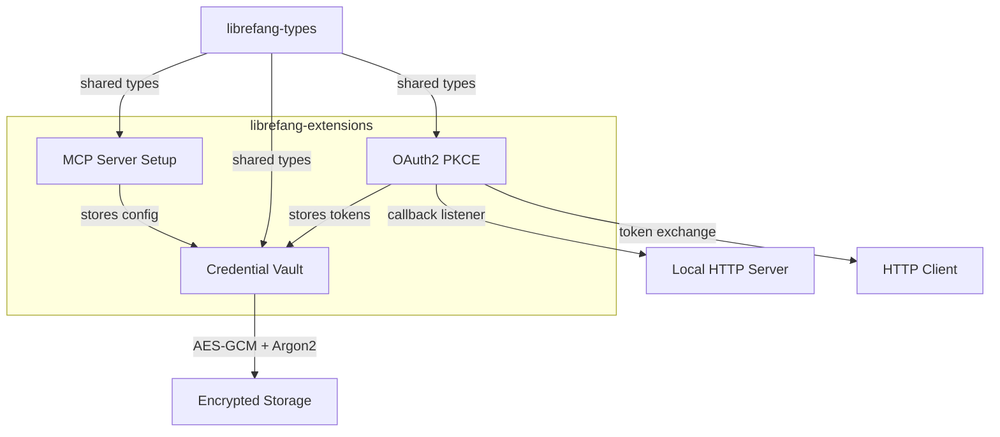

# Other — librefang-extensions

# librefang-extensions

Extension and integration system for LibreFang. Provides three integrated subsystems: one-click MCP (Model Context Protocol) server setup, an encrypted credential vault, and OAuth2 PKCE authentication flows.

## Architecture

## Key Components

### Credential Vault

Encrypted at-rest storage for sensitive credentials — API keys, OAuth tokens, MCP server secrets, and any other integration secrets.

**Encryption stack:**
- **Argon2** — derives an encryption key from a user-provided master password. Key derivation is deliberately slow to resist brute-force attacks.
- **AES-GCM** — authenticated encryption for vault contents. Provides both confidentiality and integrity checking.
- **Zeroize** — sensitive in-memory structures (keys, plaintext credentials) are zeroed on drop to minimize exposure window.

**Runtime storage:**
- **DashMap** — concurrent hashmap used as the in-memory credential cache. Allows multiple async tasks to read/write credentials without locking the entire map.
- **Platform directories** — uses the `dirs` crate to locate the appropriate platform-specific directory (`~/.config/librefang/` on Linux, equivalents on macOS/Windows) for the encrypted vault file.
- **TOML/JSON** — serialization format for persisted vault data.

### OAuth2 PKCE

Implements the OAuth2 Authorization Code flow with PKCE (Proof Key for Code Exchange), the recommended flow for native/desktop applications.

**Flow components:**
- **PKCE generation** — uses `rand` to generate a cryptographically random code verifier, `sha2` to produce the code challenge (S256 method), and `base64` for URL-safe encoding.
- **Callback listener** — spins up a temporary local HTTP server using `axum` on a random port to receive the authorization redirect. The server handles exactly one request and then shuts down.
- **Token exchange** — uses `reqwest` (backed by `rustls`) to exchange the authorization code for access/refresh tokens.
- **URL construction** — the `url` crate handles all URL building and validation for authorization endpoints.

**Token lifecycle:**
- Access tokens and refresh tokens are stored in the credential vault after successful exchange.
- Tokens are retrieved transparently by other subsystems when making authenticated requests.

### MCP Server Setup

One-click setup for MCP (Model Context Protocol) servers. Handles discovering server configuration, provisioning credentials, and preparing a server for use.

- Relies on `serde_json` for MCP server configuration documents.
- Integrates with the credential vault to store any server-specific secrets.
- Uses types from `librefang-types` for MCP server descriptors and configuration shapes.

## Dependencies and Rationale

| Dependency | Purpose |
|---|---|
| `librefang-types` | Shared type definitions used across all LibreFang crates |
| `aes-gcm` | Authenticated encryption for vault contents |
| `argon2` | Key derivation from master password |
| `zeroize` | Secure memory clearing for keys and plaintext |
| `dashmap` | Lock-free concurrent credential cache |
| `axum` | Local HTTP server for OAuth2 redirect callback |
| `reqwest` + `rustls` | TLS-backed HTTP client for OAuth2 token exchange |
| `sha2` + `rand` + `base64` | PKCE code verifier/challenge generation |
| `toml` + `serde_json` | Configuration and vault serialization |
| `url` | URL parsing and construction for OAuth2 endpoints |
| `dirs` | Platform-appropriate config directory resolution |

## Relationship to Other Crates

This crate sits between the core type system and higher-level application layers:

- **Consumes** `librefang-types` for all shared data structures.
- **Consumed by** application and runtime layers (including `librefang-runtime`, which appears as a dev-dependency for integration testing).
- Other modules that need credentials, OAuth flows, or MCP configuration depend on this crate rather than reimplementing those concerns.

## Testing

The dev-dependencies indicate the testing approach:

- `tokio-test` — async test utilities for testing the OAuth2 flow and vault operations.
- `tempfile` — creates temporary directories for vault files in isolation, ensuring tests don't touch real credentials.
- `serial_test` — serializes tests that share filesystem or port resources, preventing race conditions in CI.
- `librefang-runtime` — used for integration tests that exercise the full extension loading pipeline.

When writing tests for this crate, use `tempfile::tempdir()` for any vault path, wrap tests that bind local ports with `#[serial]`, and prefer the `tokio::test` macro for async test functions.