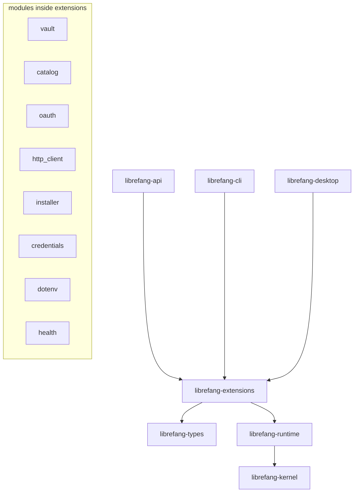

# Other — librefang-extensions

# librefang-extensions

The "everything-side-of-an-agent" toolkit — MCP server catalog management, AES-256-GCM credential vault, OAuth2 PKCE flows with Dynamic Client Registration, provider health probes, plugin install/uninstall, `.env` parsing, and a shared HTTP client.

This crate holds everything that doesn't belong in `runtime` or `kernel` but is needed by the upper layers (`api`, `cli`, `desktop`).

## Architecture



Extensions sits **above** kernel and **below** the user-facing crates. Kernel never depends on extensions. Extensions must never import from `librefang-api`, `librefang-cli`, or `librefang-desktop`.

## Module Map

| Module | Responsibility |
|---|---|
| `vault` | AES-256-GCM encrypted credential storage. Master key from OS keyring or file fallback. Per-agent vault cache behind `RwLock<HashMap<AgentId, Arc<Vault>>>`. |
| `catalog` | MCP server catalog at `~/.librefang/mcp/catalog/`. Templates, available servers, metadata. |
| `credentials` | Unified auth-source resolution. Single `credentials::resolve()` function with precedence: env var → vault → CLI login → file. |
| `oauth` | OAuth2 PKCE client building blocks. PKCE code generation, token exchange, refresh. Dynamic Client Registration (RFC 7591) for servers that expose `registration_endpoint` without a `client_id`. |
| `http_client` | Shared `reqwest::Client` builder. Returns a pre-configured client with correct `User-Agent`, timeouts, TLS, and connection pooling. |
| `installer` | MCP server install, update, and uninstall flows. The only sanctioned way to run plugin process operations. |
| `dotenv` | `.env` file parsing for agent workspaces. |
| `health` | Provider liveness probes. Backed by `provider_health` in runtime. |

## Credential Vault

### Encryption

Credentials are encrypted with **AES-256-GCM**. The master key is 32 bytes and is sourced from (in order):

1. `LIBREFANG_VAULT_KEY` environment variable — base64-encoded, must decode to exactly 32 bytes. Generate with `openssl rand -base64 32` (produces 44 characters).
2. OS keyring — `libsecret` on Linux, Windows Credential Manager, or macOS Keychain.
3. File fallback — platform-dependent path (see below).

### macOS Keychain Behavior

macOS **skips** the Keychain by default (see #2766). This avoids recurring Keychain authorization prompts. On first boot after upgrade, the vault performs one final read from Keychain, mirrors the key to the file fallback, and never touches Keychain again.

Override with config:

```toml
[vault]
use_os_keyring = true
```

File fallback path on macOS: `~/Library/Application Support/librefang/.keyring` (mode `0600`).

### OS Keyring Compilation

The `keyring` dependency is target-gated:

```toml
[target.'cfg(any(all(target_os = "linux", not(target_env = "musl")), target_os = "macos", target_os = "windows"))'.dependencies]
keyring = { workspace = true }
```

- **Linux glibc**: compiled in (uses `libsecret` via `libdbus-sys`).
- **Linux musl**: excluded — no usable `libdbus` backend, breaks static builds.
- **Android**: excluded.
- **macOS / Windows**: compiled in.

When no OS keyring backend is compiled in, the vault transparently falls back to the file-based store.

### Per-Agent Cache

Vault instances are cached per agent:

```rust
RwLock<HashMap<AgentId, Arc<Vault>>>
```

Invalidate this cache when credentials change. Always go through the `Vault` API — never read the `.keyring` file directly.

## Shared HTTP Client

Call `http_client::shared_client()` to get a configured `reqwest::Client`. It provides:

- `User-Agent: librefang/<version>` (matches `librefang_runtime::USER_AGENT`)
- Sensible timeout, redirect, and TLS defaults
- Connection pooling

**Do not create bespoke `reqwest::Client` instances.** Any code calling `reqwest::Client::new()` or `reqwest::Client::builder()…build()` directly will be flagged in review. Always use the shared client.

## OAuth2 / MCP Flow

This crate provides the building blocks. The API crate (`routes/mcp_auth.rs`) owns the user-facing flow.

1. The daemon detects a `401` from an MCP server and sets `NeedsAuth` state on the connection.
2. The API layer drives the PKCE flow: code verifier/challenge generation, redirect handling, token exchange, and refresh.
3. When a server exposes a `registration_endpoint` but no `client_id`, Dynamic Client Registration (RFC 7591) is used to register one automatically.

### Docker Considerations

Do not bind ephemeral localhost ports for OAuth callbacks in daemon code. Inside Docker, the port is unreachable from outside the container. Route callbacks through the API server's existing port instead (the `api` crate handles this).

## Credential Resolution

The `credentials::resolve()` function unifies all auth sources with a fixed precedence:

```
environment variable  >  vault  >  CLI login  >  file
```

When adding a new credential provider, integrate it into this resolution chain. Do not bypass it with ad-hoc credential lookups.

## Dependency Graph

```
librefang-types        ← shared types, error definitions
librefang-runtime      ← USER_AGENT constant, provider_health
```

No imports from `librefang-api`, `librefang-cli`, or `librefang-desktop`. Extensions is a lower layer.

## Plugin Installation

Use the `installer` module for all MCP server lifecycle operations:

- **Install** — download and set up an MCP server
- **Update** — upgrade an installed server
- **Uninstall** — remove an installed server

Do not use raw `tokio::process` calls for plugin installs. All process execution goes through `installer`, which handles sandboxing, error reporting, and state cleanup.

## Taboos Summary

| Don't | Do instead |
|---|---|
| `reqwest::Client::new()` | `http_client::shared_client()` |
| Raw `tokio::process` for plugins | `installer` module |
| Import from `api` / `cli` / `desktop` | Keep extensions below those layers |
| Read `.keyring` file directly | Use the `Vault` API |
| Add credential providers ad-hoc | Integrate into `credentials::resolve()` precedence |