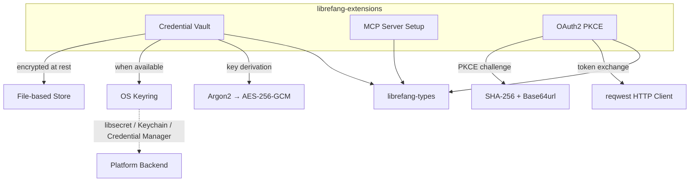

# Other — librefang-extensions

# librefang-extensions

Extension and integration system for LibreFang, providing three core capabilities: one-click MCP (Model Context Protocol) server setup, a secure credential vault, and OAuth2 PKCE authentication flows.

## Purpose

This crate centralizes all "external-facing" integration concerns that LibreFang needs to interact with third-party services and tooling. Rather than scattering credential management, server provisioning, and auth flows across the codebase, `librefang-extensions` provides a unified, well-tested surface for:

- **Storing and retrieving secrets** through an OS-native keyring with a transparent encrypted-file fallback.
- **Bootstrapping MCP servers** with minimal user interaction ("one-click" setup).
- **Completing OAuth2 authorization code flows with PKCE**, handling the cryptographic challenge construction and token exchange.

## Architecture



All three subsystems depend on `librefang-types` for shared data structures and error types, keeping the interface consistent with the rest of the LibreFang ecosystem.

## Key Components

### Credential Vault

The vault (`vault.rs`) provides secure, persistent storage for tokens, API keys, and other secrets. It uses a dual-backend strategy:

1. **OS Keyring** (preferred) — When compiled for a supported target, secrets are stored in the platform's native credential store:
   - **macOS**: Keychain
   - **Windows**: Credential Manager
   - **Linux (glibc)**: libsecret

2. **AES-256-GCM File Store** (fallback) — When no OS keyring backend is available (e.g., musl-static or Android cross builds), the vault transparently falls back to an encrypted file stored on disk.

**Key derivation**: Master keys are derived from a user-provided passphrase using Argon2, then used to encrypt individual entries with AES-256-GCM. The `zeroize` crate ensures key material is cleared from memory after use.

**Concurrent access**: The vault uses `DashMap` for lock-free concurrent reads and writes, safe for use across async tasks.

### MCP Server Setup

One-click provisioning of MCP (Model Context Protocol) servers. Handles server configuration discovery, setup orchestration, and integration with LibreFang's runtime. Configuration is serialized via `serde_json` and/or `toml` depending on the server's expected format.

### OAuth2 PKCE

Implements the OAuth2 Authorization Code flow with Proof Key for Code Exchange (RFC 7636):

1. Generates a cryptographically random code verifier using `rand`.
2. Derives the code challenge via SHA-256 hash and Base64url encoding (`sha2` + `base64`).
3. Spins up a local HTTP listener using `axum` to capture the authorization callback.
4. Exchanges the authorization code for tokens via `reqwest`, authenticating the request with the PKCE code verifier.
5. Stores the resulting tokens in the credential vault.

HMAC is available for token signature verification where needed, with constant-time comparison via `subtle` to prevent timing attacks.

## Platform Considerations

The OS keyring dependency is **target-gated** to avoid build failures on platforms without a usable backend:

```toml
[target.'cfg(any(
    all(target_os = "linux", not(target_env = "musl")),
    target_os = "macos",
    target_os = "windows"
))'.dependencies]
keyring = { workspace = true }
```

| Target | OS Keyring | Fallback |
|---|---|---|
| Linux (glibc) | libsecret | — |
| Linux (musl) | *not compiled* | AES-256-GCM file |
| macOS | Keychain | — |
| Windows | Credential Manager | — |
| Android | *not compiled* | AES-256-GCM file |

The vault detects at compile time which backends are available and selects automatically — no feature flags or runtime configuration needed.

## TLS

Outbound HTTP requests (token exchange, MCP server communication) use `reqwest` backed by `rustls` with both `webpki-roots` and `rustls-native-certs` for certificate verification, ensuring compatibility across environments without depending on OpenSSL.

## Integration with LibreFang

```
librefang-types       ← shared types, error definitions
librefang-extensions  ← this crate
librefang-runtime     ← used in dev-dependencies for integration tests
```

Other LibreFang crates consume this module's public API to:
- Retrieve stored credentials when connecting to services.
- Provision MCP servers during workspace setup.
- Kick off OAuth2 flows when a user authorizes a third-party integration.

## Testing

The crate uses `tempfile` for isolated vault tests and `serial_test` to prevent parallel test interference with shared resources (filesystem, keyring). Integration tests pull in `librefang-runtime` to verify end-to-end flows.