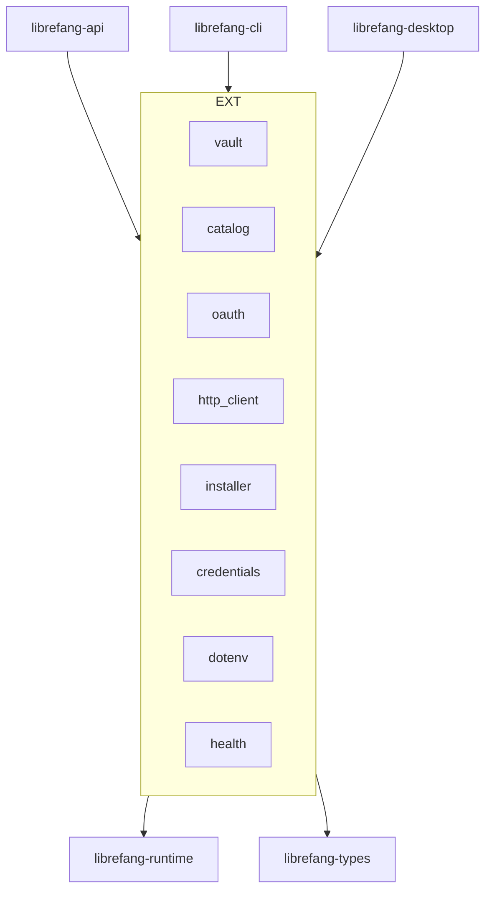

# Other — librefang-extensions

# librefang-extensions

Agent-side infrastructure that doesn't belong in `runtime` or `kernel`. MCP server catalog, credential vault, OAuth2 PKCE flows, provider health probes, plugin installer, and a shared HTTP client.

This crate sits **above** `librefang-types` and `librefang-runtime`, and **below** `librefang-api`, `librefang-cli`, and `librefang-desktop`. Kernel never depends on it.

## Architecture



## Module Map

| Module | Purpose |
|---|---|
| `catalog` | MCP server catalog at `~/.librefang/mcp/catalog/`. Templates and available servers. |
| `credentials` | Auth-source unification across env vars, vault, CLI login, and file sources. |
| `dotenv` | `.env` parsing for agent workspaces. |
| `health` | Provider liveness probes. Delegates to `provider_health` in runtime. |
| `http_client` | Shared `reqwest::Client` builder. Used everywhere — no bespoke clients. |
| `installer` | MCP server install, update, and uninstall flows. |
| `oauth` | OAuth2 PKCE client with Dynamic Client Registration (RFC 7591) for MCP. |
| `vault` | AES-256-GCM credential vault backed by OS keyring or encrypted file. |

## Credential Vault

The vault stores sensitive credentials (API keys, tokens) encrypted at rest using AES-256-GCM.

### Master Key Resolution

The 32-byte master key is loaded from the first available source:

1. **Environment variable** — `LIBREFANG_VAULT_KEY`, base64-encoded. Must decode to exactly 32 bytes. Generate with `openssl rand -base64 32` (produces 44 characters).
2. **OS keyring** — Linux (libsecret), Windows (Credential Manager), macOS (Keychain, **disabled by default**).
3. **File fallback** — Encrypted file at `~/Library/Application Support/librefang/.keyring` (macOS), mode `0600`.

### macOS Keychain Behavior

macOS skips Keychain by default due to reliability issues (#2766). The migration path: on first boot, the vault performs one final read from Keychain, mirrors the key to the file fallback, then never touches Keychain again. Re-enable with config:

```toml
[vault]
use_os_keyring = true
```

### Per-Agent Caching

Vault instances are cached per agent behind a `RwLock<HashMap<AgentId, Arc<Vault>>>`. The cache invalidates automatically on credential changes. Always use the `Vault` API — never read the `.keyring` file directly.

### Target Gating

The `keyring` dependency is only compiled on targets with a working OS backend: Linux (glibc, not musl), macOS, and Windows. On musl-static and Android builds, the vault transparently falls back to the file-based store. This avoids pulling `libdbus-sys` into builds where it has no usable backend.

## Shared HTTP Client

`http_client::shared_client()` returns a pre-configured `reqwest::Client`:

- `User-Agent: librefang/<version>` (matches `librefang_runtime::USER_AGENT`)
- Connection pooling
- Sensible timeout, redirect, and TLS defaults
- Native and webpki root certificates via `rustls`

**All HTTP traffic must use this client.** Spinning up bespoke `reqwest::Client::new()` instances will be flagged in review.

## OAuth2 / MCP Flow

The daemon detects a `401` from an MCP server and sets a `NeedsAuth` state on the connection. The API layer (specifically `routes/mcp_auth.rs` in the api crate) then drives the full flow:

1. **PKCE generation** — code verifier and challenge
2. **Dynamic Client Registration** (RFC 7591) — when the server exposes `registration_endpoint` but no `client_id`
3. **Authorization redirect** — user authenticates in browser
4. **Callback handling** — receives the authorization code
5. **Token exchange and refresh**

This crate provides the building blocks (`oauth` module). The API crate owns the user-facing HTTP routing and callback endpoints.

### Docker Considerations

Do not bind ephemeral localhost ports for OAuth callbacks in daemon code. Inside Docker, those ports are unreachable from the host. Route all callbacks through the API server's existing port — the api crate handles this.

## Credential Resolution

`credentials::resolve()` provides a unified lookup across all auth sources with a fixed precedence:

```
environment variables > vault > CLI login > file
```

Any new credential source must integrate into this precedence chain rather than bypassing it.

## Dependency Boundary

**This crate depends on:**
- `librefang-types`
- `librefang-runtime`

**This crate must NOT import:**
- `librefang-api`
- `librefang-cli`
- `librefang-desktop`

Extensions sit below those layers. Upward imports create circular dependency chains.

**This crate does NOT own:**
- The `McpOAuthProvider` trait (lives in runtime)
- The trait implementation (lives in api)
- HTTP routing
- Channel adapters

## Rules for Contributors

- Use `http_client::shared_client()` for all HTTP. No `reqwest::Client::new()`.
- Use `installer` for all plugin install/update/uninstall operations. No raw `tokio::process`.
- Use the `Vault` API for all credential access. No direct `.keyring` file reads.
- Route OAuth callbacks through the API server port in Docker environments.
- Any new credential provider must fit into the `credentials::resolve()` precedence order.