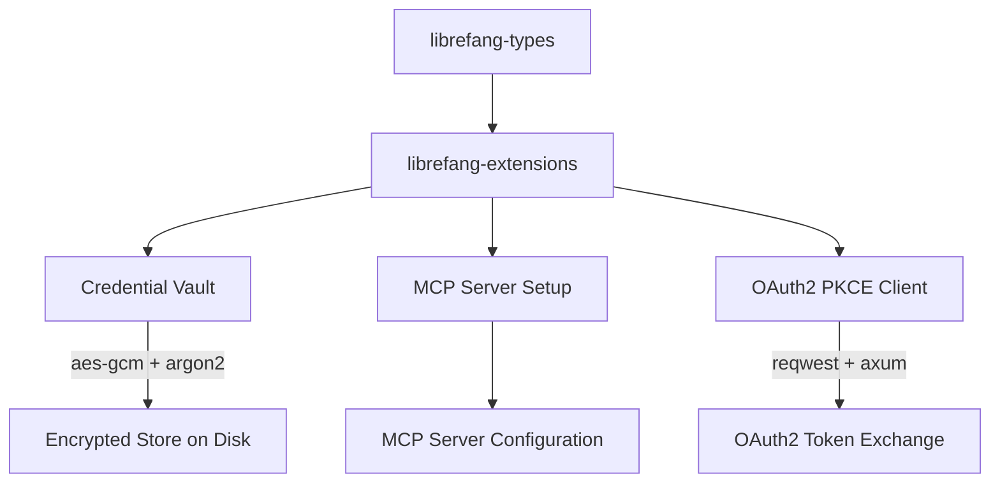

# Other — librefang-extensions

# librefang-extensions

Extension and integration system for LibreFang. Provides one-click MCP (Model Context Protocol) server setup, a local credential vault with AES-256-GCM encryption, and OAuth2 PKCE authentication flows for third-party service integrations.

## Overview

This crate acts as the integration layer between LibreFang's core runtime and external services. It handles three distinct concerns:

| Concern | Purpose |
|---|---|
| **MCP Server Setup** | Bootstrap and configure MCP-compatible servers with minimal user interaction |
| **Credential Vault** | Encrypt and persist sensitive credentials (API keys, tokens) at rest |
| **OAuth2 PKCE** | Perform browser-based OAuth2 authorization code flows with PKCE for services that require it |

The module is designed as a library crate consumed by higher-level LibreFang components. It has no binary target.

## Architecture



## Key Dependency Rationale

### Cryptography Stack

- **`aes-gcm`** — Authenticated encryption (AES-256-GCM) for the credential vault. Provides both confidentiality and integrity for stored secrets.
- **`argon2`** — Key derivation from user-provided passphrases. Used to derive the AES-GCM encryption key from a vault password.
- **`sha2`** — Additional hashing utilities, used in PKCE code verifier/challenge generation.
- **`zeroize`** — Ensures sensitive key material and credentials are zeroed from memory when dropped.
- **`rand`** — Cryptographically secure random number generation for nonce, IV, and PKCE code verifier generation.

### Networking Stack

- **`reqwest`** — HTTP client for outbound OAuth2 token exchange requests and MCP server health checks. Uses `rustls` as the TLS backend (not native TLS).
- **`rustls` + `webpki-roots` + `rustls-native-certs`** — TLS implementation. Combines Mozilla's root certificate bundle with the OS-native certificate store for broad compatibility.
- **`axum`** — Lightweight HTTP server used locally to handle the OAuth2 redirect callback (catching the authorization code).

### Concurrency and Storage

- **`dashmap`** — Concurrent hash map for in-memory caching of decrypted credentials and active OAuth2 sessions without locking the entire map.
- **`tokio`** — Async runtime integration. All I/O operations (file, network) are async.
- **`dirs`** — Resolves platform-specific directories (`~/.local/share`, `%APPDATA%`, etc.) for vault file storage.

### Serialization

- **`serde` + `serde_json` + `toml`** — Vault metadata and MCP server configurations are serialized as JSON for the vault store and TOML for user-facing configuration files.

## Credential Vault

The vault persists encrypted credentials to disk. The encryption pipeline:

1. User supplies a **vault passphrase**.
2. **Argon2** derives a 256-bit key from the passphrase with a random salt.
3. Credentials are serialized to JSON, then encrypted with **AES-256-GCM** using a random nonce.
4. The ciphertext, salt, and nonce are written to a file in the platform data directory.

On read, the process reverses. In-memory representations of sensitive values use `zeroize::Zeroize` to clear memory on drop.

### Vault File Location

Resolved via the `dirs` crate, typically:

| Platform | Path |
|---|---|
| Linux | `~/.local/share/librefang/vault.dat` |
| macOS | `~/Library/Application Support/librefang/vault.dat` |
| Windows | `%APPDATA%\librefang\vault.dat` |

## OAuth2 PKCE Flow

The module implements the full Authorization Code Flow with PKCE (RFC 7636):

1. Generate a cryptographically random **code verifier**.
2. Compute the **code challenge** as `BASE64URL(SHA256(code_verifier))`.
3. Open the user's browser to the authorization endpoint with the challenge.
4. Spawn a local **axum** HTTP server on a random high port to receive the redirect callback.
5. Exchange the authorization code + code verifier for tokens via `reqwest` POST to the token endpoint.
6. Store the resulting access/refresh tokens in the credential vault.

## MCP Server Setup

Provides streamlined configuration and bootstrapping for MCP-compatible servers. This includes:

- Parsing MCP server configuration from TOML files.
- Validating configuration against expected schemas from `librefang-types`.
- Generating default configurations for common MCP server implementations.

## Error Handling

All fallible operations return `Result<T, ExtensionError>` where `ExtensionError` is derived via `thiserror`. Error variants cover:

- Vault encryption/decryption failures
- File I/O errors
- OAuth2 protocol errors (invalid state, token exchange failures)
- Network/TLS errors from `reqwest` and `rustls`
- Serialization/deserialization errors

## Relationship to Other Crates

| Crate | Relationship |
|---|---|
| `librefang-types` | Consumes shared types for credentials, server configs, and error types |
| `librefang-runtime` | Test dependency only — used in integration tests to verify vault and OAuth flows against a runtime environment |

This crate is consumed by the main LibreFang application and any CLI/GUI frontends that need to manage extensions, authenticate with external services, or persist credentials.

## Testing

Integration tests use:

- **`tempfile`** — Isolated temporary directories for vault file tests, avoiding pollution of user data directories.
- **`serial_test`** — Serializes tests that touch shared resources (port bindings for OAuth callback servers, temp directories).
- **`tokio-test`** — Async test utilities for runtime-dependent operations.

Run tests with:

```bash
cargo test -p librefang-extensions
```