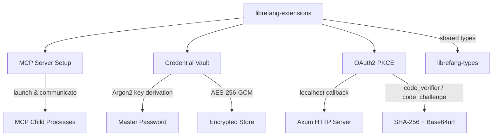
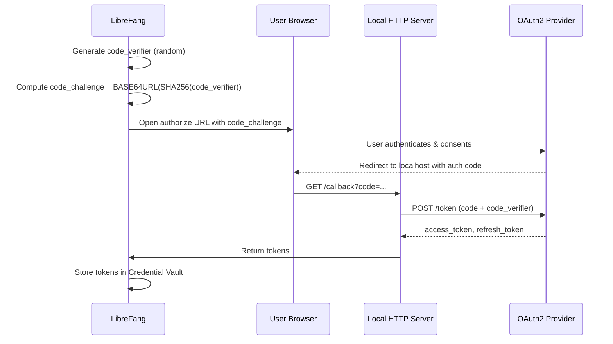

# Other — librefang-extensions

# librefang-extensions

Extension and integration system for LibreFang. Provides three capabilities that external integrations need: one-click MCP (Model Context Protocol) server setup, an encrypted credential vault, and OAuth2 PKCE authentication flows.

## Purpose

LibreFang connects to external services — language model providers, tool servers, data sources — each with its own authentication requirements and configuration conventions. This module encapsulates that integration complexity behind three focused subsystems:

| Subsystem | Responsibility |
|---|---|
| **MCP Server Setup** | Discover, configure, and launch MCP-compatible tool servers |
| **Credential Vault** | Encrypt, store, and retrieve secrets at rest using AES-256-GCM |
| **OAuth2 PKCE** | Handle browser-based OAuth2 Authorization Code flows with PKCE for public clients |

All three are designed to compose. A typical flow: a user clicks to add an integration → the vault stores the resulting OAuth2 tokens → an MCP server is launched using those credentials.

## Architecture

## Credential Vault

The vault encrypts secrets (API keys, OAuth2 tokens, passwords) to disk using authenticated encryption, ensuring confidentiality and integrity at rest.

### Encryption Stack

| Layer | Crate | Role |
|---|---|---|
| Key derivation | `argon2` | Derives a 256-bit encryption key from the user's master password plus a random salt |
| Encryption | `aes-gcm` | AES-256-GCM authenticated encryption (provides both confidentiality and integrity) |
| Memory hygiene | `zeroize` | Key material and plaintext secrets are zeroed from memory after use |

### Storage Model

The vault is persisted to the local filesystem (path resolved via the `dirs` crate). On disk, the format includes:

- **Salt** — random bytes used for Argon2 key derivation
- **Nonce** — unique per encryption operation (required by AES-GCM)
- **Ciphertext** — the encrypted blob containing all stored credentials

On load, the master password is re-derived through Argon2 to recover the AES key, the blob is decrypted, and credentials become accessible in memory. The `dashmap` dependency suggests credentials are held in a concurrent map for safe access from multiple async tasks.

### Threat Model

- **Protects against**: credential theft from the filesystem (disk encryption supplement), accidental exposure in logs or config files.
- **Does not protect against**: a compromised process that already has the master password in memory, keylogger attacks, or root-level memory scraping.

## OAuth2 PKCE

Implements the Authorization Code Flow with PKCE (Proof Key for Code Exchange), the recommended flow for public clients (native apps, CLIs) that cannot securely store a client secret.

### Flow

### Implementation Details

- **`rand`** — generates the cryptographically random `code_verifier`
- **`sha2`** — hashes the verifier to produce the `code_challenge`
- **`base64`** — base64url-encodes the challenge (no padding, per RFC 7636)
- **`axum`** — runs a temporary HTTP server on localhost to receive the OAuth2 redirect callback
- **`reqwest`** with **`rustls`** — makes the token exchange request over TLS without depending on OpenSSL
- **`url`** — constructs and parses OAuth2 URLs safely

The local callback server binds to `127.0.0.1` on an ephemeral port. The server shuts down after receiving the callback or after a timeout.

## MCP Server Setup

Provides one-click configuration and launch of MCP-compatible tool servers. This subsystem:

1. **Discovers** available MCP server configurations (likely from TOML config files, given the `toml` dependency)
2. **Validates** server definitions against expected schemas
3. **Launches** server processes and establishes communication channels

The `tokio` runtime enables async process management for child processes. TLS support via `rustls` and `webpki-roots` / `rustls-native-certs` allows secure connections to remote MCP servers.

## Dependencies and Their Roles

### Cross-module dependency

| Dependency | Usage |
|---|---|
| `librefang-types` | Shared type definitions (configuration structs, error types, credential representations) used across all LibreFang crates |

### Serialization

| Dependency | Usage |
|---|---|
| `serde` / `serde_json` | JSON serialization for OAuth2 token responses, credential interchange, and MCP protocol messages |
| `toml` | Parsing MCP server configuration files from disk |

### Cryptography and Security

| Dependency | Usage |
|---|---|
| `aes-gcm` | AES-256-GCM authenticated encryption for the credential vault |
| `argon2` | Password-based key derivation for vault master key |
| `sha2` | SHA-256 hashing for OAuth2 PKCE code challenges |
| `rand` | Secure random number generation for nonces, salts, and PKCE verifiers |
| `zeroize` | Secure memory clearing for keys and plaintext credentials |

### Networking

| Dependency | Usage |
|---|---|
| `reqwest` | HTTP client for OAuth2 token exchange |
| `rustls` / `webpki-roots` / `rustls-native-certs` | TLS backend — pure-Rust TLS with both bundled Mozilla roots and system certificate store |
| `axum` | Lightweight HTTP server for OAuth2 redirect callbacks |
| `url` | RFC-compliant URL construction and parsing |

### Async and Concurrency

| Dependency | Usage |
|---|---|
| `tokio` | Async runtime for process management, HTTP server, and network I/O |
| `dashmap` | Lock-free concurrent HashMap for thread-safe credential access |

## Error Handling

Errors are consolidated through `thiserror`, providing typed error enums that callers can match on. Expected error categories include:

- **Vault errors** — decryption failures, wrong master password, corrupted store
- **OAuth2 errors** — provider rejection, expired codes, network failures during token exchange
- **MCP launch errors** — binary not found, configuration validation failures, process spawn failures
- **I/O errors** — file system operations for config and vault storage

The `tracing` crate is used for structured diagnostic logging throughout.

## Integration Points

This crate is a **leaf dependency** in the LibreFang workspace — it depends on `librefang-types` but nothing else in the workspace depends on it. Other modules (the runtime, the UI layer) consume this crate's public API to:

- Set up integrations on behalf of a user
- Store and retrieve credentials when making authenticated requests
- Manage the lifecycle of MCP tool servers

## Development and Testing

Dev dependencies include `tokio-test` for async test helpers, `tempfile` for isolated filesystem tests (vault operations, config parsing), and `serial_test` to serialize tests that share filesystem or port resources. `librefang-runtime` is available in dev for integration testing.