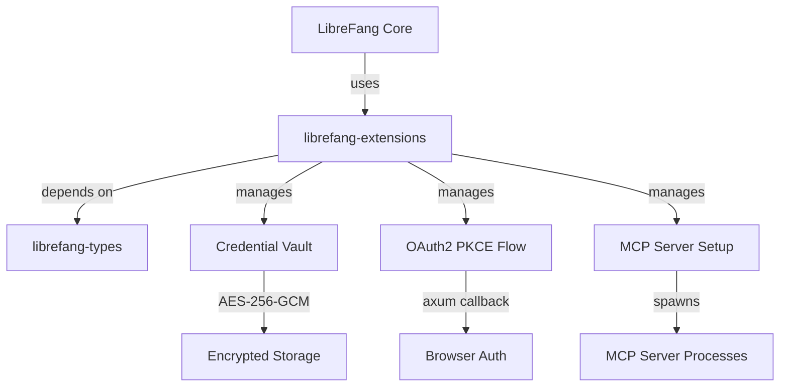

# Other — librefang-extensions

# librefang-extensions

Extension and integration system for LibreFang, providing one-click MCP server setup, an encrypted credential vault, and OAuth2 PKCE authentication flows.

## Purpose

This crate serves as the integration layer between LibreFang and external services. It handles three core responsibilities:

- **MCP Server Management** — discovering, configuring, and launching Model Context Protocol servers with minimal user friction ("one-click" setup).
- **Credential Vault** — securely storing and retrieving API keys, tokens, and other secrets at rest using AES-256-GCM encryption with Argon2 key derivation.
- **OAuth2 PKCE** — performing browser-based OAuth2 authorization flows (with Proof Key for Code Exchange) for services that require it, including spinning up a local HTTP callback server.

## Architecture

## Key Components

### Credential Vault

Encrypts sensitive credentials before writing them to disk and decrypts them on demand. The vault never holds plaintext secrets in memory longer than necessary.

**Cryptographic stack** (derived from dependencies):

| Concern | Library | Details |
|---|---|---|
| Symmetric encryption | `aes-gcm` | AES-256-GCM authenticated encryption |
| Key derivation | `argon2` | Argon2 password-based KDF for deriving encryption keys from a master passphrase |
| Secure memory | `zeroize` | Plaintext keys and credentials are zeroed after use |
| Hashing | `sha2` | SHA-256 for integrity checks and PKCE code challenges |
| Random generation | `rand` | Cryptographically secure random nonces and salt generation |

Vault files are stored under the user's data directory (via `dirs`), and all concurrent access is managed through `dashmap`.

### OAuth2 PKCE

Implements the full Authorization Code Flow with PKCE for browser-based authentication:

1. Generates a cryptographically random code verifier (`rand` + `base64`).
2. Derives the code challenge using SHA-256 (`sha2`).
3. Opens the user's browser to the authorization endpoint (`url` for URL construction).
4. Spins up a temporary local HTTP server (`axum`) to receive the callback with the authorization code.
5. Exchanges the code for tokens via `reqwest`, using TLS verification through `rustls` with platform-native and/or Mozilla certificate roots.
6. Stores the resulting tokens in the credential vault.

### MCP Server Setup

Handles the lifecycle of MCP server integrations:

- **Discovery and configuration** — reads server definitions from TOML/JSON configuration files (`toml`, `serde_json`).
- **One-click setup** — orchestrates the steps needed to get an MCP server running, including credential provisioning (pulling from the vault or triggering an OAuth2 flow as needed).
- **Process management** — spawns and tracks MCP server processes via Tokio's async runtime.

### TLS Stack

All outbound HTTP connections (token exchanges, MCP API calls) use `reqwest` backed by `rustls` rather than the system TLS library. Certificate roots come from two sources:

- `webpki-roots` — Mozilla's bundled CA certificates.
- `rustls-native-certs` — Platform-native certificate store.

This ensures connectivity in both bundled and system-installed configurations.

## Dependencies on Other Crates

| Dependency | Usage |
|---|---|
| `librefang-types` | Shared types (credentials, server descriptors, extension manifests) |
| `librefang-runtime` (dev) | Used only in tests for async runtime access |

No other LibreFang crates depend on `librefang-extensions` at the compilation level — it is consumed at the application layer by higher-level crates that compose the full LibreFang binary.

## Thread Safety and Concurrency

The credential vault uses `dashmap` for lock-free concurrent read/write access, allowing multiple extension handlers to retrieve or store credentials simultaneously without blocking. All async operations run on the Tokio runtime, and the local OAuth2 callback server integrates with the same runtime.

## Testing

Dev-dependencies include `tokio-test` for async test helpers, `tempfile` for isolated vault storage during tests, and `serial_test` to serialize tests that touch shared filesystem state (such as the encrypted vault files on disk).