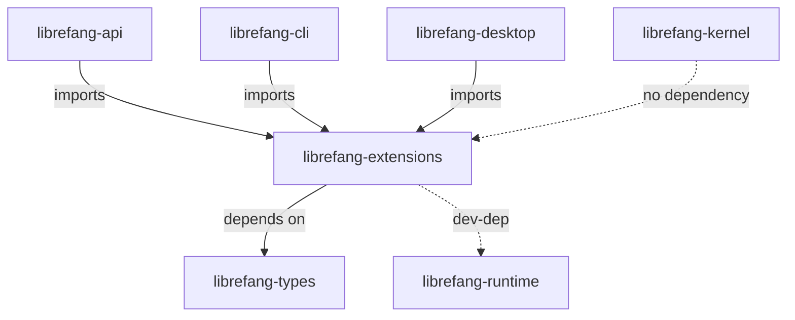

# Other — librefang-extensions

# librefang-extensions

Agent-side toolkit that doesn't belong in `runtime` or `kernel`. MCP server catalog, encrypted credential vault, OAuth2 PKCE client, provider health probes, plugin installer, shared HTTP client, and dotenv parsing.

This crate sits **above** `kernel` and **below** `librefang-api` / `librefang-cli` / `librefang-desktop`. It depends on `librefang-types` (and `librefang-runtime` in dev-dependencies only). Nothing in `kernel` depends on extensions.

## Architecture



## Module Map

| Module | Responsibility |
|---|---|
| `catalog` | MCP server catalog at `~/.librefang/mcp/catalog/`. Templates and available servers. |
| `credentials` | Auth-source unification. Resolves credentials from multiple providers with defined precedence. |
| `dotenv` | `.env` file parsing for agent workspaces. |
| `health` | Provider liveness probes. Backed by `provider_health` in runtime. |
| `http_client` | Shared `reqwest::Client` builder. All HTTP must go through here. |
| `installer` | MCP server install, update, and uninstall flows. |
| `oauth` | OAuth2 PKCE client with Dynamic Client Registration (RFC 7591). |
| `vault` | AES-256-GCM encrypted credential vault with OS keyring integration. |

## Credential Vault

The `vault` module stores secrets encrypted at rest using AES-256-GCM. Key derivation uses Argon2. The master key comes from one of three sources, tried in order:

1. **Environment variable** `LIBREFANG_VAULT_KEY` — base64-encoded, must decode to exactly 32 bytes. Generate with `openssl rand -base64 32` (produces 44 characters).
2. **OS keyring** — `libsecret` on Linux, Keychain on macOS, Credential Manager on Windows. Not compiled in for musl-static or Android targets; the vault transparently falls back to file storage.
3. **File fallback** — `~/Library/Application Support/librefang/.keyring` on macOS (mode `0600`). Linux and Windows use the OS keyring.

### macOS Keychain Behavior

macOS skips the Keychain by default (see #2766). Enable it with config:

```toml
[vault]
use_os_keyring = true
```

The migration path: on first boot, the vault performs one final read from Keychain, mirrors the key to the file fallback, and never touches Keychain again.

### Invariants

- All vault operations go through the `Vault` API. Never read the `.keyring` file directly.
- Per-agent vault instances are cached behind a `RwLock<HashMap<AgentId, Arc<Vault>>>`. Invalidate on credential change.
- The master key is held in memory and zeroized on drop via the `zeroize` crate.

## Shared HTTP Client

Call `http_client::shared_client()` to get a pre-configured `reqwest::Client`. It provides:

- `User-Agent: librefang/<version>` (matches `librefang_runtime::USER_AGENT`)
- Connection pooling
- Sensible timeout, redirect, and TLS defaults (using `rustls` with `webpki-roots` and `rustls-native-certs`)

**Do not create bespoke `reqwest::Client` instances.** This is enforced in code review. The shared client ensures consistent behavior across all HTTP traffic and avoids connection-pool proliferation.

## OAuth2 for MCP Servers

The OAuth flow is split across two crates:

- **This crate** (`oauth` module): PKCE generation, token exchange, token refresh, Dynamic Client Registration per RFC 7591. These are the building blocks.
- **`librefang-api`** (`routes/mcp_auth.rs`): The user-facing flow that drives the building blocks — callback handling, redirecting the user's browser, receiving the authorization code.

### Flow Overview

1. The daemon detects a `401` from an MCP server and sets `NeedsAuth` state on the connection.
2. The API layer initiates PKCE, generates the authorization URL, and redirects the user.
3. When the MCP server has a `registration_endpoint` but no `client_id`, Dynamic Client Registration (RFC 7591) is used to register one automatically.
4. The callback endpoint receives the authorization code, exchanges it for tokens, and stores them in the vault.

### Docker Considerations

Do not bind ephemeral localhost ports for OAuth callbacks in daemon code. Inside Docker, that port is unreachable from the host. Route all callbacks through the API server's existing port (the `api` crate handles this).

## Credential Resolution

The `credentials` module provides a unified `resolve()` function that checks sources in strict precedence:

1. Environment variables
2. Vault (encrypted store)
3. CLI login session
4. File-based credentials

When adding a new credential provider, integrate it into this precedence chain rather than bypassing it.

## Plugin Installer

Use `installer` for all MCP server install, update, and uninstall operations. Do not spawn raw `tokio::process` commands for plugin management. The installer handles process lifecycle, error reporting, and catalog updates atomically.

## Dependency Policy

| Allowed | Forbidden |
|---|---|
| `librefang-types` | `librefang-api` |
| `librefang-runtime` (dev-dep only) | `librefang-cli` |
| All workspace external crates | `librefang-desktop` |

Extensions sit below the application layers. Importing upward creates circular dependency cycles.

## Platform-Specific Compilation

The `keyring` crate is conditionally compiled for targets that have a working OS keyring backend:

```rust
// Cargo.toml target cfg
[target.'cfg(any(
    all(target_os = "linux", not(target_env = "musl")),
    target_os = "macos",
    target_os = "windows"
))'.dependencies]
keyring = { workspace = true }
```

On musl-static and Android targets, `libdbus-sys` (the secret-service C FFI) has no usable backend and would break the build. The vault module's `os_keyring()` function handles the absent-backend case by falling back to file-based storage.