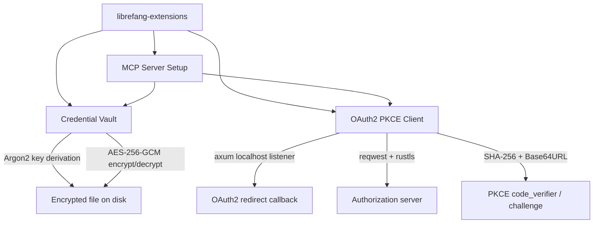

# Other — librefang-extensions

# librefang-extensions

Extension and integration layer for LibreFang. Provides three tightly coupled subsystems that allow LibreFang to connect securely to external services:

- **MCP server bootstrap** — one-click setup for Model Context Protocol servers
- **Credential vault** — AES-256-GCM encrypted, Argon2-keyed storage for secrets
- **OAuth2 PKCE flow** — Authorization Code Flow with PKCE, including a local redirect receiver

## Architecture



All three subsystems are designed to compose: MCP server setup can pull credentials from the vault and transparently run an OAuth2 PKCE flow if a server requires authorization.

## Key Dependencies and Why

| Dependency | Role in this crate |
|---|---|
| `aes-gcm` + `argon2` | Credential vault encryption and key derivation |
| `axum` | Lightweight HTTP server to catch OAuth2 redirect callbacks on `localhost` |
| `reqwest` + `rustls` | Outbound HTTPS to authorization/token endpoints without relying on OpenSSL |
| `dashmap` | Lock-free concurrent map for in-memory session/code_verifier tracking during OAuth2 flows |
| `sha2` + `base64` | PKCE `code_challenge = BASE64URL(SHA256(code_verifier))` |
| `zeroize` | Secure clearing of key material and tokens from memory |
| `toml` | Vault metadata and extension configuration files |
| `dirs` | Resolving platform-specific config/data directories for vault storage |
| `url` | Parsing and constructing OAuth2 authorization/token URLs |

## Credential Vault

The vault stores serialized credentials (tokens, API keys, etc.) in a file on disk, encrypted with AES-256-GCM. The encryption key is derived from a user-supplied passphrase via Argon2.

### Encryption pipeline

1. **KDF** — Argon2 derives a 256-bit key from the user's passphrase and a random salt.
2. **Encrypt** — A random 96-bit nonce is generated per write. Credentials are serialized to JSON, then encrypted with AES-256-GCM using the derived key and nonce.
3. **Persist** — Salt, nonce, and ciphertext are written to a file under the platform's data directory (resolved via `dirs`).

### Decryption pipeline

1. Read salt, nonce, and ciphertext from the vault file.
2. Re-derive the key from the passphrase and stored salt via Argon2.
3. Decrypt with AES-256-GCM. Deserialize the resulting JSON.

All sensitive intermediate buffers (`Vec<u8>` holding keys, tokens) implement `Drop` via `zeroize` to minimize their lifetime in memory.

## OAuth2 PKCE

Implements [RFC 7636 — PKCE for OAuth2](https://tools.ietf.org/html/rfc7636).

### Flow

1. **Generate** a cryptographically random `code_verifier` (high-entropy string via `rand`).
2. **Compute** `code_challenge = BASE64URL(SHA256(code_verifier))`.
3. **Open** the browser to the authorization endpoint with `code_challenge` and `code_challenge_method=S256`.
4. **Listen** — an `axum` server on `localhost` catches the redirect containing the `code`.
5. **Exchange** — a `reqwest` POST to the token endpoint sends `code`, `code_verifier`, and client credentials.
6. **Store** — the returned access/refresh tokens are saved to the credential vault.

The `code_verifier` → `code` mapping is held in a `DashMap` so concurrent flows don't collide.

## MCP Server Setup

One-click bootstrap for MCP servers. This subsystem:

1. Reads a TOML-based server definition (connection parameters, required scopes, etc.).
2. If the server requires OAuth2, launches the PKCE flow described above.
3. Stores the resulting credentials in the vault.
4. Returns a configured MCP client ready for use.

## Error Handling

Errors are consolidated through `thiserror` into a single enum (defined in this crate). Typical variants:

- **Vault errors** — file I/O, decryption failure (wrong passphrase), corrupt data
- **OAuth2 errors** — HTTP failures from `reqwest`, missing parameters, invalid state
- **Encryption errors** — AES-GCM authentication failure, Argon2 hashing error

All errors propagate via `Result<T, ExtensionError>` (or whatever the concrete type is named in the source).

## Integration with the Rest of LibreFang

```
librefang-types        ← shared types (error codes, credential structs)
librefang-extensions   ← this crate
librefang-runtime      ← uses extensions during test/dev (dev-dependency)
```

- `librefang-types` provides the shared data structures that this crate serializes into the vault.
- Downstream crates (the main application, runtime) depend on `librefang-extensions` to resolve credentials and establish MCP connections at startup.

## Testing

Dev-dependencies include `tokio-test` for async test helpers, `tempfile` for isolated vault files, and `serial_test` to serialize tests that touch shared state (such as the localhost OAuth2 listener or the filesystem vault).

Run tests with:

```bash
cargo test -p librefang-extensions
```

## Security Considerations

- **No plaintext at rest.** The vault file never contains unencrypted credentials.
- **No OpenSSL.** TLS is handled exclusively through `rustls` with `webpki-roots` and `rustls-native-certs`.
- **Passphrase never stored.** The vault only stores the Argon2 salt; the passphrase must be supplied at runtime.
- **Zeroization.** Key material, code verifiers, and tokens are zeroed on drop where practical.
- **PKCE over plain.** The `S256` challenge method is always used — never `plain`.