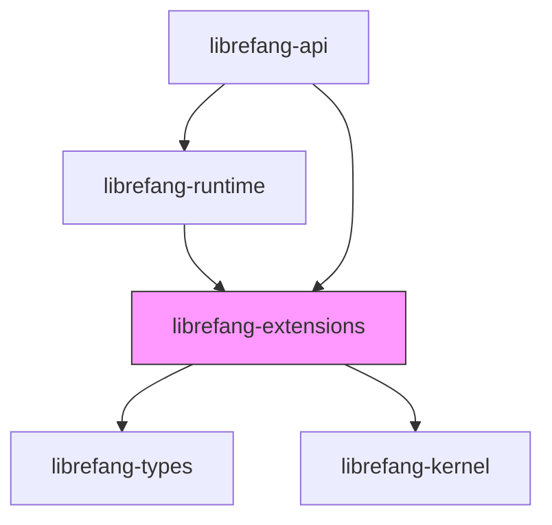

# Other — librefang-extensions

# librefang-extensions

Extension and integration toolkit for LibreFang — one-click MCP server setup, credential vault, OAuth2 PKCE, and shared infrastructure that doesn't belong in the kernel or runtime crates.

## Overview

This crate collects the "everything else an agent needs" functionality that doesn't fit into `librefang-kernel` (core abstractions) or `librefang-runtime` (execution engine). It provides concrete implementations for credential storage, MCP server lifecycle management, OAuth2 flows, HTTP client construction, and workspace environment configuration.

**Dependency direction:** `librefang-extensions` sits above `librefang-kernel` and depends on `librefang-types`. Nothing in this crate may depend on `librefang-api`, `librefang-cli`, or the desktop layer.


```mermaid
graph TD
    types["librefang-types"]
    kernel["librefang-kernel"]
    extensions["librefang-extensions"]
    runtime["librefang-runtime"]
    api["librefang-api"]

    extensions --> types
    extensions --> kernel
    runtime --> extensions
    api --> runtime
    api --> extensions

    style extensions fill:#f9f,stroke:#333
```

## Module Map

| Module | Responsibility |
|---|---|
| `catalog` | MCP server catalog metadata stored under `~/.librefang/mcp/catalog/` |
| `credentials` | Auth-source unification via `resolve` / `resolve_all` |
| `dotenv` | `.env` file parsing for agent workspaces |
| `health` | Provider liveness probes |
| `http_client` | Shared `reqwest` client builder — `client_builder()` and `new_client()` |
| `installer` | MCP server install, update, and uninstall flows |
| `oauth` | OAuth2 PKCE client with Dynamic Client Registration (RFC 7591) for MCP |
| `vault` | AES-256-GCM credential vault (`CredentialVault`) with OS keyring integration |

## Key Components

### Credential Vault (`vault`)

Stores encrypted credentials using AES-256-GCM. The master encryption key is retrieved from the OS-native keyring when available:

- **Linux** — libsecret (requires `libdbus-1-dev` at build time; not available for musl-static targets)
- **Windows** — Credential Manager
- **macOS** — file-based fallback (see the `use_os_keyring` plumbing)

When no OS keyring backend is compiled in — for example, musl-static or Android cross builds — the vault transparently falls back to an AES-256-GCM file-based store. The `keyring` dependency is target-gated in `Cargo.toml` to prevent build failures on platforms without libdbus.

The environment variable `LIBREFANG_VAULT_KEY` can influence key handling; constraints and cross-cutting rules for vault key management are documented in the top-level `CLAUDE.md`.

### OAuth2 Client (`oauth`)

Implements OAuth2 Authorization Code flow with PKCE, plus Dynamic Client Registration per RFC 7591. This is used for MCP server authentication.

**Important boundary:** The `McpOAuthProvider` trait lives in `librefang-runtime`, and its concrete implementation lives in `librefang-api`. This crate provides the OAuth2 *client* mechanics (token exchange, PKCE generation, registration) but does not own the callback wiring or HTTP routing for the OAuth flow. Cross-cutting rules about Docker callback URLs and flow ownership between daemon and API are in the top-level `CLAUDE.md`.

### HTTP Client Builder (`http_client`)

Provides two entry points for constructing `reqwest` clients:

- **`client_builder()`** — returns a pre-configured `reqwest::ClientBuilder` with shared defaults (TLS roots, timeouts, user-agent). Callers can add further customization before building.
- **`new_client()`** — builds a client immediately using the shared defaults.

There is no `shared_client()` singleton. Use whichever function fits the call site.

TLS configuration uses `rustls` with `webpki-roots` and `rustls-native-certs` for certificate verification.

### MCP Catalog (`catalog`)

Manages MCP server metadata files under `~/.librefang/mcp/catalog/`. This is the source of truth for which MCP servers are registered and their configuration.

### MCP Installer (`installer`)

Handles the full lifecycle of MCP server plugins: installation, updates, and uninstallation. Works in conjunction with the catalog module to keep metadata in sync.

### Credential Resolution (`credentials`)

Unifies multiple auth sources through `resolve` and `resolve_all`. These functions abstract over vault entries, environment variables, and other credential sources to provide a single interface for consumers.

### Health Probes (`health`)

Provider liveness checks. Used to verify that external services (MCP servers, OAuth providers) are reachable before attempting operations.

### Dotenv Parsing (`dotenv`)

Parses `.env` files for agent workspaces, loading environment variables needed by MCP servers and other integrations.

## Dependencies

Key external dependencies and why they're here:

| Dependency | Purpose |
|---|---|
| `aes-gcm` | Symmetric encryption for the credential vault |
| `argon2` | Key derivation for vault master key |
| `keyring` | OS-native keyring access (target-gated) |
| `reqwest` / `rustls` | HTTP client with Rust TLS backend |
| `dashmap` | Concurrent map for cached credentials/state |
| `sha2` / `hmac` / `subtle` | Cryptographic primitives for OAuth PKCE |
| `zeroize` | Secure memory zeroing for sensitive data |
| `rand` | Cryptographic random number generation |

## Build Considerations

The `keyring` crate is conditionally compiled based on target:

```toml
[target.'cfg(any(all(target_os = "linux", not(target_env = "musl")), target_os = "macos", target_os = "windows"))'.dependencies]
keyring = { workspace = true }
```

This means:

- **musl-static Linux builds** — no OS keyring; vault uses file-based fallback automatically.
- **Android cross builds** — same as above.
- **Standard Linux / macOS / Windows** — OS keyring is available and preferred.

If you're adding code that touches the vault, test both paths. The dev-dependency on `serial_test` exists because vault tests involve filesystem and keyring state that must not run concurrently.