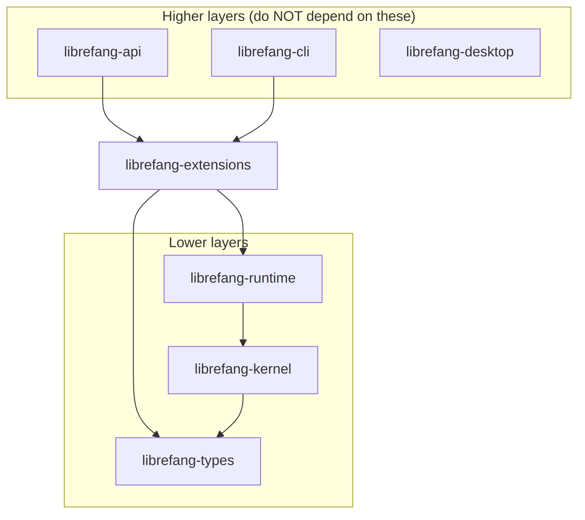

# Other — librefang-extensions

# librefang-extensions

Extension and integration toolkit for LibreFang — one-click MCP server setup, AES-256-GCM credential vault, OAuth2 PKCE with Dynamic Client Registration, shared HTTP client construction, and agent workspace configuration.

This crate sits between the foundational types layer and the higher-level runtime/API layers, providing the "everything-side-of-an-agent" functionality that doesn't belong in `librefang-kernel` or `librefang-runtime`.

## Architecture

```mermaid
graph TD
    subgraph "Higher layers (do NOT depend on these)"
        API[librefang-api]
        CLI[librefang-cli]
        Desktop[librefang-desktop]
    end

    EXT[librefang-extensions]

    subgraph "Lower layers"
        RT[librefang-runtime]
        KERN[librefang-kernel]
        TYPES[librefang-types]
    end

    EXT --> TYPES
    EXT --> RT
    API --> EXT
    CLI --> EXT
    RT --> KERN
    KERN --> TYPES
```

**Dependency rule:** This crate must never depend on `librefang-api`, `librefang-cli`, or `librefang-desktop`. It may depend on `librefang-types` and `librefang-runtime`.

## Module Map

| Module | Purpose |
|---|---|
| `catalog` | MCP server catalog metadata, stored under `~/.librefang/mcp/catalog/` |
| `credentials` | Auth-source unification layer — `resolve` and `resolve_all` functions |
| `dotenv` | `.env` file parsing for agent workspaces |
| `health` | Provider liveness probes |
| `http_client` | Shared `reqwest` client builder — `client_builder()` and `new_client()` |
| `installer` | MCP server install, update, and uninstall flows |
| `oauth` | OAuth2 PKCE client with Dynamic Client Registration (RFC 7591) for MCP |
| `vault` | AES-256-GCM credential vault (`CredentialVault`) |

## Key Components

### Credential Vault (`vault`)

The vault stores sensitive credentials using AES-256-GCM encryption. The master key has two storage strategies depending on the platform:

- **Linux (non-musl) / Windows:** OS keyring via the `keyring` crate (libsecret / Credential Manager).
- **macOS / musl targets:** File-based fallback. The `use_os_keyring` plumbing controls this behavior.

The `keyring` dependency is target-gated to avoid pulling `libdbus-sys` on musl-static and Android cross builds, where the secret-service backend has no usable C-FFI and would break the build. When compiled without OS keyring support, the vault transparently falls back to the AES-256-GCM file-based store.

The type is `CredentialVault` — not `Vault` or any other name.

**Environment variable:** `LIBREFANG_VAULT_KEY` — see the top-level `CLAUDE.md` for constraints on this variable. Do not duplicate those rules here.

### OAuth2 Client (`oauth`)

Implements OAuth2 PKCE flow combined with Dynamic Client Registration (RFC 7591) for MCP server authentication.

**Ownership boundary:** The `McpOAuthProvider` trait lives in `librefang-runtime`. Its concrete implementation lives in `librefang-api`. This crate provides the OAuth client machinery but does not own the trait definition or the callback wiring.

### HTTP Client Builder (`http_client`)

Provides two entry points for constructing `reqwest` clients:

- `client_builder()` — returns a configured `reqwest::ClientBuilder` for further customization.
- `new_client()` — returns a ready-to-use `reqwest::Client` with standard defaults.

There is no `shared_client()` function. Use whichever entry point fits the call site.

TLS is backed by `rustls` with `webpki-roots` and `rustls-native-certs` for certificate verification.

### MCP Catalog (`catalog`)

Manages MCP server catalog metadata on disk at `~/.librefang/mcp/catalog/`. Works with the `installer` module for full server lifecycle management.

### Credential Resolution (`credentials`)

Unifies auth sources through `resolve` and `resolve_all` functions, providing a single interface for credential lookup across vault entries, environment variables, and other auth sources.

### Installer (`installer`)

Handles MCP server lifecycle operations:
- Install
- Update
- Uninstall

### Health Probes (`health`)

Performs provider liveness checks to determine whether external services are reachable and responsive.

### Dotenv (`dotenv`)

Parses `.env` files for agent workspace configuration.

## Cryptographic Dependencies

| Crate | Use |
|---|---|
| `aes-gcm` | AES-256-GCM encryption for the credential vault |
| `argon2` | Key derivation |
| `zeroize` | Secure memory zeroing for sensitive data |
| `rand` | Cryptographic random number generation |
| `sha2`, `hmac`, `subtle` | Hashing and MAC operations |

## Ownership Boundaries

**This crate owns:**
- Credential vault and encryption
- MCP server catalog metadata
- OAuth2 client implementation
- Shared HTTP client builder
- `.env` parsing
- Plugin/MCP server installer
- Provider health probes

**This crate does NOT own:**
- Kernel callback wiring — the `McpOAuthProvider` trait is in `librefang-runtime`; the implementation is in `librefang-api`
- HTTP routing
- Channel adapters

## Cross-Cutting Concerns

Docker callback URLs, OAuth flow ownership between daemon and API, vault key handling, `LIBREFANG_VAULT_KEY` constraints, auth middleware allowlists, and other cross-crate rules are documented in the top-level `CLAUDE.md`. Consult that document before adding code that crosses crate boundaries. Those rules are intentionally not duplicated here to prevent drift.