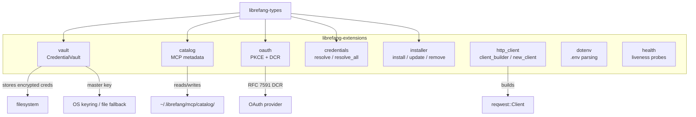

# Other — librefang-extensions

# librefang-extensions

Extension and integration toolkit for LibreFang — credential vault, MCP server catalog, OAuth2 PKCE flows, plugin installer, shared HTTP client, and workspace `.env` parsing.

This crate lives above `librefang-kernel` and below the application layers (`librefang-api`, CLI, desktop). Nothing in this crate may depend on those higher-level crates.

## Architecture


```mermaid
graph TD
    subgraph "librefang-extensions"
        V[vault<br/>CredentialVault]
        CAT[catalog<br/>MCP metadata]
        OAUTH[oauth<br/>PKCE + DCR]
        CREDS[credentials<br/>resolve / resolve_all]
        INST[installer<br/>install / update / remove]
        HC[http_client<br/>client_builder / new_client]
        DOTENV[dotenv<br/>.env parsing]
        HEALTH[health<br/>liveness probes]
    end

    TYPES[librefang-types] --> V
    TYPES --> CAT
    TYPES --> OAUTH
    TYPES --> CREDS
    TYPES --> INST

    V -->|stores encrypted creds| FS[filesystem]
    V -->|master key| KR[OS keyring / file fallback]
    OAUTH -->|RFC 7591 DCR| REMOTE[OAuth provider]
    CAT -->|reads/writes| DIR[~/.librefang/mcp/catalog/]
    HC -->|builds| REQ[reqwest::Client]
```

## Module Reference

### `vault` — AES-256-GCM Credential Vault

The core credential storage, exposed through `CredentialVault`.

**Encryption**: Credentials are encrypted with AES-256-GCM. The master encryption key is derived via Argon2 key derivation.

**Master key storage** is platform-dependent:

| Platform | Keyring backend | Fallback |
|---|---|---|
| Linux (glibc) | libsecret via `keyring` crate | File-based AES-256-GCM store |
| macOS | Keychain via `keyring` crate | File fallback |
| Windows | Credential Manager via `keyring` crate | File fallback |
| Linux (musl) | *Not compiled in* | File-based store |
| Android | *Not compiled in* | File-based store |

The `keyring` dependency is target-gated in `Cargo.toml` to avoid pulling `libdbus-sys` on musl and Android targets where there is no usable secret-service backend. When no OS keyring is compiled in, the vault transparently falls back to its file-based store.

The `LIBREFANG_VAULT_KEY` environment variable can provide the master key. Cross-cutting rules for vault key handling are documented in the top-level `CLAUDE.md`.

### `catalog` — MCP Server Catalog

Manages MCP server metadata under `~/.librefang/mcp/catalog/`. Stores installation metadata, version information, and server capabilities for installed MCP servers.

### `credentials` — Auth Source Unification

Provides `resolve` and `resolve_all` functions that unify multiple auth sources (vault entries, environment variables, `.env` files, OAuth tokens) into a single credential resolution pipeline. This is the single entry point for code that needs to authenticate against an MCP server or external provider.

### `oauth` — OAuth2 PKCE Client

Implements OAuth2 Authorization Code flow with PKCE (Proof Key for Code Exchange) plus Dynamic Client Registration per RFC 7591. Used when MCP servers require OAuth-based authentication.

**Important boundary note**: The `McpOAuthProvider` trait lives in `librefang-runtime`. The concrete implementation lives in `librefang-api`. This crate provides the OAuth client primitives (PKCE generation, token exchange, DCR calls) but does not own the trait or the callback wiring.

### `installer` — MCP Server Install / Update / Uninstall

Handles one-click MCP server lifecycle: downloading, installing, updating, and removing MCP server packages. Works in concert with the `catalog` module to track installed state.

### `http_client` — Shared HTTP Client Builder

Provides two functions for creating `reqwest::Client` instances:

- **`client_builder()`** — Returns a pre-configured `reqwest::ClientBuilder` with shared TLS settings (rustls with webpki roots and native cert loading). Callers can add additional configuration before building.
- **`new_client()`** — Builds a `reqwest::Client` directly with default settings.

There is no `shared_client()` singleton. Use whichever function fits the call site. TLS is backed by `rustls` (not native-tls), with both `webpki-roots` and `rustls-native-certs` loaded.

### `dotenv` — `.env` Parsing

Parses `.env` files in agent workspaces to surface environment variables for credential resolution and configuration. Integrates with the `credentials` module's resolution pipeline.

### `health` — Provider Liveness Probes

Health check utilities for probing whether MCP servers and external providers are reachable and responsive.

## Dependency Notes

### Target-gated OS keyring

```toml
[target.'cfg(any(all(target_os = "linux", not(target_env = "musl")), target_os = "macos", target_os = "windows"))'.dependencies]
keyring = { workspace = true }
```

This means `cargo build --target x86_64-unknown-linux-musl` will not pull in `libdbus-sys`. The vault code internally checks whether the OS keyring feature is compiled in and falls back gracefully.

### TLS stack

Uses `rustls` + `webpki-roots` + `rustls-native-certs`. No OpenSSL dependency. The HTTP client builder configures rustls directly.

## Crate Boundaries

**This crate owns**: vault, MCP catalog, OAuth client primitives, shared HTTP client builder, `.env` parsing, plugin installer.

**This crate does NOT own**:
- Kernel callback wiring (`McpOAuthProvider` trait is in `librefang-runtime`)
- HTTP routing
- Channel adapters
- Auth middleware allowlist

**Dependency direction**: `librefang-extensions` → `librefang-types`. No dependency on `librefang-api`, CLI, or desktop crates. Upper-layer crates depend on this one, never the reverse.

## Adding Code to This Crate

1. Check the top-level `CLAUDE.md` for cross-cutting rules (Docker callback URLs, OAuth flow ownership between daemon and API, vault key handling, `LIBREFANG_VAULT_KEY` constraints, auth middleware allowlist) before adding code that crosses crate boundaries.
2. Do not duplicate those rules within this crate's documentation — they belong in the top-level file to avoid drift.
3. New features that are "agent-side infrastructure" (not kernel primitives, not HTTP routing, not UI) belong here.
4. If a new module needs types from `librefang-runtime`, consider whether the dependency should be inverted (trait in runtime, implementation here) or whether the type belongs in `librefang-types` instead.