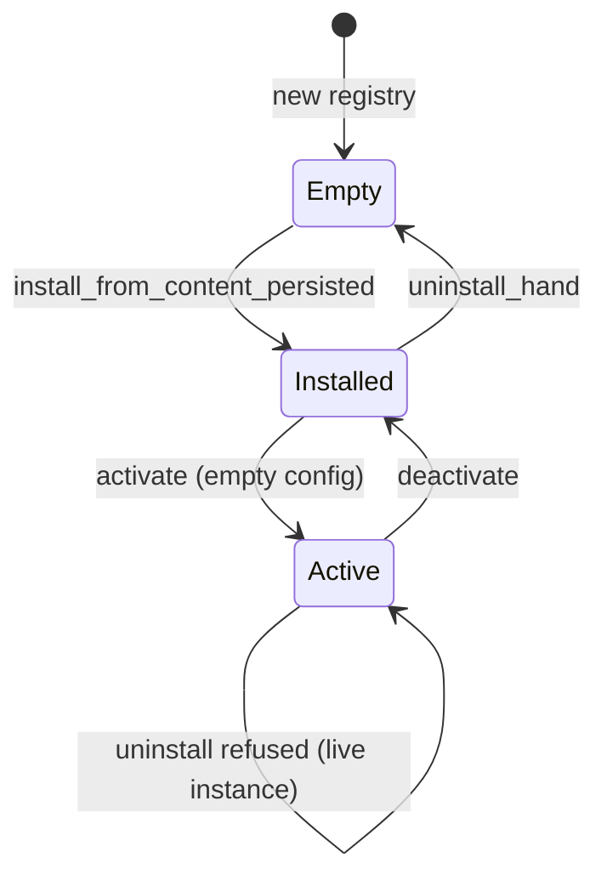

# Other — librefang-hands-tests

# Registry Smoke Tests (`librefang-hands/tests/registry_smoke.rs`)

## Purpose

Integration smoke tests that exercise the `HandRegistry` public API end-to-end, catching cross-method invariant violations that unit tests on individual methods can miss. Every historical bug in this area was a composition failure — definitions present without a workspace, instances surviving uninstall, etc. — so these tests drive the full lifecycle on a fresh temporary home directory.

No LLM, no kernel. Pure tool-dispatch and persistence behaviour.

## Test Coverage

### `install_activate_deactivate_uninstall_lifecycle`

Validates the complete state machine of a hand from installation through teardown:



**Invariants verified at each transition:**

| Step | Method called | Assertions |
|------|--------------|------------|
| Fresh state | — | `list_definitions()` and `list_instances()` are empty |
| Install | `install_from_content_persisted` | Returns correct definition; `HAND.toml` and `SKILL.md` exist on disk at `home/workspaces/<id>/`; definition visible via `list_definitions()` and `get_definition()` |
| Activate | `activate` with empty config map | Returns instance with `HandStatus::Active`; exactly one instance in `list_instances()`; retrievable via `get_instance()` |
| Refused uninstall | `uninstall_hand` | Returns `Err`; definition and instance unchanged in memory |
| Deactivate | `deactivate` | Returns the same instance; `list_instances()` becomes empty |
| Uninstall | `uninstall_hand` | Returns `Ok`; `get_definition()` returns `None`; workspace directory physically removed from disk |

The "refused uninstall while active" check enforces the contract that `DELETE /api/hands/{id}` depends on — the test deliberately avoids pinning a specific error variant (that's covered by unit tests in `registry.rs`) and instead asserts that the failed call leaves all in-memory state untouched.

### `definitions_round_trip_through_a_disk_reload`

Locks in the contract that `home/workspaces/<id>/HAND.toml` is the source of truth for persistence:

1. A fresh `HandRegistry` installs a hand via `install_from_content_persisted`.
2. A second, independent `HandRegistry` is created (simulating a daemon restart).
3. Before reload, the second registry sees nothing — `list_definitions()` is empty.
4. After `reload_from_disk(home)`, the hand is fully discoverable via `get_definition("smoke-hand")`.

This ensures that no in-memory log or external state is required to reconstruct the registry — the filesystem layout alone is sufficient.

## Test Fixtures

Two inline constants define the minimal valid hand content:

- **`SMOKE_HAND_TOML`** — A complete `HAND.toml` with id `smoke-hand`, routing alias `smoke`, and a minimal agent definition. No required settings, so `activate` with an empty `HashMap` is valid.
- **`SMOKE_SKILL_MD`** — A trivial Markdown skill body written alongside the TOML.

## Relationship to `HandRegistry`

Both tests target `librefang_hands::registry::HandRegistry` exclusively. The methods exercised are:

| Method | Used in |
|--------|---------|
| `HandRegistry::new()` | Both tests |
| `install_from_content_persisted(home, toml, md)` | Both tests |
| `activate(hand_id, config_map)` | Lifecycle test |
| `deactivate(instance_id)` | Lifecycle test |
| `uninstall_hand(home, hand_id)` | Lifecycle test |
| `list_definitions()` | Both tests |
| `list_instances()` | Lifecycle test |
| `get_definition(id)` | Both tests |
| `get_instance(instance_id)` | Lifecycle test |
| `reload_from_disk(home)` | Reload test |

## Running

These are regular `#[test]` functions — run with:

```bash
cargo test -p librefang-hands --test registry_smoke
```

Each test creates its own `tempfile::tempdir()` for full isolation. No shared state, no ordering dependencies.