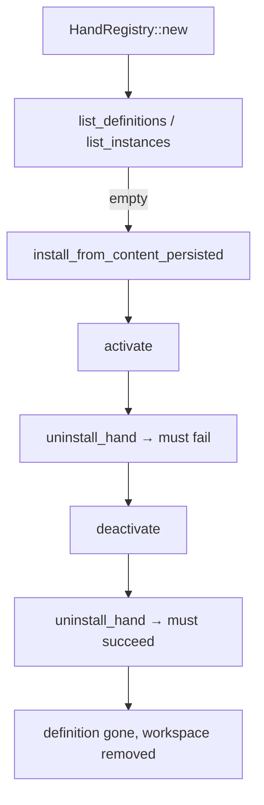

# Other — librefang-hands-tests

# librefang-hands/tests/registry_smoke

Integration smoke tests for the `HandRegistry` public API. These tests exercise cross-method invariants — the class of bugs historically responsible for regressions in this module (e.g., definitions present without a workspace directory, instances lingering after uninstall).

The tests are intentionally **end-to-end on a fresh temp home**: no LLM, no kernel, no mocks. They verify that the registry's persistence and in-memory layers stay consistent across the full lifecycle.

## Test Fixtures

Two inline constants provide the minimum viable hand content:

| Constant | Purpose |
|---|---|
| `SMOKE_HAND_TOML` | A minimal `HAND.toml` defining `"smoke-hand"` with one alias and a trivial agent. |
| `SMOKE_SKILL_MD` | A one-line markdown file acting as the hand's skill body. |

Both are passed as strings to `install_from_content_persisted`, which writes them to disk under `home/workspaces/<id>/`.

## Test Cases

### `install_activate_deactivate_uninstall_lifecycle`

Full happy-path lifecycle plus one critical error-path invariant. Exercises the following `HandRegistry` methods in sequence:



**Invariants verified at each step:**

1. **Fresh state** — `list_definitions()` and `list_instances()` return empty on a new registry.
2. **Install** — `install_from_content_persisted` writes `HAND.toml` and `SKILL.md` to `home/workspaces/smoke-hand/`, returns a definition with the correct `id` and `name`, and makes the definition visible to `list_definitions()` and `get_definition()`.
3. **Activate** — `activate("smoke-hand", HashMap::new())` creates a single active instance (`HandStatus::Active`). The instance appears in `list_instances()` and is retrievable via `get_instance()`.
4. **Refused uninstall** — Calling `uninstall_hand` while a live instance exists returns an error. Crucially, the refusal must **not corrupt in-memory state**: the definition and instance remain intact.
5. **Deactivate** — `deactivate(instance_id)` returns the deactivated instance and removes it from `list_instances()`.
6. **Successful uninstall** — After deactivation, `uninstall_hand` succeeds, removes the definition from memory, and deletes the workspace directory from disk.

### `definitions_round_trip_through_a_disk_reload`

Verifies that the `home/workspaces/<id>/HAND.toml` layout is the **source of truth** — a brand-new `HandRegistry` calling `reload_from_disk` on the same home directory discovers previously installed hands without replaying any in-memory log.

**Steps:**

1. Install `smoke-hand` via one `HandRegistry` instance.
2. Create a second `HandRegistry` (starts empty).
3. Call `reload_from_disk(home)` on the second instance.
4. Assert at least one hand was loaded and `get_definition("smoke-hand")` returns the correct definition.

This test locks in the contract that a daemon restart can fully reconstruct state from disk alone.

## APIs Under Test

All methods live on [`HandRegistry`](../src/registry.rs) unless noted:

| Method | Called by |
|---|---|
| `HandRegistry::new()` | Both tests |
| `install_from_content_persisted(home, toml, md)` | Both tests |
| `activate(hand_id, config_map)` | Lifecycle test |
| `deactivate(instance_id)` | Lifecycle test |
| `uninstall_hand(home, hand_id)` | Lifecycle test |
| `list_definitions()` | Both tests |
| `get_definition(id)` | Both tests |
| `list_instances()` | Lifecycle test |
| `get_instance(instance_id)` | Lifecycle test |
| `reload_from_disk(home)` | Round-trip test |
| [`HandStatus::Active`](../src/lib.rs) | Lifecycle test |

## Running

```sh
cargo test -p librefang-hands --test registry_smoke
```

No external services or environment variables required. The `tempfile` crate provides isolated temporary directories that are cleaned up automatically on test completion.