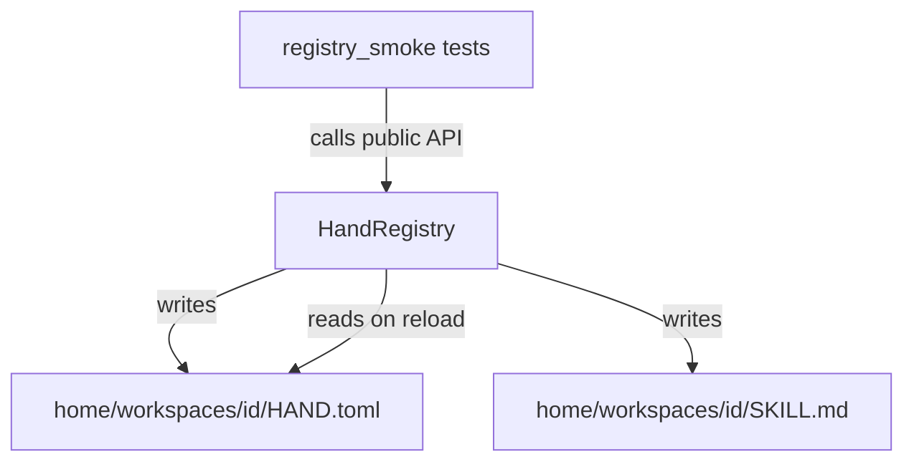

# Other — librefang-hands-tests

# librefang-hands-tests — Registry Smoke Tests

## Purpose

This module contains **integration smoke tests** for `HandRegistry`, the core hand management component in `librefang-hands`. The tests exercise the public API's cross-method invariants — the places where previous bugs were most common. They operate against a temporary filesystem with no LLM, no kernel, and no external services.

## When to Run

```bash
cargo test -p librefang-hands --test registry_smoke
```

These tests are gated behind the default test target (no feature flags required). Because they write to a temp directory and perform no I/O beyond that, they are safe to run in parallel and on CI.

## Test Coverage

### `install_activate_deactivate_uninstall_lifecycle`

Full end-to-end lifecycle of a hand from installation through cleanup. This test exists because every previous regression in the hand registry was a **cross-method invariant violation** (e.g., definitions present but no workspace directory, instances lingering after uninstall).

The lifecycle proceeds through these phases:

1. **Fresh-state sanity** — A new `HandRegistry` reports zero definitions and zero instances.
2. **Install** — `install_from_content_persisted` writes `HAND.toml` and `SKILL.md` to `home/workspaces/<id>/` and registers the definition in memory. The test asserts both the returned definition's fields and the physical files on disk.
3. **Discovery** — `list_definitions` and `get_definition` must now surface the installed hand.
4. **Activation** — `activate` is called with an empty config `HashMap` (the explicit-default path for hands with no required settings). The returned instance must have `HandStatus::Active`.
5. **Active-instance observability** — `list_instances` reports exactly one instance; `get_instance` can retrieve it by ID.
6. **Refused uninstall** — `uninstall_hand` must fail while a live instance exists. The test asserts that the refused call does **not** corrupt in-memory state — the definition and instance remain intact.
7. **Deactivation** — `deactivate` removes the instance from `list_instances`.
8. **Successful uninstall** — After deactivation, `uninstall_hand` succeeds. Both the in-memory definition and the on-disk workspace directory are removed.

### `definitions_round_trip_through_a_disk_reload`

Validates that `home/workspaces/<id>/HAND.toml` is the **source of truth** — a daemon restart can fully reconstruct state from disk.

The test installs a hand with one `HandRegistry` instance, then creates a second, empty `HandRegistry` and calls `reload_from_disk` on the same home directory. It asserts:

- The fresh registry starts empty (no stale state).
- `reload_from_disk` reports at least one hand loaded.
- `get_definition` recovers the hand with the correct name.

## Fixture Data

Both tests share two constant fixtures:

| Constant | Content | Purpose |
|---|---|---|
| `SMOKE_HAND_TOML` | A minimal valid `HAND.toml` with id `smoke-hand`, category `data`, routing alias `smoke`, and an agent block. | Validates TOML parsing and definition registration. |
| `SMOKE_SKILL_MD` | A short Markdown string. | Validates that skill content is persisted alongside the hand definition. |

## API Methods Exercised

| Method | Called By | Notes |
|---|---|---|
| `HandRegistry::new` | Both tests | Creates an empty in-memory registry. |
| `install_from_content_persisted` | Both tests | Writes files to disk and registers definition. |
| `list_definitions` | Lifecycle test | Returns all registered hand definitions. |
| `get_definition` | Both tests | Looks up a single definition by ID. |
| `activate` | Lifecycle test | Creates a running instance from a definition. |
| `list_instances` | Lifecycle test | Returns all active instances. |
| `get_instance` | Lifecycle test | Looks up a single instance by ID. |
| `deactivate` | Lifecycle test | Stops and removes an instance. |
| `uninstall_hand` | Lifecycle test | Removes definition and workspace directory. Refused if live instances exist. |
| `reload_from_disk` | Reload test | Reconstructs definitions from `home/workspaces/*/HAND.toml`. |

## Architecture Relationship


```mermaid
graph TD
    A[registry_smoke tests] -->|calls public API| B[HandRegistry]
    B -->|writes| C[home/workspaces/id/HAND.toml]
    B -->|writes| D[home/workspaces/id/SKILL.md]
    B -->|reads on reload| C
```

The tests treat `HandRegistry` as a black box, exercising only its public methods. They depend on the `librefang_hands::registry` and `librefang_hands::HandStatus` imports, plus the `tempfile` crate for isolated filesystems.

## Contributing

When adding a new public method to `HandRegistry`, or changing the on-disk layout under `home/workspaces/`, add a corresponding assertion to the lifecycle test or create a new test in this file. The guiding principle: **unit tests cover individual method contracts; these smoke tests cover cross-method invariants**.