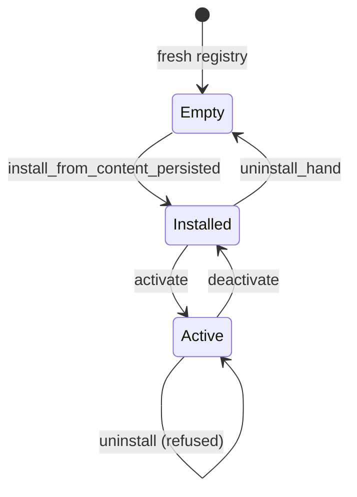

# Other — librefang-hands-tests

# librefang-hands — Registry Smoke Tests (`tests/registry_smoke.rs`)

## Purpose

Integration smoke tests that exercise the `HandRegistry` public API through its full lifecycle. These tests exist to catch **cross-method invariant violations** — bugs where individual methods work in isolation but break when composed (e.g., a definition exists but no workspace directory, or an instance remains after uninstall). Every historical regression in this area was a composition bug, not a unit-level failure.

No LLM, no kernel — these tests validate pure tool-dispatch and disk-persistence behaviour.

## Test Fixtures

Two inline constants provide the test content:

| Constant | Content | Purpose |
|---|---|---|
| `SMOKE_HAND_TOML` | A minimal valid `HAND.toml` with `id = "smoke-hand"` | Hand definition with routing alias and agent config |
| `SMOKE_SKILL_MD` | `# Smoke Skill\n\nIntegration-test skill body.\n` | Skill markdown body |

## Tests

### `install_activate_deactivate_uninstall_lifecycle`

End-to-end lifecycle test that walks the primary state machine of a hand:


```mermaid
stateDiagram-v2
    [*] --> Empty : fresh registry
    Empty --> Installed : install_from_content_persisted
    Installed --> Active : activate
    Active --> Active : uninstall (refused)
    Active --> Installed : deactivate
    Installed --> Empty : uninstall_hand
```

**Step-by-step contract verified:**

1. **Fresh state** — A new `HandRegistry` reports zero definitions and zero instances.

2. **Install** — `install_from_content_persisted` writes both `HAND.toml` and `SKILL.md` to `home/workspaces/<id>/`, registers the definition in memory, and returns the parsed definition with the expected `id` and `name`.

3. **Post-install observability** — `list_definitions()` and `get_definition("smoke-hand")` both reflect the new hand.

4. **Activate** — `activate` with an empty `HashMap` config (the explicit-default path for hands with no required settings) returns an instance with `status == HandStatus::Active`. The instance is visible via `list_instances()` and `get_instance()`.

5. **Uninstall refused while active** — Calling `uninstall_hand` while instances exist must fail. Critically, the test asserts that this **refused** call does not corrupt in-memory state: the definition and instance both survive untouched. This is the cross-method invariant the DELETE `/api/hands/{id}` route depends on.

6. **Deactivate** — `deactivate` removes the instance from `list_instances()`.

7. **Uninstall succeeds** — After deactivation, `uninstall_hand` removes both the in-memory definition and the workspace directory from disk.

### `definitions_round_trip_through_a_disk_reload`

Validates that `home/workspaces/<id>/HAND.toml` is the **source of truth** — a daemon restart that creates a fresh `HandRegistry` and calls `reload_from_disk` must recover all installed hands without replaying any in-memory log.

1. **Install** on one `HandRegistry` instance.
2. **Create a second** `HandRegistry` (starts empty).
3. **`reload_from_disk`** on the same `home` directory.
4. Assert the second registry discovers `smoke-hand` with the correct name.

`reload_from_disk` returns a `(loaded, _failed)` tuple; the test asserts `loaded >= 1`.

## APIs Exercised

| Method | Called By |
|---|---|
| `HandRegistry::new()` | Both tests |
| `install_from_content_persisted(home, toml, md)` | Both tests |
| `list_definitions()` | Lifecycle test |
| `get_definition(id)` | Both tests |
| `activate(hand_id, config)` | Lifecycle test |
| `list_instances()` | Lifecycle test |
| `get_instance(instance_id)` | Lifecycle test |
| `deactivate(instance_id)` | Lifecycle test |
| `uninstall_hand(home, hand_id)` | Lifecycle test |
| `reload_from_disk(home)` | Round-trip test |

## Running

```sh
cargo test -p librefang-hands --test registry_smoke
```

These tests use `tempfile::tempdir()` for isolation — no global state is mutated, and tests can run in parallel.