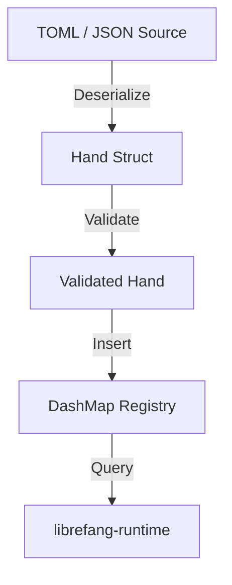

# Other — librefang-hands

# librefang-hands

Curated autonomous capability packages for the LibreFang system.

## Overview

In LibreFang, a **Hand** is a discrete, self-contained capability package that can be assigned to an autonomous agent. Hands encapsulate a specific set of behaviors, permissions, and configuration — allowing the system to compose agent functionality from well-defined, auditable building blocks.

This crate provides the data model, loading, validation, and registry for hands. It does not execute hands itself; execution is delegated to the runtime layer (`librefang-runtime`).

## Core Concepts

### Hand

A hand represents a named capability package. Each hand is defined by:

- **Identity** — A unique `Uuid` and a human-readable name.
- **Metadata** — Description, version, authorship, and timestamps (`chrono`) recorded at creation and modification time.
- **Capabilities** — A declaration of what the hand is permitted to do.
- **Configuration** — Structured parameters (loaded from TOML or JSON) that parametrize the hand's behavior.

### Registry

The module maintains an in-memory registry of loaded hands, backed by a `DashMap` for concurrent read-write access. This allows multiple runtime components to query available hands without locking the entire data structure.

### Loading and Validation

Hands are materialized from configuration sources (TOML files, JSON payloads). The loading pipeline:

1. **Deserialize** raw input into the hand data structure (`serde` + `toml` / `serde_json`).
2. **Validate** the resulting hand against schema and policy constraints.
3. **Register** the validated hand in the shared registry.

Failures at any stage produce structured errors via `thiserror`.

## Architecture

## Key Dependencies

| Dependency | Role |
|---|---|
| `librefang-types` | Shared type definitions used across all LibreFang crates. Hands reference these types for cross-module consistency. |
| `serde`, `serde_json`, `toml` | Serialization frameworks for loading hand definitions from configuration formats. |
| `dashmap` | Lock-free concurrent hash map backing the hand registry. |
| `uuid` | Unique identification of each registered hand. |
| `chrono` | Timestamping of hand creation, modification, and audit events. |
| `thiserror` | Ergonomic, typed error definitions for the loading and validation pipeline. |
| `tracing` | Structured logging and instrumentation of registry operations. |

## Relationship to Other Crates

- **`librefang-types`** — Provides foundational types (e.g., permission models, agent identifiers) that hands reference. This crate consumes those types but does not define them.
- **`librefang-runtime`** — Consumes hands from the registry at execution time. Listed as a dev-dependency here for integration testing only; the dependency is unidirectional at runtime.

## Error Handling

All public operations that can fail return a `Result` parameterized by this crate's error enum, derived via `thiserror`. Error variants cover:

- Deserialization failures (malformed TOML/JSON).
- Validation failures (missing required fields, invalid capability declarations).
- Registry conflicts (duplicate hand registration).

Errors are logged with `tracing` spans that include the hand name and source, aiding debugging in multi-hand environments.

## Testing

Integration tests use `tokio-test` for async context, `tempfile` for isolated configuration files, and `serial_test` to prevent race conditions when tests share global registry state.