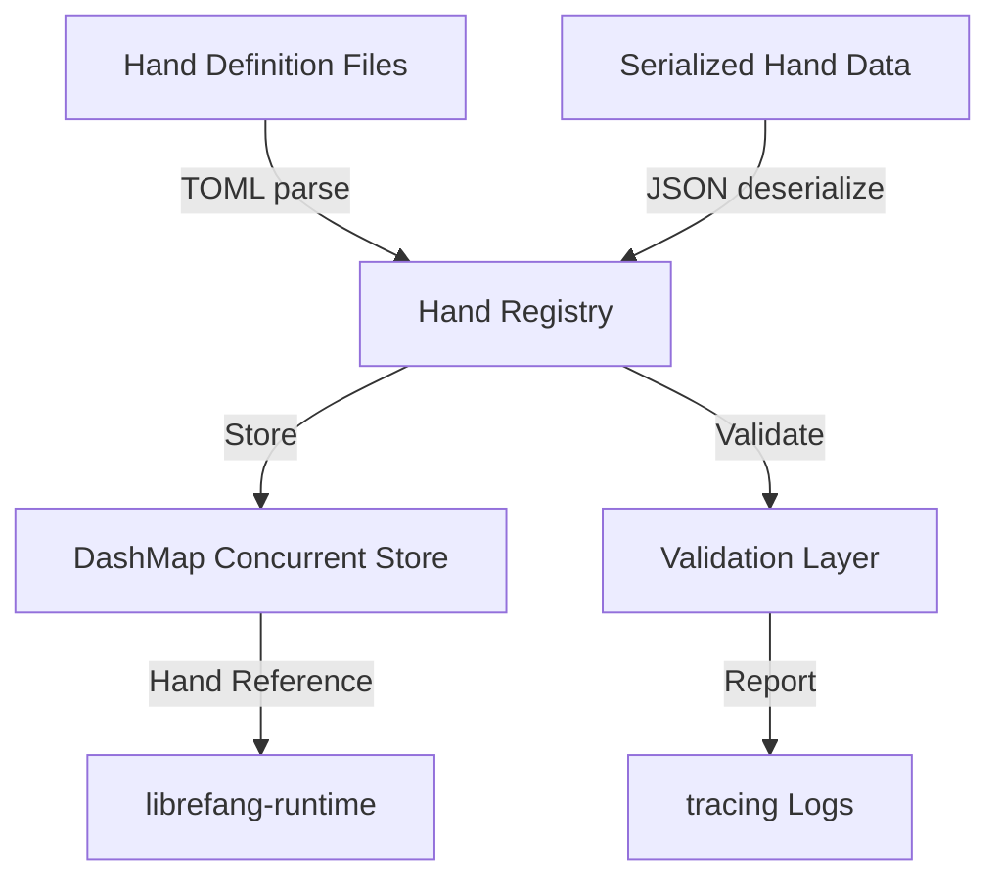

# Other — librefang-hands

# librefang-hands

Curated autonomous capability packages for the LibreFang system.

## Overview

**Hands** are self-contained, declaratively-defined capability units that encapsulate specific autonomous behaviors. Each Hand represents a discrete skill or set of skills that can be loaded, inspected, and executed by the LibreFang runtime. The term draws from the metaphor of different "hands" an agent can use to interact with the world — each one purpose-built for a class of tasks.

This crate provides the infrastructure for defining, loading, validating, storing, and managing Hand packages. It does **not** execute Hands directly — that responsibility belongs to `librefang-runtime`. Instead, this module acts as the registry and lifecycle manager for Hand definitions.

## Conceptual Model

```
┌─────────────────────────────────────────────────┐
│                  Hand Package                    │
│                                                  │
│  ┌──────────────┐  ┌──────────────────────────┐ │
│  │  Manifest    │  │  Capability Definitions   │ │
│  │  (TOML)      │  │  (Serialized Structs)     │ │
│  └──────────────┘  └──────────────────────────┘ │
│                                                  │
│  Identity (UUID) · Metadata · Timestamps        │
└─────────────────────────────────────────────────┘
```

A Hand is characterized by:

- **Identity** — A UUID uniquely identifying the Hand package.
- **Manifest** — A TOML-based configuration file declaring the Hand's metadata, dependencies, and capabilities.
- **Capabilities** — The serialized definitions of what the Hand can do, structured as typed data.
- **Timestamps** — Creation and modification records via `chrono` for lifecycle tracking.

## Architecture



The module is structured around a **registry pattern** backed by `DashMap`, providing lock-free concurrent access to loaded Hand definitions. This allows multiple runtime components to query available Hands without blocking.

## Key Dependency Roles

| Dependency | Role in this Module |
|---|---|
| `librefang-types` | Shared type definitions for Hand structures, capability descriptors, and cross-crate contracts |
| `serde` / `serde_json` / `toml` | Serialization framework: TOML for human-authored manifests, JSON for machine interchange |
| `thiserror` | Typed error definitions for Hand loading, validation, and registry operations |
| `tracing` | Structured logging of Hand lifecycle events — registration, validation failures, lookups |
| `uuid` | Stable unique identifiers for each Hand package |
| `chrono` | Timestamping Hand registration and modification events |
| `dashmap` | Concurrent hashmap for the Hand registry, enabling lock-free reads from multiple threads |

## Hand Lifecycle

1. **Definition** — A Hand is authored as a TOML manifest accompanied by capability descriptors.
2. **Loading** — The manifest is parsed and deserialized into typed structures using `serde` + `toml`.
3. **Validation** — The parsed Hand is checked for completeness, structural correctness, and compatibility.
4. **Registration** — A valid Hand is assigned a UUID (if not already present), timestamped, and inserted into the concurrent registry.
5. **Lookup** — Runtime and other consumers query the registry by UUID or capability type.
6. **Deregistration** — Hands can be removed from the registry, with appropriate logging.

## Error Handling

All errors in this module are defined using `thiserror` derivations. Expected error categories include:

- **Parse errors** — Malformed TOML manifests or invalid JSON capability data.
- **Validation errors** — Missing required fields, incompatible versions, or duplicate registrations.
- **Registry errors** — Hands not found, or conflicts during insertion.

Errors are propagated with context via `tracing` spans, making it possible to trace a failure back to a specific Hand package and loading step.

## Relationship to Other Crates

```
librefang-types  ←── librefang-hands  ──→  librefang-runtime
     (shared types)    (registry/management)    (execution)
```

- **Depends on `librefang-types`** for the structural definitions that Hands conform to.
- **Used by `librefang-runtime`** which is listed as a dev-dependency, confirming that the runtime consumes Hand references from this module's registry during integration tests.
- The module has **no incoming or outgoing runtime calls** in its static call graph, reflecting its role as a data management layer rather than an orchestration layer.

## Testing

The test suite uses:

- **`tokio-test`** — For async test helpers, confirming that registry operations are designed for async contexts.
- **`tempfile`** — Creates temporary directories and files for testing Hand loading from disk without polluting the filesystem.
- **`serial_test`** — Ensures certain tests run sequentially, likely to prevent race conditions on shared registry state during test parallelism.
- **`librefang-runtime`** (dev-only) — Integration tests that verify the runtime can correctly consume registered Hands.

Tests are expected to cover manifest parsing, validation acceptance/rejection, concurrent registry access, and Hand lifecycle transitions.

## Design Principles

- **Curated, not crowdsourced** — Hands are expected to pass validation before entering the registry. This is a deliberate quality gate.
- **Immutable once registered** — A Hand's definition does not change after registration. If an update is needed, a new UUID/version is registered.
- **Thread-safe by default** — The `DashMap`-backed registry eliminates the need for external locking in consumers.
- **Declarative over imperative** — Hands are defined by what they *are* (their capabilities, metadata, constraints) rather than by executable code. Execution logic lives in the runtime.