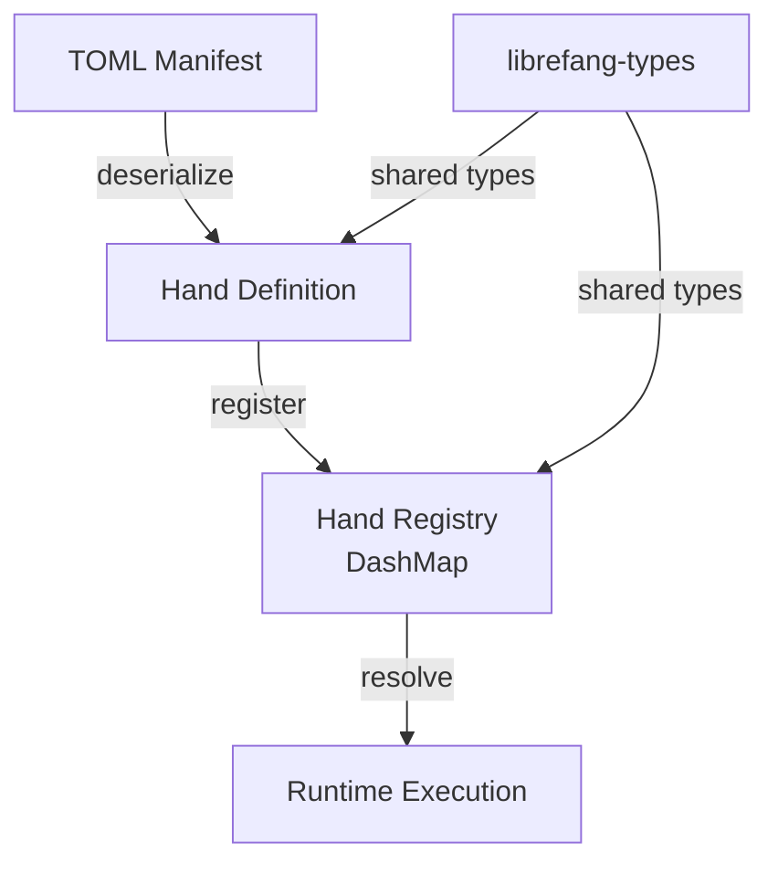

# Other — librefang-hands

# librefang-hands

Hands system for LibreFang — curated autonomous capability packages.

## Overview

A **hand** in LibreFang is a curated, self-contained capability package that describes an autonomous action or set of actions the system can perform. This module provides the core abstractions for defining, loading, storing, and managing hands throughout their lifecycle.

Hands serve as the bridge between high-level task intent and concrete execution. Each hand encapsulates everything needed to carry out a specific capability — metadata, configuration, and a reference to the logic that implements it.

## Architecture

Hands are defined declaratively (via TOML manifests), loaded into an in-memory registry backed by `DashMap` for concurrent access, and resolved at runtime when the system needs to invoke a capability.

## Key Dependencies

| Dependency | Role |
|---|---|
| `librefang-types` | Shared type definitions used across all LibreFang modules |
| `serde` / `serde_json` / `toml` | Serialization and deserialization of hand manifests and metadata |
| `dashmap` | Lock-free concurrent hashmap powering the hand registry |
| `uuid` | Unique identification of hand instances |
| `chrono` | Timestamp tracking for hand lifecycle events |
| `thiserror` | Ergonomic error types for hand loading and validation failures |
| `tracing` | Structured logging throughout hand operations |

## Hand Lifecycle

1. **Definition** — A hand is authored as a TOML manifest describing its identity, capabilities, and configuration schema.
2. **Loading** — The manifest is read and deserialized into a typed hand definition. Validation ensures required fields are present and well-formed.
3. **Registration** — The validated hand is inserted into the registry, making it available for lookup by ID or capability name.
4. **Resolution** — When the runtime needs a capability, it queries the registry to find a matching hand.
5. **Execution** — The resolved hand is handed off to `librefang-runtime` for dispatch and execution.

## Module Boundaries

This module is intentionally self-contained. It owns the data model and storage layer for hands but does not execute them directly. Execution is delegated to `librefang-runtime`, which is listed as a dev-dependency — the runtime depends on this module, not the other way around.

The separation means:
- Hand definitions can be loaded and inspected without spinning up the full runtime.
- The registry can be populated in tests using `tempfile`-backed manifests without side effects.
- Other modules can query hand metadata without pulling in execution logic.

## Testing

Tests use `serial_test` to serialize access to shared state, and `tempfile` to create isolated temporary directories for hand manifests. The `librefang-runtime` dev-dependency enables integration tests that verify hand resolution through the runtime path.