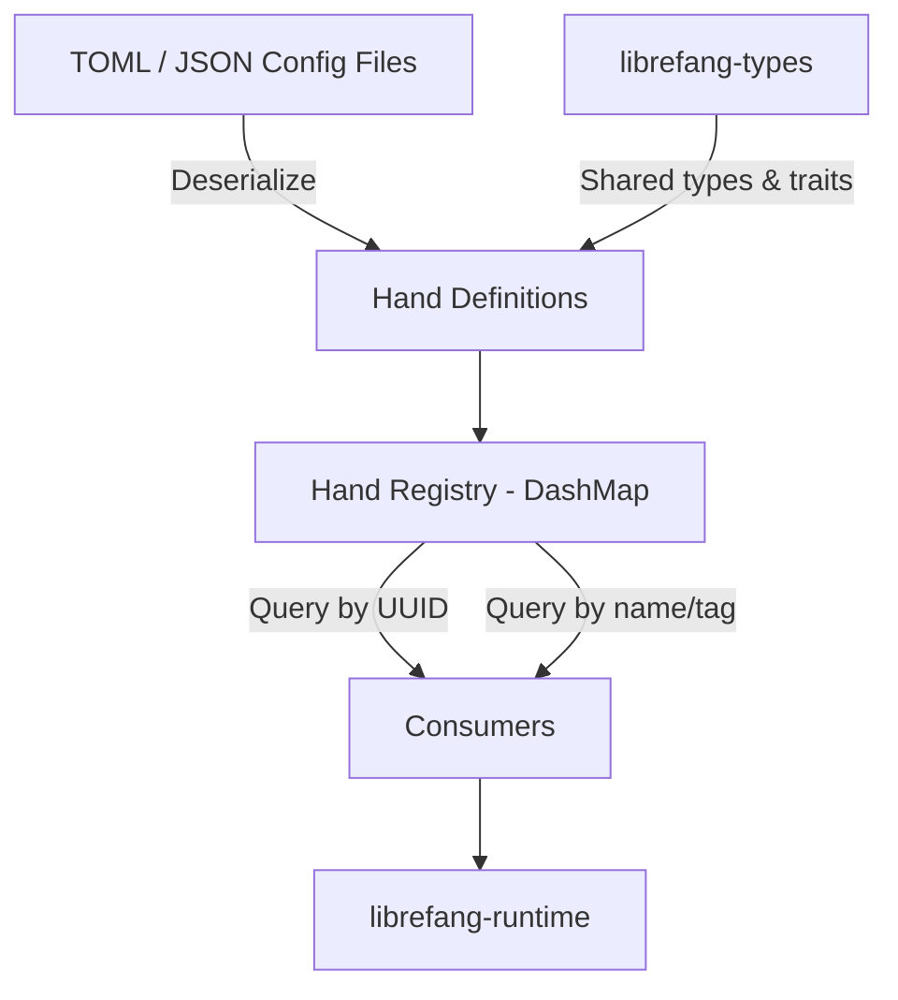

# Other — librefang-hands

# librefang-hands

Hands system for LibreFang — curated autonomous capability packages.

## Overview

In LibreFang, a **Hand** is a discrete, curated capability package that defines an autonomous behavior or skill. Hands encapsulate everything needed to describe and manage a specific capability — its identity, configuration, metadata, and lifecycle state. This module provides the infrastructure for defining, loading, storing, and querying hands throughout the system.

Think of hands as installable "skills" — each one is self-contained, identifiable, and can be activated or deactivated independently.

## Architecture

## Key Concepts

### Hand

A hand represents a single autonomous capability. Each hand carries:

- **Unique identity** — identified by UUID, ensuring global uniqueness across the system
- **Metadata** — name, description, version, and timestamps (via `chrono`) tracking creation and modification
- **Configuration** — arbitrary structured data loaded from TOML or JSON, typed against definitions from `librefang-types`
- **Lifecycle state** — tracks whether a hand is loaded, active, disabled, or errored

### Hand Registry

The module maintains a thread-safe registry of all known hands, backed by `DashMap`. This provides:

- **Concurrent access** — multiple threads can read and write hand entries without external locking
- **Fast lookup** — hands can be retrieved by UUID or by name
- **Safe mutation** — atomic insert, update, and remove operations

## Dependencies & Rationale

| Dependency | Purpose |
|---|---|
| `librefang-types` | Shared type definitions, traits, and domain primitives used across all LibreFang crates |
| `serde` / `serde_json` / `toml` | Declarative hand definitions loaded from TOML or JSON configuration files |
| `dashmap` | Lock-free concurrent hashmap backing the hand registry |
| `uuid` | Unique identification of each hand instance |
| `chrono` | Timestamps for hand creation, modification, and lifecycle events |
| `thiserror` | Ergonomic, typed error definitions for loading and validation failures |
| `tracing` | Structured logging for hand lifecycle events and registry operations |

## Loading Hands

Hands are defined declaratively in configuration files (TOML preferred, JSON supported). The module deserializes these into typed hand structures using `serde`, validates them, and inserts them into the registry.

Typical loading flow:

1. Read a TOML or JSON file containing one or more hand definitions
2. Deserialize into the hand type using the serde-derived structures
3. Validate required fields (name present, UUID unique, configuration well-formed)
4. Assign a UUID if not provided
5. Record creation timestamp via `chrono`
6. Insert into the `DashMap`-backed registry
7. Emit a `tracing` event confirming the hand was loaded

## Error Handling

All fallible operations return typed errors derived via `thiserror`. Error categories include:

- **Parse errors** — malformed TOML or JSON input
- **Validation errors** — missing required fields, invalid configuration values
- **Registry errors** — duplicate hand names or UUIDs, hand not found on lookup
- **I/O errors** — file not found, permission denied during loading

Consumers should match on the specific error variants to decide on recovery strategies.

## Relationship to Other Crates

- **`librefang-types`** — provides the foundational types that hand definitions build on. This crate depends on it but does not depend on the runtime.
- **`librefang-runtime`** — consumes hands at execution time. It appears as a dev-dependency here for integration testing, meaning the dependency direction is `librefang-runtime → librefang-hands`.
- **The broader system** — any crate that needs to query available capabilities does so through this module's registry.

## Testing

The dev-dependencies reveal the testing approach:

- **`tokio-test`** — async test utilities for testing concurrent registry operations
- **`tempfile`** — creates temporary config files for loading tests without touching the filesystem
- **`librefang-runtime`** — integration tests verifying hands work correctly when consumed by the runtime
- **`serial_test`** — serializes tests that share mutable global state (the registry), preventing race conditions in the test suite

## Extending

To add a new hand type or capability:

1. Define the configuration schema in the hand's TOML structure
2. Ensure any new domain types are added to `librefang-types` if they are shared
3. Add deserialization and validation logic in this crate
4. Write tests using `tempfile` for config loading and `serial_test` for registry mutations
5. Verify integration with `librefang-runtime` via the dev-dependency test suite