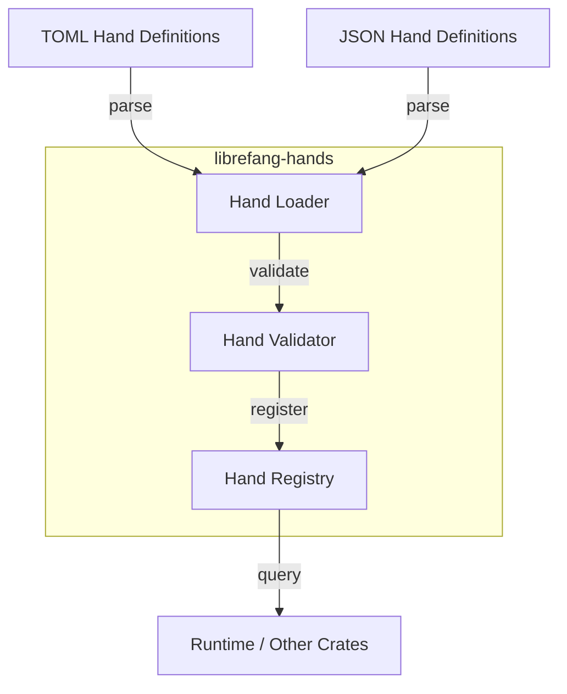

# Other — librefang-hands

# librefang-hands

Curated autonomous capability packages for the LibreFang system.

## Overview

A **Hand** is a self-contained bundle of capabilities that defines what an autonomous agent can do. This crate provides the data structures, loading, validation, and lifecycle management for Hands — serving as the bridge between declarative capability definitions (authored in configuration files) and the runtime systems that execute them.

Think of a Hand as a curated, versioned package: it declares what it provides, what it requires, and how those capabilities are organized. The `librefang-hands` crate is responsible for parsing these packages, maintaining a registry, and ensuring they are structurally sound before any runtime consumes them.

## Concepts

### What is a Hand?

A Hand encapsulates a discrete set of autonomous capabilities. Each Hand is:

- **Identifiable** — tracked by a unique ID and a human-readable name.
- **Versioned** — carries version metadata for compatibility checks.
- **Described** — includes structured metadata (author, description, timestamps).
- **Validatable** — must pass structural checks before it can be registered or used.

### Capability Packages

Rather than monolithic agent definitions, LibreFang decomposes autonomy into capability packages. A Hand groups related capabilities together, making it possible to:

- Compose agents from multiple Hands.
- Share and reuse capability sets across different agent configurations.
- Enforce clear boundaries around what a set of capabilities can and cannot do.

## Architecture

The registry (`dashmap`) provides concurrent-safe access, meaning multiple runtime threads can query for available Hands without external synchronization.

## Key Responsibilities

| Responsibility | Detail |
|---|---|
| **Parsing** | Reads Hand definitions from TOML and JSON using `serde` + `toml` + `serde_json`. |
| **Validation** | Checks structural integrity of a Hand before registration — missing fields, invalid references, or malformed capability declarations are caught early. |
| **Registry** | Maintains an in-memory, thread-safe map of active Hands keyed by their identifiers. |
| **Lifecycle** | Tracks creation and modification timestamps via `chrono`, and assigns stable identifiers via `uuid`. |
| **Error Reporting** | Uses `thiserror` to produce typed, descriptive errors for parse failures, validation violations, and registry conflicts. |

## Dependencies

| Crate | Role |
|---|---|
| `librefang-types` | Shared type definitions used across LibreFang crates — defines the base data models that Hands build on. |
| `serde` / `serde_json` / `toml` | Serialization frameworks for loading hand definitions from configuration files. |
| `thiserror` | Ergonomic error types for Hand parsing and validation failures. |
| `tracing` | Structured logging for Hand lifecycle events (registration, validation errors, lookups). |
| `uuid` | Unique identification for Hand instances. |
| `chrono` | Timestamps for Hand metadata. |
| `dashmap` | Concurrent hashmap powering the Hand registry. |

## Relationship to Other Crates

`librefang-hands` sits between the type layer and the runtime layer:

- **Depends on** `librefang-types` — Hands are built on top of the shared type vocabulary. Any structure a Hand references (capability descriptors, metadata schemas) is defined in the types crate.
- **Consumed by** `librefang-runtime` (listed as a dev-dependency) — the runtime queries the Hand registry to discover available capabilities when assembling and executing autonomous agents.

The crate is intentionally self-contained. It performs no execution itself; it is a data layer responsible for loading, validating, and serving Hand definitions to whichever system needs them.

## Error Handling

All fallible operations return typed errors derived via `thiserror`. Expect error variants covering:

- Malformed TOML or JSON input.
- Missing required fields in a Hand definition.
- Validation rule violations (e.g., circular dependencies, unrecognized capability types).
- Registry conflicts (e.g., duplicate Hand registration with the same identifier).

Errors are instrumented with `tracing` spans to provide context when debugging failed Hand loads.

## Testing

The dev-dependencies indicate the testing approach:

- `tokio-test` — async test utilities, suggesting the registry or loader may involve async operations.
- `tempfile` — tests create temporary configuration files to exercise the parsing pipeline end-to-end.
- `serial_test` — serializes tests that share global state (likely the registry), preventing race conditions in the test suite.
- `librefang-runtime` — integration tests likely verify that the runtime can correctly consume Hands registered through this crate.