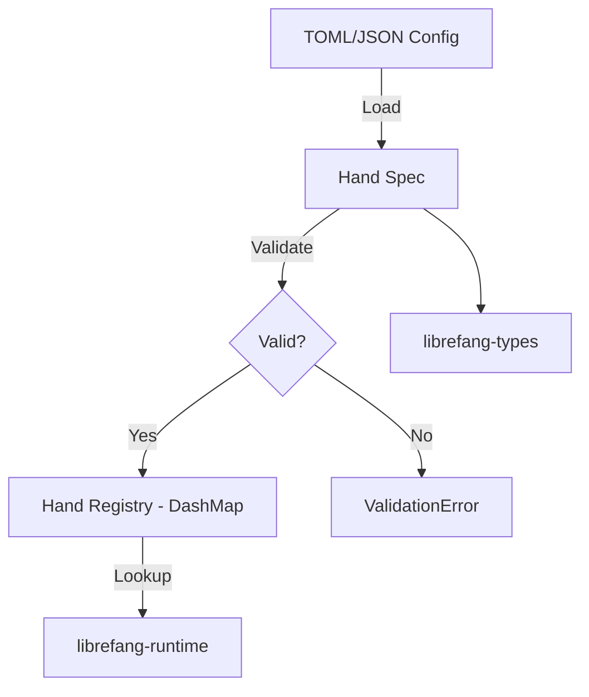

# Other — librefang-hands

# librefang-hands

The hands system for LibreFang — provides curated autonomous capability packages that encapsulate discrete, composable units of functionality within the LibreFang ecosystem.

## Overview

A **Hand** is a self-contained capability package that defines an autonomous action or set of actions the system can perform. Hands are the primary mechanism by which LibreFang extends its behavior: each hand declares what it can do, what it requires, and how it executes.

This module is responsible for:

- **Defining** the Hand data model and associated types
- **Loading** hand specifications from configuration (TOML/JSON)
- **Managing** a concurrent registry of available hands
- **Validating** hand definitions before registration

## Architecture



Hands are loaded from declarative configuration files, validated against the expected schema, and registered in a concurrent registry (`DashMap`). The runtime module (`librefang-runtime`) consumes registered hands for execution.

## Key Concepts

### Hand

A hand represents a single autonomous capability. Each hand carries:

- A **unique identifier** (`uuid`) for tracking and deduplication
- **Metadata** including name, description, and timestamps (`chrono`)
- A **capability specification** defining inputs, outputs, and constraints
- **Configuration** loaded from serialized formats (`serde` + `toml`/`serde_json`)

### Hand Registry

The module maintains a thread-safe registry of all loaded hands using `DashMap`, allowing concurrent reads and writes without a global lock. This supports the async, multi-task nature of the LibreFang runtime.

### Validation

Before a hand enters the registry, it undergoes validation to ensure structural correctness and internal consistency. Errors during validation or loading are surfaced through a typed error enum using `thiserror`.

## Dependencies and Integration

| Dependency | Role |
|---|---|
| `librefang-types` | Shared type definitions used across all LibreFang modules |
| `serde` / `serde_json` / `toml` | Serialization and deserialization of hand specifications |
| `thiserror` | Ergonomic error types for load and validation failures |
| `tracing` | Structured logging throughout the hand lifecycle |
| `uuid` | Unique identification of each hand instance |
| `chrono` | Timestamping for creation, modification, and audit |
| `dashmap` | Lock-free concurrent hashmap for the hand registry |

The runtime module (`librefang-runtime`) is a **dev-dependency**, used only in tests to verify that hands integrate correctly with the execution environment.

## Error Handling

All fallible operations return typed errors derived via `thiserror`. The primary error categories are:

- **Parse errors** — malformed TOML or JSON configuration
- **Validation errors** — a hand definition that doesn't meet schema requirements
- **Registry errors** — conflicts such as duplicate hand registration

Errors are instrumented with `tracing` spans to provide context in logs.

## Testing

The test suite uses:

- `tokio-test` for async test harnesses
- `tempfile` for creating isolated configuration files during tests
- `serial_test` to order tests that share global state
- `librefang-runtime` to verify end-to-end hand execution

Run the tests:

```bash
cargo test -p librefang-hands
```