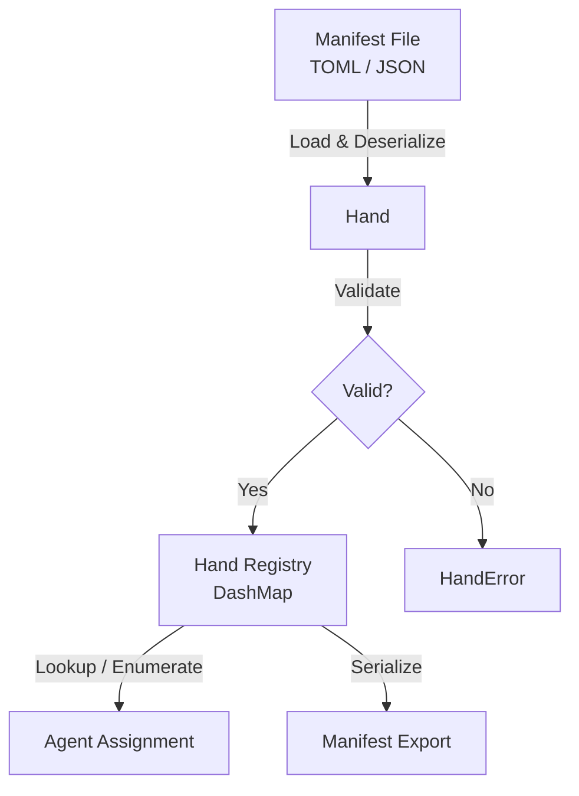

# Other — librefang-hands

# librefang-hands

The **Hands** system defines curated, self-contained capability packages that can be assigned to autonomous agents within LibreFang. A "hand" represents a discrete bundle of functionality—tools, permissions, constraints, and metadata—that an agent can use to interact with its environment.

## Purpose

Rather than granting agents blanket access to all available capabilities, the Hands system provides a mechanism for packaging and distributing well-defined capability sets. Each hand is:

- **Self-describing** — carries its own metadata, version, and dependency information
- **Curated** — intentionally assembled with specific tools and constraints
- **Composable** — multiple hands can be assigned to a single agent
- **Persistable** — serializable to and from TOML/JSON for storage and transport

This module handles the definition, loading, validation, and runtime management of these capability packages.

## Key Concepts

### Hand

A hand is the central unit of capability. It groups together related tools, configuration parameters, and policy constraints into a named, versioned package. Hands serve as the bridge between what an agent *can* do and what it is *allowed* to do.

### Hand Registry

The module maintains a thread-safe registry of loaded hands using `DashMap`, allowing concurrent lookups and modifications. The registry supports:

- Dynamic registration of new hands at runtime
- Lookup by unique identifier
- Enumeration of all available hands and their capabilities

### Manifest Format

Hands are defined via manifest files (TOML or JSON) that describe:

- **Identity** — name, version, unique ID (`uuid`)
- **Capabilities** — the tools and actions the hand provides
- **Constraints** — rate limits, permission boundaries, and safety policies
- **Dependencies** — other hands or runtime features required

## Architecture

## Error Handling

Errors are consolidated through the `HandError` enum, powered by `thiserror`. Common error conditions include:

- **Parse failures** — malformed TOML/JSON manifests
- **Validation errors** — missing required fields, invalid capability definitions, or unresolvable dependencies
- **Registry conflicts** — duplicate hand registration with the same identifier
- **IO errors** — failures reading manifest files from disk

All errors carry sufficient context for debugging via the `tracing` integration.

## Dependencies

| Dependency | Role |
|---|---|
| `librefang-types` | Shared type definitions used across LibreFang modules |
| `serde` / `serde_json` / `toml` | Serialization and deserialization of hand manifests |
| `thiserror` | Ergonomic error type derivation |
| `tracing` | Structured logging and diagnostic spans |
| `uuid` | Unique identification for each hand instance |
| `chrono` | Timestamp handling for metadata and audit trails |
| `dashmap` | Lock-free concurrent map for the hand registry |

## Testing

The test suite (`dev-dependencies`) includes:

- **`tokio-test`** — async runtime support for testing concurrent registry operations
- **`tempfile`** — isolated temporary directories for manifest file I/O tests
- **`librefang-runtime`** — integration tests that validate hands against the actual runtime
- **`serial_test`** — ensures certain tests (e.g., global registry state) run without parallel interference

## Integration Points

This module sits between the type definitions (`librefang-types`) and the execution layer (`librefang-runtime`). Other modules consume the Hands API to:

1. Resolve which capabilities an agent has access to at execution time
2. Validate that a requested action falls within the constraints of an assigned hand
3. Export hand definitions for distribution or persistence

The Hands module itself does not execute agent logic—it provides the data structures, loading machinery, and registry that upstream consumers rely on.