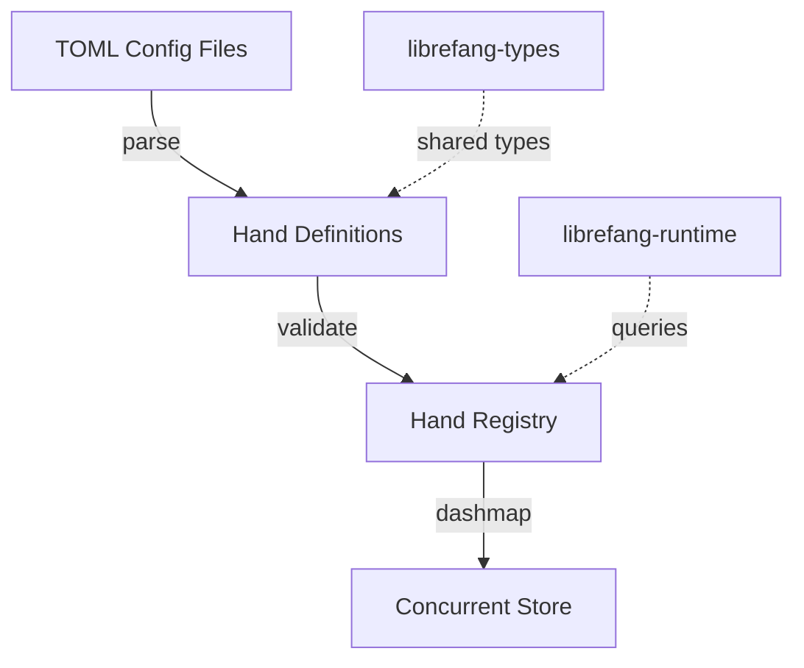

# Other — librefang-hands

# librefang-hands

Curated autonomous capability packages for the LibreFang system.

## Overview

`librefang-hands` manages **hands** — discrete, self-contained capability packages that can be assigned to agents within the LibreFang framework. Each hand represents a curated set of behaviors or tools that an agent can use autonomously. The module is responsible for defining, loading, storing, and retrieving these capability packages.

## Concept: What Is a Hand?

A hand is a named, versioned bundle of autonomous capability. Rather than granting agents unrestricted access to all available actions, hands provide a controlled mechanism for scoping what an agent can do. This enables:

- **Principle of least privilege** — agents receive only the capabilities they need
- **Reusability** — common capability sets are defined once and shared across agents
- **Auditing** — each hand is identifiable and traceable

## Dependencies and Their Roles

| Dependency | Purpose |
|---|---|
| `librefang-types` | Shared type definitions used across the LibreFang ecosystem |
| `serde`, `serde_json`, `toml` | Serialization and deserialization — hands are loaded from declarative config files (TOML) and may be serialized to JSON for transport or storage |
| `thiserror` | Ergonomic error types for hand loading, validation, and lookup failures |
| `tracing` | Structured logging throughout the hand lifecycle |
| `uuid` | Unique identification for hand instances and registrations |
| `chrono` | Timestamping for hand creation, modification, and audit records |
| `dashmap` | Concurrent hashmap for thread-safe storage and retrieval of registered hands |

## Architecture

Hands originate as TOML configuration files, are parsed and validated into structured definitions, and then registered in a concurrent store backed by `dashmap`. The runtime (`librefang-runtime`, a dev dependency here) queries the registry when assigning capabilities to agents.

## Key Design Decisions

### Concurrent Access via DashMap

The use of `dashmap` indicates that the hand registry is accessed from multiple threads simultaneously — likely because the runtime manages several agents in parallel, each needing to resolve its assigned hands without blocking others.

### TOML-First Configuration

Hands are defined declaratively in TOML. This choice keeps configuration human-readable and version-control friendly, separating the definition of capabilities from the code that executes them.

### Error Handling

Errors are handled through `thiserror`, providing typed, descriptive error variants for common failure modes such as:

- Malformed or missing TOML configuration
- Validation failures (missing required fields, invalid values)
- Lookup failures when a requested hand is not registered

## Relationship to Other Modules

- **`librefang-types`**: Defines the base data structures that hands build upon. This crate depends on it directly.
- **`librefang-runtime`**: Consumes the hand registry at execution time. It appears as a dev dependency, suggesting the crate is tested against the runtime but does not depend on it at compile time.
- **Broader system**: Hands sit between the static definition layer (config files, types) and the dynamic execution layer (runtime, agents), acting as the bridge that translates declared capabilities into actionable agent behavior.

## Testing

The test suite uses:

- `tempfile` — for creating isolated temporary directories when testing config file loading
- `serial_test` — to serialize tests that may share global state or filesystem resources
- `librefang-runtime` — for integration tests that verify hand registration works correctly within the runtime context

Tests are expected to cover TOML parsing, validation logic, concurrent registration and lookup, and error paths.