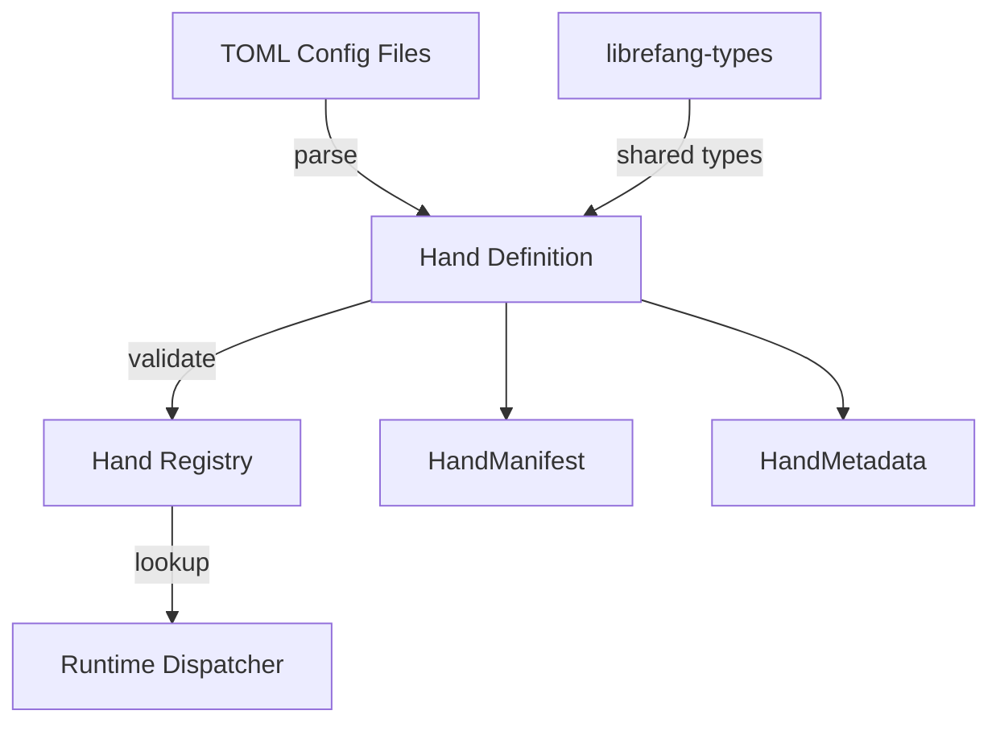

# Other — librefang-hands

# librefang-hands

Curated autonomous capability packages for the LibreFang system.

## Overview

In LibreFang, a **Hand** is a self-contained, declaratively-defined capability package — a unit of autonomous behavior that can be loaded, validated, and dispatched at runtime. `librefang-hands` provides the data structures, loading logic, and concurrent registry for managing these packages.

Hands are the bridge between static configuration and runtime execution. Each hand describes *what* it can do and *what it needs*, while the runtime decides *when* to invoke it.

## Architecture



## Key Concepts

### Hand

A hand encapsulates a discrete capability — for example, a network probing task, a file analysis routine, or a notification action. Each hand is identified by a unique `uuid` and carries metadata describing its purpose, version, and requirements.

### Hand Manifest

Every hand is defined by a **manifest**, typically authored in TOML. The manifest declares:

- **Identity** — name, version, unique ID, and description
- **Capabilities** — what operations this hand can perform
- **Requirements** — runtime dependencies or environmental constraints
- **Configuration schema** — accepted parameters and their types

The `toml` and `serde` dependencies handle deserialization of these manifests into structured Rust types.

### Hand Registry

The module maintains a thread-safe registry of loaded hands, backed by `dashmap`. This allows concurrent registration and lookup without external locking, which is critical in an asynchronous runtime where multiple tasks may query available hands simultaneously.

## Dependencies & Integration

| Dependency | Role |
|---|---|
| `librefang-types` | Shared type definitions (hand IDs, status enums, capability descriptors) used across all LibreFang crates |
| `serde` / `serde_json` / `toml` | Serialization framework for manifest parsing and hand state persistence |
| `thiserror` | Ergonomic error types for manifest validation and registry operations |
| `tracing` | Structured logging for hand lifecycle events (loading, validation failures, registration) |
| `uuid` | Unique identifiers for each hand instance |
| `chrono` | Timestamps for hand registration, last-used tracking, and expiration |
| `dashmap` | Lock-free concurrent map powering the hand registry |

### Relationship to Other Crates

- **`librefang-types`** — This crate consumes shared types but does not depend on the runtime directly (except in tests via `librefang-runtime`).
- **`librefang-runtime`** — Consumes hands from the registry at execution time. The runtime is a dev-dependency here, used only in integration tests to verify that hands load and resolve correctly end-to-end.
- Downstream consumers should depend on `librefang-hands` to define or inspect hands, and on `librefang-runtime` to execute them.

## Error Handling

Errors are defined using `thiserror` and cover the hand lifecycle:

- **Parse errors** — Malformed TOML manifests, missing required fields, type mismatches during deserialization.
- **Validation errors** — Hands that fail structural or semantic validation (e.g., conflicting capabilities, invalid parameter schemas).
- **Registry errors** — Duplicate registration, lookup failures, or concurrent modification issues.

All errors are traceable via `tracing` spans, which emit structured diagnostics at the point of failure.

## Testing

The test suite uses:

- **`tempfile`** — Creates isolated temporary directories for testing manifest loading from disk without polluting the filesystem.
- **`serial_test`** — Serializes tests that share registry state, preventing race conditions in global or shared registries.
- **`librefang-runtime`** — Integration tests that verify end-to-end hand loading and runtime resolution.

To run the tests:

```bash
cargo test -p librefang-hands
```

## Usage Patterns

### Defining a Hand via TOML

Hands are typically defined in `.toml` files following the manifest schema. The hand is then loaded, validated, and inserted into the registry.

### Looking Up a Hand

Consumers query the registry by ID or capability to retrieve a hand definition, which the runtime then uses to dispatch execution.

### Registering Hands Programmatically

In addition to TOML loading, hands can be constructed and registered directly in code — useful for built-in system hands or dynamically generated capabilities.

---

*This crate is part of the LibreFang workspace. See the workspace root for build instructions and overall architecture documentation.*