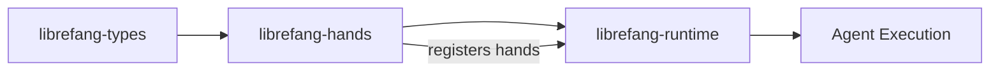

# Other — librefang-hands

# librefang-hands

Hands are LibreFang's unit of **autonomous capability** — self-contained, curated packages that define what an agent can *do*. Each hand encapsulates a discrete skill or toolset along with the metadata needed to discover, validate, and invoke it.

## Concept

In LibreFang, an agent's abilities aren't monolithic. Instead, they're composed from individual "hands" — capability packages that can be loaded, inspected, and managed independently. A hand might represent anything from file system operations to network scanning to payload generation. The hands system provides the registry, serialization, and lifecycle infrastructure to make these capabilities pluggable and composable.

## Architecture

```
┌─────────────────────────────────────────────┐
│                 Hand                         │
│  ┌───────────────┐  ┌─────────────────────┐ │
│  │   Metadata     │  │  Capability Config  │ │
│  │  - id (UUID)   │  │  (TOML definition)  │ │
│  │  - timestamps  │  │                     │ │
│  │  - name/desc   │  └─────────────────────┘ │
│  └───────────────┘                           │
└─────────────────────────────────────────────┘
        │
        ▼
┌─────────────────────┐
│    HandRegistry     │
│    (DashMap-backed) │
│                     │
│  Concurrent access  │
│  to loaded hands    │
└─────────────────────┘
```

The registry uses `dashmap` for lock-free concurrent access, allowing multiple runtime tasks to query and interact with hands simultaneously without contention.

## Key Design Decisions

**TOML-based definitions.** Hands are defined via TOML configuration, making them human-readable, version-control friendly, and easy to audit. The `toml` and `serde` dependencies handle parsing and deserialization into strongly-typed Rust structures.

**UUID identification.** Every hand is identified by a unique UUID (`uuid` crate), ensuring unambiguous references even when hands share names or are updated across versions.

**Timestamped lifecycle.** The `chrono` dependency supports creation and modification timestamps on hand metadata, enabling cache invalidation, staleness checks, and audit trails.

**Structured errors.** `thiserror` provides the error type hierarchy for hand loading, parsing, and validation failures, giving callers precise diagnostics.

## Integration Points

| Dependency | Role |
|---|---|
| `librefang-types` | Shared types that hands produce or consume — ensures type compatibility across the system |
| `librefang-runtime` *(dev)* | Used in tests to verify hands integrate correctly with the runtime environment |
| `tempfile` *(dev)* | Test fixtures for hand loading from temporary filesystem paths |

### How Hands Connect to the Wider System



The hands module sits between the type layer and the runtime. It depends on `librefang-types` for shared data structures and is consumed by `librefang-runtime`, which orchestrates hand invocation during agent execution.

## Serialization Format

Hands are serialized in two contexts:

- **Definition**: TOML files read at load time, deserialized into hand structures via `serde`.
- **Interchange**: JSON (`serde_json`) for runtime hand state snapshots, cross-process communication, or persistence.

Both formats derive from the same `serde`-annotated structures, so the schema stays consistent regardless of transport.

## Testing

Tests use `serial_test` to serialize test cases that share global state (such as the hand registry), preventing race conditions in concurrent scenarios. `tempfile` creates isolated filesystem environments for testing hand discovery and loading without polluting the host system.

To run the test suite:

```bash
cargo test -p librefang-hands
```

## Error Handling

All fallible operations return `Result<T, E>` where `E` is a hand-specific error type derived via `thiserror`. Error variants cover:

- Malformed or missing TOML configuration
- Invalid or duplicate hand identifiers
- Schema validation failures during loading

The `tracing` crate provides structured diagnostics throughout — every hand load, parse, and registration event is instrumented so operators can trace capability resolution in production logs.