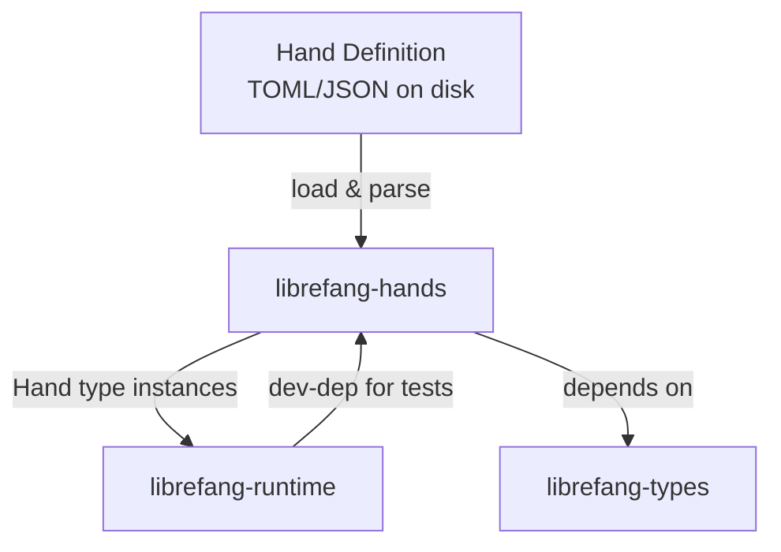

# Other — librefang-hands

# librefang-hands

Hands system for LibreFang — curated autonomous capability packages.

## Overview

In LibreFang, a **Hand** is a self-contained, declaratively-defined capability package. Each hand encapsulates a discrete unit of autonomous behavior — a set of actions, constraints, and metadata that can be discovered, validated, and dispatched by the runtime. The `librefang-hands` crate provides the types, loading, and management infrastructure for these capability packages.

Think of hands as pluggable skill modules: they define *what* an agent can do and *how* to invoke it, while the runtime decides *when* and *whether* to do so.

## Architecture

Hands are defined as static files (typically TOML) that are parsed into structured types at load time. The crate validates each hand against schema requirements and makes them available to the runtime through a concurrent registry.

## Key Concepts

### Hand

A hand represents a single autonomous capability. It carries:

- **Identity** — A unique identifier (`uuid`) and a human-readable name.
- **Metadata** — Description, version, authorship, and timestamps (`chrono`) for creation and modification.
- **Definition** — The serialized specification of what the hand does, stored as structured data (`serde_json::Value` or typed structs from `librefang-types`).

### Hand Registry

The crate uses `dashmap` to provide a lock-free concurrent map for storing and retrieving loaded hands. This allows multiple runtime threads to query available capabilities without contention.

### Loading and Parsing

Hands are loaded from disk (hence `toml` and `serde_json` dependencies). The loading pipeline:

1. Reads hand definition files from a configured directory.
2. Deserializes TOML into intermediate types.
3. Validates required fields and schema compliance.
4. Inserts valid hands into the registry.
5. Reports errors via `thiserror`-derived error types and `tracing` spans.

### Error Handling

Errors are modeled with `thiserror` and cover common failure modes:

- File I/O failures (missing or unreadable hand files).
- Deserialization errors (malformed TOML or JSON).
- Validation errors (missing required fields, invalid schema).
- Registry conflicts (duplicate hand identifiers).

## Dependencies

| Crate | Purpose |
|---|---|
| `librefang-types` | Shared type definitions used across LibreFang crates |
| `serde` / `serde_json` / `toml` | Serialization and deserialization of hand definitions |
| `thiserror` | Derived error types for the loading and validation pipeline |
| `tracing` | Structured logging throughout the hand lifecycle |
| `uuid` | Unique identification of hand instances |
| `chrono` | Timestamp handling for hand metadata |
| `dashmap` | Concurrent hash map for the hand registry |

### Dev Dependencies

| Crate | Purpose |
|---|---|
| `tempfile` | Creating temporary directories for hand-loading tests |
| `librefang-runtime` | Integration tests verifying hand registration with the runtime |
| `serial_test` | Ensuring test isolation when tests share filesystem or global state |

## Integration with LibreFang

This crate sits between the type layer and the runtime layer:

- **Downstream of `librefang-types`**: Consumes shared types for hand definitions, ensuring consistency across the system.
- **Upstream of `librefang-runtime`**: The runtime queries `librefang-hands` to discover available capabilities and to instantiate hand behaviors during execution.

The `serial_test` dev-dependency on `librefang-runtime` confirms that integration tests exercise the full path from hand loading through runtime dispatch, but under serialized execution to avoid state leakage between tests.

## Writing a Hand Definition

Hands are authored as TOML files. A minimal hand definition includes the required identity and metadata fields. When adding a new hand:

1. Create a `.toml` file in the hands directory.
2. Define the required fields (id, name, description, version).
3. Specify the capability definition appropriate to the hand's purpose.
4. Run the test suite — the crate's tests use `tempfile` to create isolated hand directories, ensuring your definition parses and validates correctly.

Invalid or incomplete hand definitions will be rejected during loading with a descriptive error emitted via `tracing`.